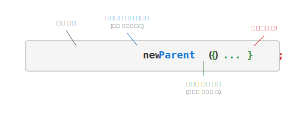

# 12.7 익명 객체 (Anonymous Object)


<br>

## 1. 이름 없는 영웅 🎭

익명(Anonymous) 객체는 말 그대로 **"이름이 없는 객체"**입니다.
보통 클래스를 만들 때는 이름을 지어주지만(`class Dog`), 딱 한 번만 쓰고 버릴 객체라면 굳이 이름을 지어줄 필요가 없습니다.



*   **특징**: 클래스 선언과 동시에 객체를 생성합니다.
*   **장점**: 코드가 줄어들고, 특정 위치에서만 동작을 재정의해서 쓰기 좋습니다.

<br>


<br>

## 2. 문법 해부 (상속 + 생성)

익명 객체를 만드는 문법은 처음 보면 조금 낯설 수 있습니다.
**"나는 `Parent`를 상속받지만, 내 클래스 이름은 짓지 않고 본문(`{}`)만 정의하겠다"**는 뜻입니다.



```java
// 변수에 대입하거나
Parent p = new Parent() {
    // Parent의 내용을 여기서 바로 수정(Override)해서 씀!
}; // <- 세미콜론 필수!
```

<br>


<br>

## 3. 사용 예시 1: 익명 자식 객체 (상속)

부모 클래스(`Tire`)가 있는데, 특정 상황에서만 굴러가는 방식(`roll`)을 바꾸고 싶을 때 사용합니다.

```java
public class Car {
    public void run() {
        // 일반 타이어
        Tire tire = new Tire();
        tire.roll();
        
        // 익명 자식 타이어 (이름 없음, 즉석 튜닝)
        Tire specialTire = new Tire() {
            @Override
            public void roll() {
                System.out.println("🛞 스노우 타이어로 굴러갑니다!");
            }
        };
        specialTire.roll();
    }
}
```

<br>


<br>

## 4. 사용 예시 2: 익명 구현 객체 (인터페이스)

가장 많이 쓰이는 형태입니다. 인터페이스(`RemoteControl`)를 구현한 클래스 파일을 따로 만들지 않고, 즉석에서 구현해버립니다.

```java
public class User {
    public static void main(String[] args) {
        // 인터페이스를 바로 new? (파격적!)
        // 사실은 인터페이스를 구현한 '이름 없는 클래스'를 만들어서 new 하는 것.
        RemoteControl rc = new RemoteControl() {
            @Override
            public void turnOn() {
                System.out.println("📺 TV를 켭니다.");
            }
            
            @Override
            public void turnOff() {
                System.out.println("📺 TV를 끕니다.");
            }
        };
        
        rc.turnOn();
    }
}
```

> **핵심 요약**: 익명 객체는 **"일회용 구현 클래스"**입니다. 이벤트 처리(버튼 클릭 등)처럼 한 번만 정의해서 쓰는 곳에 아주 유용합니다!

---

## 코딩 영단어 학습 📝

코딩에서 영어 단어의 의미만 정확히 이해해도 절반은 성공입니다! 오늘 배운 핵심 영단어들을 다시 한번 짚고 넘어가 볼까요?

*   **`Anonymous`**: 어노니머스, 익명의. (마치 복면을 쓴 영웅처럼 자기 클래스의 정식 이름표를 달지 않고도 묵묵히 훌륭하게 기능을 수행하는 상태)
*   **`Override`**: 오버라이드, 재정의. (익명 객체를 만들면서 부모의 기능을 그 자리에서 내 입맛에 맞게 즉석으로 뜯어고쳐 사용하는 핵심 기술)
