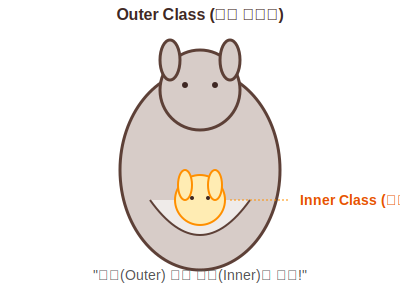

# Chapter 12. 중첩 선언과 익명 객체

> **"클래스 안에 클래스를 품다."**

 

## 학습목표

1.  클래스 내부에 클래스를 선언하는 **중첩 클래스**의 개념과 목적을 이해합니다.
2.  **인스턴스 멤버 클래스**와 **정적(static) 멤버 클래스**의 차이를 구분합니다.
3.  메소드 안에 선언하는 **로컬 클래스**의 특징을 알아봅니다.
4.  이름 없는 객체, **익명 객체(Anonymous Object)**의 활용법을 익힙니다.

---

 

## 목차

### [12.1 중첩 클래스란?](./nested-class)
"캥거루 뱃속의 아기 캥거루"처럼 클래스 안에 선언된 클래스의 개념과 사용하는 이유(캡슐화, 관계 형성)를 알아봅니다.

### [12.2 인스턴스 멤버 클래스](./instance-member-class)
객체를 생성해야만 사용할 수 있는 가장 일반적인 중첩 클래스입니다. "내(바깥 객체)가 있어야 너(안쪽 객체)도 있다"는 관계를 배웁니다.

### [12.3 정적(static) 멤버 클래스](./static-member-class)
바깥 클래스의 객체가 없어도 독자적으로 사용할 수 있는 중첩 클래스입니다. `static` 키워드가 붙었을 때 접근 범위가 어떻게 달라지는지 확인합니다.

### [12.4 로컬 클래스](./local-class)
메소드가 실행될 때만 잠깐 생겨났다가 사라지는 '임시 클래스'입니다. 메소드 내부에서의 독특한 동작 방식을 배웁니다.

### [12.5 바깥 멤버 접근](./access-outer)
"안에서 밖을 보는 창문"처럼, 중첩 클래스 내부에서 바깥 클래스의 필드와 메소드를 어떻게 가져다 쓰는지(`this` 키워드 활용) 배웁니다.

### [12.6 중첩 인터페이스](./nested-interface)
클래스 안에 선언된 인터페이스로, 주로 UI 프로그래밍(버튼 이벤트 처리 등)에서 사용되는 패턴을 알아봅니다.

### [12.7 익명 객체](./anonymous-object)
이름을 짓지 않고 즉석에서 만들어 쓰는 "일회용 객체"입니다. 상속과 인터페이스 구현을 통해 코드를 획기적으로 줄이는 방법을 배웁니다.

---

 

## 확인문제
- [확인문제](./quiz)
