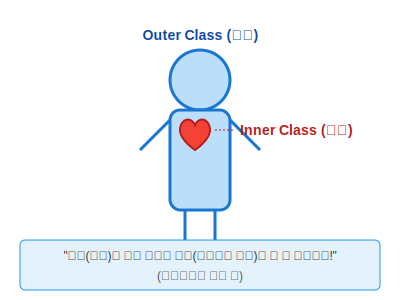
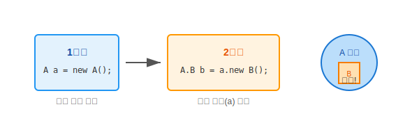

# 12.2 인스턴스 멤버 클래스 (Instance Member Class)


<br>

## 1. 사람과 심장

가장 기본적인 형태의 중첩 클래스입니다.
**"사람(A)이 살아있어야 심장(B)도 뛸 수 있다"**는 관계를 떠올려보세요.



*   **특징**: 바깥 클래스(`A`)의 객체를 먼저 만들어야만, 안쪽 클래스(`B`)의 객체를 만들 수 있습니다.
*   **접근**: 안쪽 클래스(`B`)는 바깥 클래스(`A`)의 모든 필드와 메소드(비밀스러운 `private` 변수까지!)를 내 것처럼 가져다 쓸 수 있습니다.

<br>


<br>

## 2. 생성 방법 (a.new B)

인스턴스 멤버 클래스는 바깥 클래스의 **인스턴스(객체)**에 소속됩니다.
따라서 **반드시 바깥 객체가 먼저 존재해야** 합니다.



```java
// 1단계: 바깥 객체(사람) 먼저 생성
A a = new A();

// 2단계: 바깥 객체를 통해 안쪽 객체(심장) 생성
A.B b = a.new B();  // 문법 주의! (a.new B())
```

> **주의**: `new A.B()`가 아닙니다! `a.new B()`입니다. `a`라는 특정 객체에 소속된 `B`를 만든다는 뜻입니다.

<br>


<br>

## 3. 선언과 접근 범위

클래스 내부에 `class` 키워드로 선언하며, `static` 키워드는 붙이지 않습니다.

```java
public class A {
    // 인스턴스 멤버 클래스
    class B {
        // 필드, 생성자, 메소드 모두 가능
        int field1 = 1;
        
        B() {
            System.out.println("B 객체 생성");
        }
        
        void method1() {
            System.out.println("B 메소드 실행");
        }
    }
    
    // A 클래스 내부에서는 자유롭게 사용 가능
    void useB() {
        B b = new B();
        b.method1();
    }
}
```

### 접근 제한자 (`private`을 쓰는 이유)
보통 내부 클래스는 바깥 클래스 `A`의 **비밀스러운 작업**을 돕기 위해 만듭니다.
그래서 `private class B`로 선언하여 외부에서는 아예 B가 존재하는지조차 모르게 하는 경우가 많습니다. (캡슐화)

<br>


<br>

## 4. 예제 코드로 확인하기

실제 코드를 통해 생성 순서와 사용법을 확인해 봅시다.

### 💻 예제 코드

```java
// 파일명: A.java
package ch09.sec02.exam01;

public class A {
    // 인스턴스 멤버 클래스
    class B {
        // [Java 17+] 정적 필드/메소드도 선언 가능해졌음 (이전 버전은 불가)
        int field = 10;
        
        void print() {
            System.out.println("B 객체의 필드값: " + field);
        }
    }
    
    // A의 메소드에서 B 사용하기
    void useB() {
        B b = new B();
        b.print();
    }
}
```

```java
// 파일명: Example.java
package ch09.sec02.exam01;

public class Example {
    public static void main(String[] args) {
        // 1. A 객체 생성
        A a = new A();
        
        // 2. A 객체를 이용하여 B 객체 생성
        A.B b = a.new B();
        b.print();
        
        // 3. A 내부 메소드를 통해 간접적으로 사용
        a.useB();
    }
}
```

### 📋 실행 결과
```
B 객체의 필드값: 10
B 객체의 필드값: 10
```

> **핵심 요약**: 인스턴스 멤버 클래스는 **바깥 객체(`this`)**와 운명 공동체입니다!

---

## 코딩 영단어 학습 📝

코딩에서 영어 단어의 의미만 정확히 이해해도 절반은 성공입니다! 오늘 배운 핵심 영단어들을 다시 한번 짚고 넘어가 볼까요?

*   **`Instance Member Class`**: 인스턴스 멤버 클래스. (마치 심장처럼, 부모 격인 바깥쪽 객체(인스턴스)가 살아 숨 쉬어야만 비로소 자신도 태동할 수 있는 핏줄 같은 중첩 클래스)
*   **`Encapsulation`**: 인캡슐레이션, 캡슐화. (바깥쪽 클래스를 도울 복잡하고 사적인 로직들을 인스턴스 멤버 클래스 안에 꽁꽁 숨겨두어, 외부에서 쓸데없이 간섭하지 못하게 철벽을 치는 행위)
