# 12.4 로컬 클래스 (Local Class)


<br>

## 1. 메소드 안의 팝업 스토어

로컬 클래스는 생성자나 메소드 **내부**에서 선언되는 클래스입니다.
**"축제 기간(메소드 실행)에만 잠시 열리는 팝업 스토어"**와 같습니다.



*   **한정된 수명**: 메소드가 실행될 때 정의되고, 메소드가 끝나면 사라집니다.
*   **사용 범위**: 해당 메소드 안에서만 객체를 만들고 쓸 수 있습니다. 밖에서는 이 클래스의 존재조차 모릅니다.

<br>


<br>

## 2. 왜 쓸까요? (일회용 도구)

특정 작업을 수행할 때만 필요한 아주 복잡한 로직이 있다고 가정해 봅시다.
이를 별도의 클래스로 만들기엔 너무 작고, 그렇다고 메소드 안에 다 때려넣기엔 코드가 지저분할 때 사용합니다.
(비동기 처리를 위한 스레드 객체를 만들 때 자주 사용됨)

```java
void run() {
    // 이 안에서만 쓸 클래스 정의
    class Calculator {
        int add(int a, int b) { return a + b; }
    }
    
    // 사용
    Calculator calc = new Calculator();
    System.out.println(calc.add(10, 20)); // 30
}
```

<br>


<br>

## 3. 로컬 변수의 캡처 (스냅샷) 📸

로컬 클래스에서 가장 중요한 특징은 **바깥 메소드의 변수(로컬 변수)를 사용할 때의 제약**입니다.

### 문제 상황: 수명의 불일치
1.  **메소드(Stack)**: 실행이 끝나면 로컬 변수들은 메모리에서 사라집니다.
2.  **객체(Heap)**: 로컬 클래스로 만든 객체는 메소드가 끝나도 힙 메모리에 남아있을 수 있습니다 (예: 다른 곳에 참조가 넘어갔을 때).

그렇다면, **이미 사라진 변수**를 객체가 어떻게 참조할까요?



자바는 이 문제를 해결하기 위해, 객체를 생성할 때 **사용하는 지역 변수의 값을 복사(Capture)**해서 객체 안에 저장해둡니다.
마치 **사진(스냅샷)**을 찍어두는 것과 같습니다.

### 왜 `final`이어야 할까요?
만약 원본 변수의 값이 나중에 바뀐다면, 객체 안에 복사된 값과 서로 달라지게 됩니다. (데이터 불일치)
그래서 자바는 **"로컬 클래스에서 사용하는 지역 변수는 `final`(상수)이어야 한다"**는 규칙을 정했습니다.
(Java 8부터는 `final`을 안 붙여도, **사실상 수정되지 않는다면(effectively final)** 허용해줍니다. 하지만 값을 바꾸려 하면 에러가 납니다.)

<br>


<br>

## 4. 예제 코드로 확인하기

### 💻 예제 코드

```java
public class LocalExample {
    public void process(int arg) { // arg는 사실상 final
        int localVar = 10;         // localVar도 사실상 final
        
        // 로컬 클래스
        class Processor {
            void run() {
                // 바깥 변수 사용 (읽기만 가능)
                System.out.println("arg: " + arg);
                System.out.println("localVar: " + localVar);
                
                // 수정 시도 -> 컴파일 에러!
                // localVar = 20; 
                // "Variable 'localVar' is accessed from within inner class, needs to be final or effectively final"
            }
        }
        
        Processor p = new Processor();
        p.run();
    }
    
    public static void main(String[] args) {
        LocalExample ex = new LocalExample();
        ex.process(5);
    }
}
```

### 📋 실행 결과
```
arg: 5
localVar: 10
```

> **핵심 요약**: 로컬 클래스는 메소드 안에서만 쓰이는 **비밀 도구**입니다. 바깥 변수를 쓸 때는 **"변하지 않는 값(final)"**만 쓸 수 있다는 제약을 꼭 기억하세요!

---

## 코딩 영단어 학습 📝

코딩에서 영어 단어의 의미만 정확히 이해해도 절반은 성공입니다! 오늘 배운 핵심 영단어들을 다시 한번 짚고 넘어가 볼까요?

*   **`Local Class`**: 로컬 클래스, 지역 클래스. (하나의 특정 메소드(동네/지역) 안에서만 잠깐 반짝 섰다가 장사를 마치면 사라지는 팝업스토어처럼 제한적인 수명을 가진 클래스)
*   **`Capture`**: 캡처, 포획. (메소드가 끝나버리면 지역 변수가 펑 날아가는 문제를 해결하기 위해, 로컬 클래스가 마치 스냅샷 사진을 찰칵 찍듯 변수의 현재 값을 통째로 복사해서 품고 있는 꼼수)
