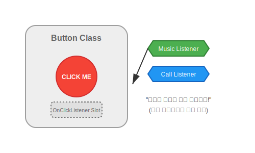

# 12.6 중첩 인터페이스 (Nested Interface)


<br>

## 1. 버튼과 기능 칩 (Magic Button)

"버튼"이라는 클래스를 생각해봅시다.
이 버튼을 눌렀을 때 무슨 일이 일어날까요? 음악을 틀 수도 있고, 전화를 걸 수도 있습니다.
버튼(Class) 내부에 **"무엇을 할지"**를 결정하는 슬롯(Interface)을 만들어두고, 그때그때 필요한 칩(구현 객체)을 끼우는 방식입니다.



*   **중첩 인터페이스**: 버튼 클래스 **안에** 정의된 `OnClickListener` 인터페이스.
*   **이유**: 이 인터페이스는 **오직 버튼을 위해서만** 존재하기 때문에, 굳이 외부에 따로 파일을 만들 필요가 없습니다.

<br>


<br>

## 2. 안드로이드의 패턴 (이벤트 리스너)

안드로이드 앱 개발을 포함한 많은 GUI 프로그래밍에서 이 패턴을 사용합니다.

```java
public class Button {
    // 1. 중첩 인터페이스 선언 (규격 정의)
    public static interface ClickListener {
        void onClick(); // 버튼 눌렸을 때 실행할 추상 메소드
    }
    
    // 2. 필드로 선언 (칩 슬롯)
    private ClickListener listener;
    
    // 3. Setter (칩 끼우기)
    public void setClickListener(ClickListener listener) {
        this.listener = listener;
    }
    
    // 4. 동작 (버튼 클릭)
    public void touch() {
        // 끼워진 칩의 기능을 실행
        if (listener != null) {
            listener.onClick();
        }
    }
}
```

<br>


<br>

## 3. 예제 코드로 확인하기

### 💻 예제 코드

```java
// 파일명: ButtonExample.java
public class ButtonExample {
    public static void main(String[] args) {
        Button btn = new Button();
        
        // 1. 전화 거는 기능 객체 만들기 (익명 객체 대신 로컬 클래스로 명시)
        class CallListener implements Button.ClickListener {
            @Override
            public void onClick() {
                System.out.println("📞 전화를 겁니다.");
            }
        }
        
        // 2. 버튼에 전화 기능 장착
        btn.setClickListener(new CallListener());
        btn.touch(); // "📞 전화를 겁니다."
        
        // 3. 메시지 보내는 기능 장착
        btn.setClickListener(new Button.ClickListener() {
           @Override
           public void onClick() {
               System.out.println("✉️ 메시지를 보냅니다.");
           } 
        });
        btn.touch(); // "✉️ 메시지를 보냅니다."
    }
}
```

### 📋 실행 결과
```
📞 전화를 겁니다.
✉️ 메시지를 보냅니다.
```

> **핵심 요약**: 중첩 인터페이스는 **특정 클래스와 긴밀하게 연결된 규격**을 만들 때 사용합니다. 주로 버튼 이벤트 처리기(Listener)로 많이 봅니다.
