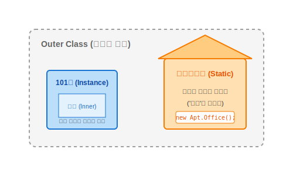

# 12.3 정적 멤버 클래스 (Static Member Class)


<br>

## 1. 아파트 단지와 관리사무소

이번에는 `static` 키워드가 붙은 중첩 클래스입니다.
**"아파트 단지(A) 안에 있는 관리사무소(B)"**를 상상해보세요.



*   **특징**: 관리사무소(`B`)는 아파트 단지(`A`)에 속해있긴 하지만, **특정 입주민(객체)의 집 내부**에 있는 것은 아닙니다.
*   **독립성**: 입주민(인스턴스)이 없어도 관리사무소는 홀로 존재할 수 있습니다. 즉, **바깥 객체(`new A`) 없이도 바로 생성 가능**합니다.

<br>


<br>

## 2. 생성 방법 (new A.B)

정적 멤버 클래스는 바깥 클래스의 **인스턴스가 아닌, 클래스 그 자체**에 소속됩니다.
따라서 바깥 객체를 만들 필요 없이, 클래스 이름으로 바로 접근해서 만듭니다.


```java
// [O] 바깥 객체 생성 없이 바로 생성!
A.B b = new A.B();
```

> **비교**: 인스턴스 멤버 클래스는 `a.new B()`였지만, 정적 멤버 클래스는 `new A.B()`입니다. 문법 차이를 꼭 기억하세요!

<br>


<br>

## 3. 선언과 접근 제한

`static` 키워드를 붙여서 선언합니다.
모든 종류의 필드와 메소드를 선언할 수 있습니다.

```java
public class A {
    // 정적 멤버 클래스
    static class B {
        int field1 = 1;
        static int field2 = 2; // 정적 필드도 가능
        
        void method1() { ... }
        static void method2() { ... }
    }
}
```

### 주의할 점 (접근 범위)
`static` 클래스 내부에서는 **바깥 클래스(A)의 인스턴스 멤버(필드, 메소드)를 쓸 수 없습니다.**
왜냐하면 `B`가 만들어질 때 `A` 객체가 존재한다는 보장이 없기 때문입니다.
(관리사무소 직원이 입주민 냉장고 문을 마음대로 열 수 없는 것과 같습니다!)

<br>


<br>

## 4. 예제 코드로 확인하기

### 💻 예제 코드

```java
// 파일명: A.java
package ch09.sec03.exam01;

public class A {
    // 정적 멤버 클래스
    static class B {
        void print() {
            System.out.println("B 객체(관리사무소)가 일을 합니다.");
        }
    }
}
```

```java
// 파일명: Example.java
package ch09.sec03.exam01;

public class Example {
    public static void main(String[] args) {
        // A(아파트) 객체 생성 없이, 바로 B(관리사무소) 생성 가능
        A.B b = new A.B(); 
        
        b.print();
    }
}
```

### 📋 실행 결과
```
B 객체(관리사무소)가 일을 합니다.
```

> **핵심 요약**: 정적 멤버 클래스는 바깥 클래스와 **느슨한 관계**입니다. 바깥 객체가 없어도 독립적으로 `new` 할 수 있습니다!
