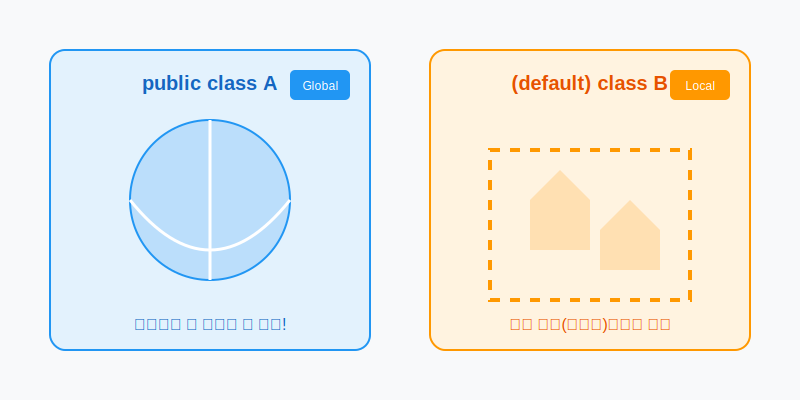
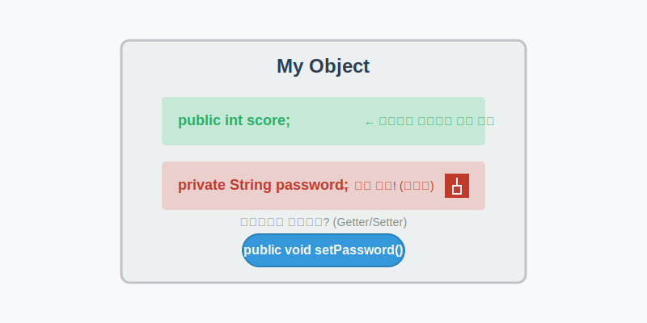

# 6.13 접근 제한자 (보안 시스템)


## 우리 집 보안 시스템

접근 제한자(Access Modifier)는 쉽게 말해 **'우리 집 보안 시스템'**과 같습니다.

집에 있는 모든 물건을 아무나 가져가게 둘 수는 없잖아요?
어떤 건 대문 밖에 내놓고(누구나 가져가도 됨), 어떤 건 안방 금고에 넣어두고(나만 볼 수 있음) 관리해야 안전하겠죠.


자바에서도 마찬가지입니다.

 클래스, 필드, 메소드를 **누구에게 어디까지 공개할 것인가**를 결정하는 것이 바로 접근 제한자입니다.



| 접근 제한자   | 의미 (비유)                  | 접근 가능 범위                        |
| :------------ | :--------------------------- | :------------------------------------ |
| **public**    | **공원** (Public Park)       | **누구나** 출입 가능 (모든 패키지)    |
| **protected** | **상속 재산**                | **자식**에게만 물려줌 (+ 같은 패키지) |
| **default**   | **동네 친구**                | **같은 동네(패키지)** 친구들끼리만    |
| **private**   | **개인 금고** (Private Safe) | **오직 나(클래스 내부)**만 접근 가능  |


## 클래스의 접근 제한

클래스를 만들 때 `public`을 붙일지 말지 결정해야 합니다.





*   **public class**: "전국적으로 유명한 맛집" (어디서든 찾아올 수 있음)
*   **(default) class**: "동네 사람들만 아는 맛집" (같은 패키지 안에서만 사용 가능)


```java
// 전국구 맛집 (어디서든 import 가능)
public class A { ... }

// 동네 맛집 (같은 패키지에서만 사용 가능)
class B { ... }
```


## 생성자의 접근 제한 (열쇠 관리)

객체를 생성(`new`)한다는 것은, 그 객체의 문을 열고 들어가는 것과 같습니다.
생성자에 어떤 접근 제한자를 붙이느냐에 따라 **누구에게 열쇠를 줄 것인가**가 결정됩니다.





코드예시

```java
public class Car {
    // 1. public: 누구나 차를 살 수 있음
    public Car() { ... }

    // 2. private: 아무도 못 삼 (공장 내부용)
    private Car(int secretCode) { ... }
}
```

*   `public Car()`: 누구나 `new Car()`를 호출해서 자동차를 만들 수 있습니다.
*   `private Car()`: 외부에서는 절대 `new Car()`를 할 수 없습니다. (보통 식구들끼리만 쓸 때 사용)


## 필드와 메소드의 접근 제한

객체 안에 있는 데이터(필드)와 기능(메소드)도 보호해야 합니다.




### 데이터 보호 (Private Field)

내 통장 잔고(`balance`)를 다른 사람이 마음대로 `0`원으로 바꾸면 안 되겠죠?
그래서 중요한 데이터는 `private`으로 꽉 잠가둡니다.


코드예시
---

# 6.13 접근 제한자 (보안 시스템)


## 우리 집 보안 시스템

접근 제한자(Access Modifier)는 쉽게 말해 **'우리 집 보안 시스템'**과 같습니다.

집에 있는 모든 물건을 아무나 가져가게 둘 수는 없잖아요?
어떤 건 대문 밖에 내놓고(누구나 가져가도 됨), 어떤 건 안방 금고에 넣어두고(나만 볼 수 있음) 관리해야 안전하겠죠.


자바에서도 마찬가지입니다.

 클래스, 필드, 메소드를 **누구에게 어디까지 공개할 것인가**를 결정하는 것이 바로 접근 제한자입니다.


| 접근 제한자   | 의미 (비유)                  | 접근 가능 범위                        |
| :------------ | :--------------------------- | :------------------------------------ |
| **public**    | **공원** (Public Park)       | **누구나** 출입 가능 (모든 패키지)    |
| **protected** | **상속 재산**                | **자식**에게만 물려줌 (+ 같은 패키지) |
| **default**   | **동네 친구**                | **같은 동네(패키지)** 친구들끼리만    |
| **private**   | **개인 금고** (Private Safe) | **오직 나(클래스 내부)**만 접근 가능  |


## 클래스의 접근 제한

클래스를 만들 때 `public`을 붙일지 말지 결정해야 합니다.


*   **public class**: "전국적으로 유명한 맛집" (어디서든 찾아올 수 있음)
*   **(default) class**: "동네 사람들만 아는 맛집" (같은 패키지 안에서만 사용 가능)


```java
// 전국구 맛집 (어디서든 import 가능)
public class A { ... }

// 동네 맛집 (같은 패키지에서만 사용 가능)
class B { ... }
```


## 생성자의 접근 제한 (열쇠 관리)

객체를 생성(`new`)한다는 것은, 그 객체의 문을 열고 들어가는 것과 같습니다.
생성자에 어떤 접근 제한자를 붙이느냐에 따라 **누구에게 열쇠를 줄 것인가**가 결정됩니다.


코드예시

```java
public class Car {
    // 1. public: 누구나 차를 살 수 있음
    public Car() { ... }

    // 2. private: 아무도 못 삼 (공장 내부용)
    private Car(int secretCode) { ... }
}
```

*   `public Car()`: 누구나 `new Car()`를 호출해서 자동차를 만들 수 있습니다.
*   `private Car()`: 외부에서는 절대 `new Car()`를 할 수 없습니다. (보통 식구들끼리만 쓸 때 사용)


## 필드와 메소드의 접근 제한

객체 안에 있는 데이터(필드)와 기능(메소드)도 보호해야 합니다.


### 데이터 보호 (Private Field)

내 통장 잔고(`balance`)를 다른 사람이 마음대로 `0`원으로 바꾸면 안 되겠죠?
그래서 중요한 데이터는 `private`으로 꽉 잠가둡니다.


코드예시

```java
public class BankAccount {
    // 중요! 외부에서 접근 금지
    private int balance;

    // 공개된 메소드를 통해서만 돈을 입금/출금 가능
    public void deposit(int amount) {
        if (amount > 0) {
            balance += amount;
        }
    }
}
```

*   `field`는 대문 밖에서 안 보입니다. (`private`)
*   `deposit` 버튼은 누구나 누를 수 있습니다. (`public`)
*   외부 사람은 `deposit` 버튼을 통해서만 안전하게 잔고를 바꿀 수 있습니다. 이를 **캡슐화(Encapsulation)**라고 합니다.

---

## 코딩 영단어 학습 📝

코딩에서 영어 단어의 의미만 정확히 이해해도 절반은 성공입니다! 오늘 배운 핵심 영단어들을 다시 한번 짚고 넘어가 볼까요?

*   **`Access Modifier`**: 접근 제한자. (클래스, 필드, 메소드에 누가 어디서 접근할 수 있는지 권한을 통제하는 보안 등급)
*   **`public`**: 퍼블릭, 공공의. (어느 패키지에서나 누구나 자유롭게 접근 가능한 완전 개방 상태)
*   **`protected`**: 프로텍티드, 보호된. (같은 패키지 주민이거나, 다른 패키지라도 나를 상속받은 자식 클래스까지만 접근 가능)
*   **`default`**: 디폴트, 기본값. (접근 제한자를 아무것도 적지 않았을 때 적용되며, 같은 동네(패키지) 내에서만 접근 가능)
*   **`private`**: 프라이빗, 사적인, 개인적인. (오로지 해당 클래스 내부에서만 접근할 수 있는 가장 강력한 비밀 형태)
*   **`Encapsulation`**: 인캡슐레이션, 캡슐화. (중요한 데이터를 `private`으로 꽁꽁 싸매어 보호하고, 안전한 `public` 메소드만 외부에 노출시켜 객체의 무결성을 유지하는 객체지향의 핵심 원리)
