# 6.14 Getter와 Setter (안전한 데이터 관리)

<br>

## 6.14.1 직접 접근의 위험성과 데이터 무결성

객체가 가진 데이터(필드)는 그 객체의 핵심 정보입니다. 만약 외부에서 마음대로 이 데이터를 뜯어고칠 수 있다면 심각한 문제가 생길 수 있습니다.

예를 들어 자동차의 **속도(speed)**를 생각해 봅시다. 물리적으로 속도는 음수(-)가 될 수 없습니다. 그런데 누군가 실수로 속도를 `-100`으로 설정한다면? 현실 세계라면 자동차가 고장 나거나 사고가 날 것입니다. 프로그래밍에서도 마찬가지로 객체의 데이터가 논리에 맞지 않는 상태가 되는 것을 **"무결성(Integrity)이 깨졌다"**고 합니다.

> **비유: 본넷 열고 엔진 만지기**
> 자동차를 운전할 때 가속 페달을 밟는 것이 아니라, 본넷을 열고 엔진의 연료선을 직접 당기는 것은 매우 위험합니다. 필드에 직접 값을 대입하는 것은 이처럼 위험한 행동입니다.



### 💻 코드 예시

```java
// 위험한 코드! (누구나 엔진을 직접 만질 수 있음)
myCar.speed = -100; 
```

### 🔍 코드를 다시 한번 원리와 동작을 살펴봅니다

*   `myCar.speed` 필드에 `-100`이라는 값을 **직접 대입(=)**하고 있습니다.
*   속도는 음수가 될 수 없지만, 컴파일러는 문법적으로 숫자를 넣는 것이니 막지 않습니다.
*   결과적으로 객체 내부에 **잘못된 데이터**가 저장되고, 객체는 고장 난 상태(무결성 훼손)가 됩니다.

<br>
<br>

## 6.14.2 Setter: 검증과 필터링 (가속/브레이크 페달)

이러한 문제를 막기 위해 자바에서는 **필드를 `private`으로 감추어 외부 접근을 차단**하고, 대신 **안전한 통로(메소드)를 제공**하는 방식을 사용합니다. 이때 데이터를 변경하는 안전한 통로가 바로 **Setter(설정자)**입니다.

**Setter**는 외부에서 값을 받아 필드에 저장하기 전에, **"이 값이 유효한가?"를 검사(검증)하는 메소드**입니다. 만약 잘못된 값이 들어오면 이를 차단하거나 적절한 기본값으로 바꿔줄 수 있습니다.

> **비유: 자동차 페달**
> 운전자가 페달을 밟으면 자동차 내부 장치가 안전한 범위 내에서 속도를 조절하듯이, Setter는 잘못된 값이 들어오면 이를 걸러냅니다.


### 💻 코드 예시

```java
// 안전한 코드 (메소드를 통해 데이터 변경)
public void setSpeed(int speed) {
    if (speed < 0) {
        this.speed = 0; // 음수가 들어오면 0으로 강제 설정 (보호)
        return;
    }
    this.speed = speed; // 유효한 값일 때만 필드에 저장
}
```

### 🔍 코드를 다시 한번 원리와 동작을 살펴봅니다

*   **메소드 호출**: 외부에서는 `speed = -100` 대신 `setSpeed(-100)`을 호출해야 합니다.
*   **if 문 (검문소)**: 메소드 내부의 `if (speed < 0)` 문장이 값의 유효성을 검사합니다.
*   **데이터 보호**: 음수 값이 들어오면 필드에 저장하지 않고 `0`으로 바꾸거나 무시하여, 필드(`this.speed`)를 안전하게 지킵니다.

<br>
<br>

## 6.14.3 Getter: 가공과 반환 (자동차 계기판)

**Getter(접근자)**는 필드에 저장된 값을 읽어서 외부로 전달하는 메소드입니다. 단순히 값을 리턴할 수도 있지만, 필요한 경우 **값을 가공해서(단위를 바꾸거나 포맷팅해서) 보여줄 수 있습니다.**

> **비유: 자동차 계기판**
> 엔진 내부에서는 복잡한 기계값으로 속도를 관리하지만, 운전자에게는 보기 편한 `km/h` 숫자로 보여주는 것과 같습니다.



### 💻 코드 예시

```java
// 내부 데이터 가공해서 전달
public double getSpeed() {
    // 내부에서는 mile 단위로 관리하더라도, 외부에는 km 단위로 보여줄 수 있음
    double km = speed * 1.6;
    return km;
}
```

### 🔍 코드를 다시 한번 원리와 동작을 살펴봅니다

*   **정보 은닉**: 외부에서는 `speed` 필드가 실제로 어떻게 저장되어 있는지(단위가 무엇인지) 알 필요가 없습니다.
*   **데이터 가공**: `getSpeed()` 메소드가 내부의 값을 `* 1.6` 하여 보기 편한 형태(`km`)로 바꿔서 줍니다.
*   **읽기 전용**: Getter만 있고 Setter가 없다면, 외부는 값을 읽을 수만 있고 고칠 수는 없는 **읽기 전용(Read Only)** 객체가 됩니다.

<br>
<br>

## 6.14.4 Getter/Setter 작성 규칙

자바에서는 Getter와 Setter를 작성할 때 따르는 약속(관례)이 있습니다.

| 종류       | 리턴 타입 | 메소드 이름 규칙               | 예시            | 설명      |
| :--------- | :-------- | :----------------------------- | :-------------- | :-------- |
| **Setter** | `void`    | `set` + 필드명(첫 글자 대문자) | `setSpeed(...)` | 값을 설정 |
| **Getter** | 일반 타입 | `get` + 필드명(첫 글자 대문자) | `getSpeed()`    | 값을 반환 |
| **Getter** | `boolean` | `is` + 필드명(첫 글자 대문자)  | `isStop()`      | 상태 확인 |

### 💻 코드 예시 (전체)

**Car.java**
```java
package ch06.sec14;

public class Car {
	// 1. 필드는 private으로 보호 (외부 접근 차단)
	private int speed;
	private boolean stop;
	
	// 2. Getter 메소드 (값 읽기)
	public int getSpeed() {
		return speed;
	}
	
	// 3. Setter 메소드 (값 검증 및 변경)
	public void setSpeed(int speed) {
		if (speed < 0) {
			this.speed = 0; // 마이너스 속도는 0으로 초기화
			return;
		} else {
			this.speed = speed;
		}
	}
	
	// boolean 타입의 Getter는 'is'로 시작
	public boolean isStop() {
		return stop;
	}
	
	public void setStop(boolean stop) {
		this.stop = stop;
		if (stop == true) this.speed = 0; // 차가 멈추면 속도도 0으로
	}
}
```

### 🔍 코드를 다시 한번 원리와 동작을 살펴봅니다

1.  **Private 필드 Declaration**: `speed`와 `stop` 필드는 `private`이므로 `Car` 클래스 외부에서 안 보입니다.
2.  **Public 메소드 Open**: 대신 `public`으로 열려 있는 `get...`, `set...` 메소드를 통해서만 대화할 수 있습니다.
3.  **안전한 제어**: `setStop(true)`가 호출되면 단순히 `stop` 상태만 바꾸는 게 아니라, `speed = 0`으로 만드는 추가적인 안전 조치(로직)가 함께 동작합니다. 이것이 캡슐화의 장점입니다.
