# Chapter 06. 클래스 완전 정복

자바 프로그래밍의 가장 중요한 핵심인 '클래스(Class)'를 배우는 챕터입니다. 어렵게 느껴질 수 있는 개념을 우리 주변의 사물에 비유하여 쉽게 설명했습니다.

## 🗺️ 학습 로드맵

먼저 전체 그림을 보고 시작해 보세요.

 
 

## 목차

### 6.1 객체지향 프로그래밍 (부품 조립)
> **"자동차를 만들 때 엔진, 바퀴, 핸들을 조립하듯이 소프트웨어도 부품(객체)을 조립해서 만듭니다."**
> 복잡한 프로그램을 작고 관리하기 쉬운 부품 단위로 나누어 개발하는 방법입니다.

👉 [**학습하기**](./oop)

---

### 6.2 객체와 클래스 (설계도와 제품)
> **"붕어빵 틀(클래스)이 있으면 붕어빵(객체)을 수천 개도 만들 수 있습니다."**
> 클래스는 객체를 만들기 위한 **설계도**이고, 객체는 그 설계도로 만들어진 **실제품**입니다.

👉 [**학습하기**](./object-class)

---

### 6.3 클래스 선언 (설계도 그리기)
> **"어떤 이름의 자동차를 만들지, 어떤 부품이 필요한지 설계도에 적는 과정입니다."**
> `class` 키워드를 사용해 새로운 종류의 객체를 정의합니다.

👉 [**학습하기**](./class-declaration)

---

### 6.4 객체 생성과 클래스 변수 (주문과 배송)
> **"`new`는 공장에 '이 설계도로 제품 하나 만들어주세요!'라고 주문 넣는 것과 같습니다."**
> 메모리 어딘가에 실제 제품(객체)이 만들어지고, 우리는 그 위치(주소)를 리모컨(변수)에 저장해서 사용합니다.

👉 [**학습하기**](./instance-creation)

---

### 6.5 ~ 6.8 클래스의 구성 멤버 (자동차의 구성 요소)
> 자동차에 엔진, 핸들, 기능이 있듯이 클래스도 3가지 요소로 이루어집니다.
> *   **6.6 필드**: **데이터** (자동차의 속도, 색상)
> *   **6.7 생성자**: **초기 설정** (출고 시 색상 결정)
> *   **6.8 메소드**: **동작** (달린다, 멈춘다)

👉 [**학습하기 (6.5 구성 멤버)**](./class-members)
👉 [**학습하기 (6.6 필드)**](./field)
👉 [**학습하기 (6.7 생성자)**](./constructor)
👉 [**학습하기 (6.8 메소드)**](./method)

---

### 6.9 인스턴스 멤버 (개인 물건)
> **"내 주머니 속의 스마트폰은 나만의 것입니다."**
> 객체마다 각각 따로 가지고 있는 데이터입니다. (`this` = 나 자신)

👉 [**학습하기**](./instance-member)

---

### 6.10 정적 멤버 (공용 물건)
> **"교실 벽에 걸린 시계는 모든 학생이 함께 봅니다."**
> 모든 객체가 공유하는 데이터입니다. (`static` = 공용)

👉 [**학습하기**](./static-member)

---

### 6.11 final 필드와 상수 (불변의 법칙)
> **"주민등록번호는 태어날 때 정해지면 평생 바꿀 수 없습니다."**
> 한 번 값을 정하면 수정할 수 없는 데이터입니다. (`final`)

👉 [**학습하기**](./final-constant)

---

### 6.12 패키지 (폴더 정리)
> **"파일이 너무 많으면 폴더별로 정리하듯이, 클래스도 패키지로 정리합니다."**
> 비슷한 성격의 클래스들을 모아두는 디렉토리함입니다.

👉 [**학습하기**](./package)

---

### 6.13 접근 제한자 (보안 장치)
> **"우리 집 안방은 가족만 들어올 수 있고, 대문은 누구나 볼 수 있습니다."**
> `public`, `private` 등을 이용해 중요 데이터에 아무나 접근하지 못하게 막습니다.

👉 [**학습하기**](./access-modifier)

---

### 6.14 Getter와 Setter (안전 장치)
> **"자동차 속도계는 눈으로만 보고(Get), 속도 조절은 브레이크/액셀 페달(Set)로만 합니다."**
> 데이터를 직접 건드리지 않고, 메소드를 통해 안전하게 확인하거나 변경하는 방법입니다.

👉 [**학습하기**](./getter-setter)

---

### 6.15 싱글톤 패턴 (유일한 존재)
> **"우리 회사의 CEO는 단 한 명뿐입니다."**
> 프로그램 전체에서 딱 하나만 존재해야 하는 객체를 만드는 방법입니다.

👉 [**학습하기**](./singleton)

---

### 6.16 레코드 (택배 상자)
> **"데이터를 안전하게 배송하기 위해 밀봉된 상자입니다."**
> 데이터를 담기 위한 용도로, 한 번 담으면 수정할 수 없는 간단한 객체입니다.

👉 [**학습하기**](./record)

---

## 확인문제
👉 [**확인문제 풀러 가기**](./quiz)
