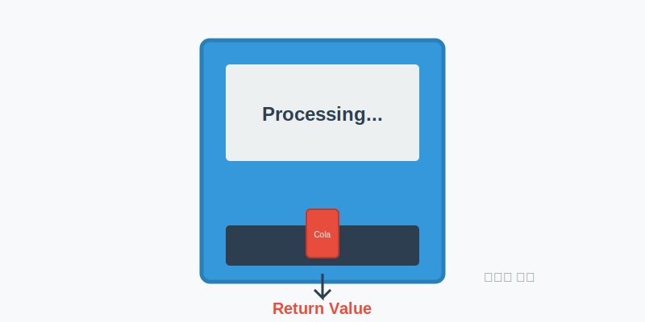

# 6.8 메소드 선언과 호출

메소드(Method)는 객체 안에 있는 **'기능'**이나 **'명령'**이라고 생각하면 쉽습니다.
우리가 로봇에게 "청소해!", "요리해!" 라고 명령을 내리면 로봇이 그 동작을 수행하듯이, 객체에게 일을 시키기 위해 사용하는 것이 바로 메소드입니다.

*   **메소드 선언**: 로봇에게 어떤 동작을 어떻게 수행해야 하는지 가르쳐 주는 것 (설계도 작성)
*   **메소드 호출**: 로봇에게 실제로 그 동작을 하라고 명령하는 것 (실행)


## 메소드 선언

메소드를 선언한다는 것은 "이 기능은 이렇게 작동해야 해"라고 정의하는 것입니다. 마치 요리책에 라면 끓이는 법(레시피)을 적어두는 것과 같습니다.

```java
리턴타입 메소드명 (매개변수, ...) {
    // 실행할 코드를 작성하는 곳
}
```

### 리턴 타입 (결과값)

자판기에서 음료수 버튼을 누르면 음료수가 나오죠? 이때 나오는 **음료수**가 바로 **리턴값**입니다.
메소드가 실행을 마치고 나면, 그 결과를 호출한 곳으로 돌려줄 수 있는데 그 결과의 데이터 타입을 말합니다.

*   **결과가 있는 경우**: `int`, `double`, `String` 등 해당 타입을 적어줍니다. 반드시 `return` 문으로 값을 돌려줘야 합니다.
*   **결과가 없는 경우**: `void`라고 적습니다. "일만 하고 결과 보고는 안 해도 돼"라는 뜻입니다.



```java
void powerOn() { ... } // 전원만 켜고 끝! (리턴값 없음)
double divide(int x, int y) { ... } // 나눗셈 결과를 double로 돌려줘!
```

### 메소드명 (이름)

메소드 이름은 알기 쉽게 짓는 것이 중요합니다.
*   **첫 글자는 소문자**: `run`, `start`
*   **두 번째 단어부터는 대문자**: `setSpeed`, `getName` (캐멀 스타일)

### 매개변수 (재료 투입)

자판기에 동전을 넣어야 음료수가 나오듯이, 메소드를 실행할 때 **필요한 재료(데이터)**를 넣어주는 구멍입니다.



*   **재료가 필요한 경우**: 필요한 변수 타입을 적어줍니다. `int x`, `String name`
*   **재료가 필요 없는 경우**: 빈 괄호 `()` 로 둡니다.

```java
double divide(int x, int y) { ... } // 계산하려면 숫자 2개가 필요해
void powerOn() { ... } // 전원 켜는 건 재료가 필요 없어
```

### 실행 블록

메소드가 호출되었을 때 실제로 실행되는 코드들이 들어있는 중괄호 `{ }` 블록입니다.

**Calculator.java**
```java
package ch06.sec08.exam01;

public class Calculator {
	// 1. 리턴값이 없는 메소드 (void)
	void powerOn() {
		System.out.println("전원을 켭니다.");
	}

	// 2. 리턴값이 없는 메소드 (void)
	void powerOff() {
		System.out.println("전원을 끄니다.");
	}

	// 3. 덧셈 결과를 'int'로 돌려주는 메소드
	int plus(int x, int y) {
		int result = x + y;
		return result; // 결과값 반환
	}

	// 4. 나눗셈 결과를 'double'로 돌려주는 메소드
	double divide(int x, int y) {
		double result = (double)x / (double)y;
		return result; // 결과값 반환
	}
}
```

## 메소드 호출

메소드 호출은 "야, 이거 해!" 하고 **실제로 명령을 내리는 것**입니다. 레시피만 있다고 요리가 되는 게 아니죠? 요리사가 직접 요리를 해야(호출해야) 음식을 먹을 수 있습니다.

### 객체 내부에서 호출

같은 객체 안에서는 이름만 부르면 됩니다. "철수야!" 하고 부르는 것과 같습니다.

```java
void method() {
    powerOn(); // 이름만 부르면 됨
    int r1 = plus(3, 5);
}
```

### 외부 객체에서 호출

다른 객체에 있는 메소드를 부를 때는, 그 객체를 먼저 만들고 `.`(도트) 연산자를 사용해야 합니다. 마치 "옆집.철수야!" 하고 부르는 것과 비슷합니다.

```java
void method() {
    Calculator calc = new Calculator(); // 객체 생성 (도구 준비)
    calc.powerOn(); // 도구.동작()
}
```

**CalculatorExample.java**
```java
package ch06.sec08.exam01;

public class CalculatorExample {
	public static void main(String[] args) {
		// 1. 계산기(객체) 생성
		Calculator myCalc = new Calculator();
		
		// 2. 전원 켜기
		myCalc.powerOn();
		
		// 3. 더하기 기능 사용 (5와 6을 넣으면 11을 줌)
		int result1 = myCalc.plus(5, 6);
		System.out.println("result1: " + result1);
		
		int x = 10;
		int y = 4;
		// 4. 나누기 기능 사용 (10과 4를 넣으면 2.5를 줌)
		double result2 = myCalc.divide(x, y);
		System.out.println("result2: " + result2);
		
		// 5. 전원 끄기
		myCalc.powerOff();
	}
}
```

**실행 결과**
```
전원을 켭니다.
result1: 11
result2: 2.5
전원을 끕니다.
```

## 가변길이 매개변수 (재료 개수가 내 맘대로?)

보통은 재료(매개변수) 개수가 정해져 있지만, 때로는 몇 개가 들어올지 모를 때가 있습니다. 이때 사용하는 것이 `...` (가변길이 매개변수) 입니다.

```java
int sum(int ... values) { ... }
```

이렇게 쓰면 `sum(1, 2)`도 되고, `sum(1, 2, 3, 4, 5)`도 됩니다. 마치 "재료가 몇 개든 다 받아서 처리해 줄게!" 하는 것과 같습니다. 들어온 값들은 **배열**처럼 다뤄집니다.

**Computer.java**
```java
package ch06.sec08.exam02;

public class Computer {
	// 입력된 숫자들을 모두 더해주는 메소드
	int sum(int ... values) {
		int sum = 0;
		
		// 들어온 값들을 하나씩 꺼내서 더하기
		for (int i = 0; i < values.length; i++) {
			sum += values[i];
		}
		
		return sum;
	}
}
```

## return 문 (일 끝내고 복귀!)

`return` 문은 두 가지 역할을 합니다.
1.  **값 돌려주기**: `return 결과값;`
2.  **즉시 종료하기**: `return;` (리턴값이 없는 void 메소드에서 사용)

`return`이 실행되면 메소드는 하던 일을 멈추고 즉시 종료됩니다. 그래서 `return` 뒤에 코드를 쓰면 "이 코드는 절대 실행될 리가 없어(Unreachable code)"라며 에러가 납니다.

## 메소드 오버로딩 (같은 이름, 다른 기능)

**오버로딩(Overloading)**은 같은 이름의 메소드를 여러 개 만드는 것을 말합니다.
"운전하다"라는 말이 자동차를 운전할 때와 오토바이를 운전할 때 조금씩 방식이 다르지만 똑같이 "운전하다"라고 부르는 것과 같습니다.

조건은 **매개변수(재료)가 달라야 한다**는 것입니다.

```java
// 정사각형 넓이 (길이 하나만 필요)
double areaRectangle(double width) { ... }

// 직사각형 넓이 (가로, 세로 두 개 필요)
double areaRectangle(double width, double height) { ... }
```

이름은 `areaRectangle`로 같지만, 재료가 1개냐 2개냐에 따라 알아서 맞는 기능이 실행됩니다. 이것이 바로 **다형성(다양한 형태를 가짐)**의 기초가 됩니다.
