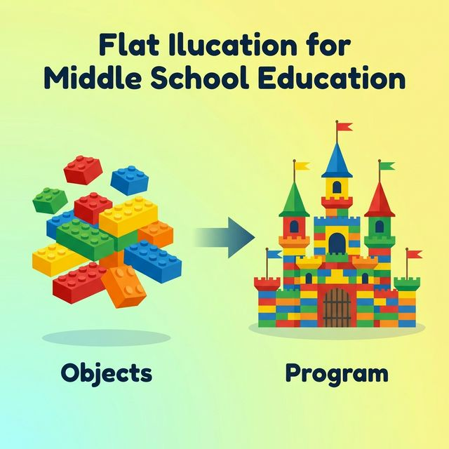
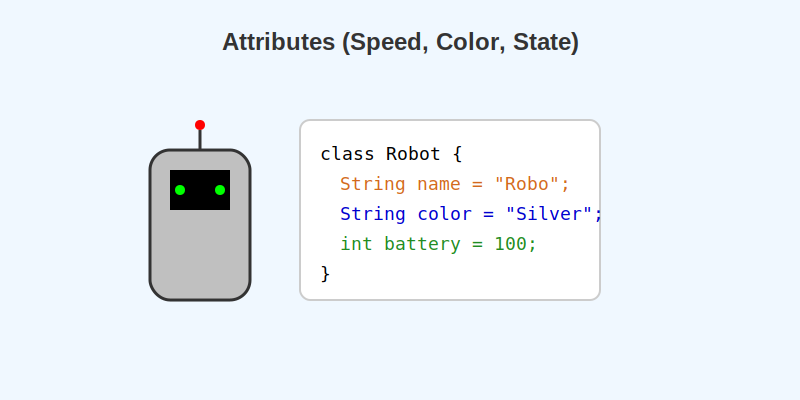
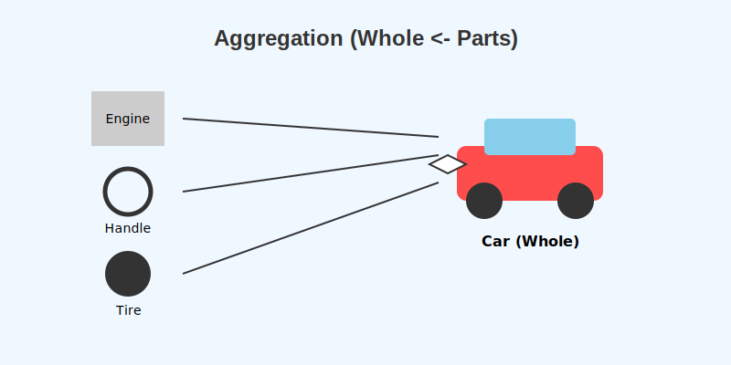

# 6.1 객체지향 프로그래밍 (OOP)

레고 블록으로 멋진 성을 만드는 것을 상상해 보세요.
한 번에 성 전체를 뚝딱 만드는 것이 아니라, 작은 **블록(부품)**들을 먼저 하나하나 만들고 그것들을 조립해서 완성합니다.
자동차도 마찬가지입니다. 엔진, 바퀴, 핸들 같은 부품을 먼저 만들고 조립하죠.



소프트웨어 개발도 이와 비슷합니다.
프로그램의 부품에 해당하는 **'객체(Object)'**를 먼저 만들고, 이 객체들을 하나씩 조립해서 연결하여 완성된 프로그램을 만드는 방법을 **객체지향 프로그래밍(OOP)**이라고 합니다.

## 객체(Object)란?

"세상에 존재하는 모든 것"이 객체가 될 수 있습니다.
*   **물리적 객체**: 자동차, 자전거, 책, 사람
*   **개념적 객체**: 강의, 주문, 학과



객체는 크게 **'속성(특징)'**과 **'동작(기능)'**으로 구성됩니다.

### 속성 (Attributes)
객체가 가지고 있는 고유한 특징이나 상태입니다.
*   **자동차**: 색상, 모델명, 속도
*   **사람**: 이름, 나이, 키



### 동작 (Actions)
객체가 수행하는 기능이나 행동입니다.
*   **자동차**: 달린다, 멈춘다
*   **사람**: 웃다, 걷다, 밥을 먹다



자바에서는 이 '속성'을 **필드(Field)**라고 부르고, '동작'을 **메소드(Method)**라고 부릅니다.

### 객체 모델링 (현실을 코드로!)
현실 세계의 물건을 본떠서 소프트웨어 객체로 설계하는 것을 **객체 모델링**이라고 합니다.
현실의 복잡한 특징 중에서 우리 프로그램에 필요한 핵심적인 특징(속성과 동작)만 추려내는 작업입니다.


## 객체들의 상호작용 (협력)

혼자서 모든 것을 다 하는 사람은 없듯이, 객체들도 서로 돕고 상호작용하며 프로그램을 움직입니다.
사람(객체)이 계산기(객체)를 이용해서 계산을 하는 것처럼 말이죠.


객체끼리 소통하는 수단은 **메소드(Method)**입니다.
"계산해줘!" 라고 메소드를 호출하면, 상대방 객체는 일을 처리하고 그 결과(데이터)를 돌려줍니다.


```java
// 계산기야(객체), 10이랑 20 더해줘(메소드 호출)
int result = calculator.add(10, 20);
```


## 객체 간의 관계

객체들은 서로 다양한 관계를 맺으며 살아갑니다.



### 1. 집합 관계 (부품 관계)
"자동차는 엔진, 타이어, 핸들로 이루어져 있다."
완성품과 부품의 관계입니다. 여러 부품 객체들이 모여 하나의 완성품 객체가 됩니다.



### 2. 사용 관계
"사람이 자동차를 운전한다."
한 객체가 다른 객체의 메소드를 호출하여 사용하는 관계입니다.


### 3. 상속 관계 (부모-자식)
"스마트폰은 전화기의 기능을 물려받았다."
부모 객체의 필드와 메소드를 자식 객체가 그대로 물려받아서 사용하는 관계입니다.



## 객체지향 프로그래밍의 3대 특징

### 캡슐화 (Capsule) -> "보호하다"
알약을 생각해 보세요. 안에 어떤 가루약이 섞여 있는지 모르지만, 우리는 껍질(캡슐)에 싸인 약을 안전하게 먹습니다.
객체도 마찬가지입니다. 중요한 데이터(필드)와 기능(메소드)을 하나로 묶고, 외부에서 함부로 접근하거나 고장 내지 못하도록 **감추는 것**을 캡슐화라고 합니다.


### 상속 (Inheritance) -> "물려받다"
부모님의 재산을 물려받듯이, 상위 객체(부모)의 필드와 메소드를 하위 객체(자식)가 물려받는 것입니다.
*   **장점 1: 재사용성**: 이미 잘 만들어진 부모 코드를 다시 안 짜도 됩니다.
*   **장점 2: 유지보수**: 부모만 고치면 자식들도 다 같이 고쳐집니다.


### 다형성 (Polymorphism) -> "다양한 형태"
같은 사용 방법(버튼 누르기)이지만, 결과가 다양하게 나오는 성질입니다.
자동차 타이어를 '한국타이어'에서 '금호타이어'로 교체해도, 운전자는 똑같이 운전(메소드 호출)만 하면 됩니다. 하지만 성능(결과)은 달라질 수 있습니다. 이것이 다형성입니다.


