# 6.12 패키지 (폴더와 정리)

<br>

## 6.12.1 패키지란? (컴퓨터 폴더)

컴퓨터에 파일이 수천 개가 있는데, 바탕화면에 전부 다 꺼내져 있다고 상상해 보세요. 원하는 문서를 찾으려면 한참 걸릴 것입니다. 

그래서 우리는 **폴더(Directory)**를 만들어서 종류별로 파일을 정리합니다.


자바의 **패키지(Package)**도 똑같습니다. 

수많은 클래스 파일을 체계적으로 관리하기 위해 사용하는 **파일 시스템의 폴더**입니다.


> **비유: 컴퓨터 폴더**
> `C:\Program Files\Java` 처럼 폴더 안에 폴더가 있듯이, 자바 패키지도 점(`.`)을 찍어서 하위 폴더를 구분합니다.


### 패키지 이름 짓는 법 (국룰)

전 세계적으로 유일한 이름을 갖기 위해, 보통 **회사의 도메인 주소를 거꾸로** 사용합니다.

**❓ 왜 도메인을 거꾸로 쓰나요?**
1.  **유일성 보장**: 도메인(예: `naver.com`)은 전 세계에서 딱 하나만 존재하므로, 이를 패키지 이름으로 쓰면 절대 겹치지 않습니다.
2.  **포괄적인 것부터 구체적인 순서로**:
    *   주소를 쓸 때 `대한민국 > 서울 > 강남구` 순서로 쓰는 것과 같습니다.
    *   `com` (상업용 전체) ➡️ `samsung` (삼성이라는 회사) ➡️ `project` (그 안의 특정 프로젝트)

*   삼성전자 프로젝트: `com.samsung.projectname`
*   네이버 프로젝트: `com.naver.projectname`
*   내 개인 프로젝트: `me.myname.myapp`

<br>
<br>

## 6.12.2 패키지 선언

자바 클래스를 만들 때는 "이 클래스는 어느 폴더(패키지)에 소속되어 있다"고 맨 윗줄에 명찰을 달아줘야 합니다.

### 💻 코드 예시

```java
package com.mycompany.car; // 이 파일은 com/mycompany/car 폴더에 있습니다.

public class Engine {
    ...
}
```

### 🔍 코드를 다시 한번 원리와 동작을 살펴봅니다

*   **물리적 위치**: 위 코드를 컴파일하면 실제로 컴퓨터에 `com` 폴더 -> `mycompany` 폴더 -> `car` 폴더가 생성되고, 그 안에 `Engine.class` 파일이 들어갑니다.
*   **전체 이름(Full Name)**: 이 클래스의 진짜 이름은 단순히 `Engine`이 아니라, `com.mycompany.car.Engine`이 됩니다. (성+이름처럼 소속을 포함해야 함)
*   **이동 불가**: 소스 코드의 `package` 선언과 실제 파일 위치가 다르면 실행되지 않습니다.

<br>
<br>

## 6.12.3 `import` 문 (바로가기 만들기)

같은 패키지(같은 폴더)에 있는 친구들끼리는 그냥 이름만 불러도 됩니다. 하지만 **다른 패키지(다른 폴더)**에 있는 클래스를 쓰려면 어떻게 해야 할까요?

1.  **풀 네임 부르기**: `com.hankook.Tire tire = new com.hankook.Tire();` (너무 길고 힘들다)
2.  **`import` 하기**: "나 이제부터 `Tire`라고 하면 저기 딴 동네에 있는 걔를 말하는 거야"라고 미리 선언하기.



### 💻 코드 예시

```java
package com.mycompany.car;

// 다른 동네(패키지)에 있는 Tire 클래스를 가져옴
import com.hankook.Tire;

public class MyCar {
    public static void main(String[] args) {
        // import 덕분에 짧은 이름으로 사용 가능
        Tire myTire = new Tire(); 
    }
}
```

### 🔍 코드를 다시 한번 원리와 동작을 살펴봅니다

*   **위치**: `import` 문은 반드시 `package` 선언 밑에, 그리고 `class` 선언 위에 와야 합니다.
*   **편의성**: `import`는 물리적으로 파일을 복사해오는 것이 아니라, 컴파일러에게 "이 이름은 저기서 찾아라"라고 **바로가기(Shortcut)**를 알려주는 역할을 합니다.
*   **이름 충돌**: 만약 `com.hankook.Tire`와 `com.kumho.Tire`를 둘 다 쓰고 싶다면? 이때는 `import`로 해결이 안 되니, 어쩔 수 없이 코드 안에서 풀 네임(`com.kumho.Tire`)을 써야 합니다.
