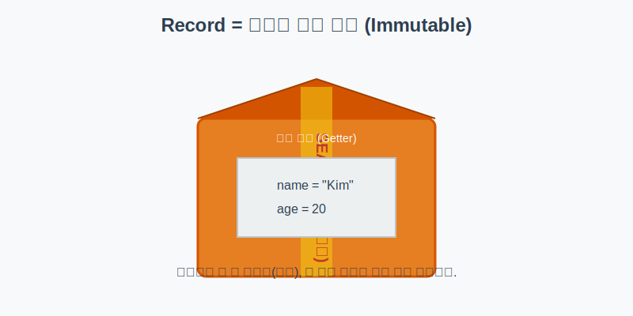

# 6.16 레코드 (데이터 보관 상자)

<br>

## 6.16.1 레코드(Record)란?

**"데이터를 안전하게 배달하는 밀봉된 상자"**

프로그래밍을 하다 보면 단순히 데이터를 보관하거나 전달하기 위한 객체(DTO, Data Transfer Object)를 자주 만들게 됩니다. 예전에는 이를 위해 엄청나게 긴 코드를 작성해야 했지만, 자바 14부터는 **`record`** 키워드로 한 줄이면 충분해졌습니다.

> **비유: 밀봉된 택배 상자**
> *   **생성**: 상자에 물건(데이터)을 넣고 테이프로 밀봉합니다. created
> *   **사용**: 투명한 창문(Getter)으로 내용을 볼 수는 있지만, 밀봉되어 있어서 내용물을 바꿀 수는(Setter 없음) 없습니다. 이를 **불변(Immutable) 객체**라고 합니다.



<br>
<br>

## 6.16.2 얼마나 간편해졌을까요?

기존 클래스로 "이름과 나이"를 가진 사람을 만들려면 **50줄**이 넘는 코드가 필요했습니다. 하지만 레코드는 단 **1줄**이면 됩니다.



### 💻 코드 예시

```java
// 기존 방식 (너무 길다...)
public class Person {
    private final String name;
    private final int age;

    public Person(String name, int age) {
        this.name = name;
        this.age = age;
    }

    public String name() { return name; }
    public int age() { return age; }
    
    // equals, hashCode, toString ... (생략)
}
```

```java
// 레코드 방식 (깔끔!)
public record Person(String name, int age) {}
```


### 🔍 코드를 다시 한번 원리와 동작을 살펴봅니다

*   **자동 생성**: `record`를 쓰면 컴파일러가 알아서 다음을 만들어줍니다.
    1.  **private final 필드**: 데이터를 바꿀 수 없게 `final`로 선언합니다.
    2.  **생성자**: 데이터를 받아서 필드에 넣는 초기화 코드를 만듭니다.
    3.  **Getter**: `getName()` 대신 `name()`이라는 이름으로 값을 꺼내는 메소드를 만듭니다.
    4.  **toString()**: 객체 내용을 예쁘게 출력해줍니다. (`Person[name=Kim, age=20]`)
    5.  **equals() & hashCode()**: 두 객체의 내용물이 같은지 비교하는 기능을 만듭니다.

<br>
<br>

## 6.16.3 레코드 사용하기

레코드는 일반 클래스처럼 `new` 키워드로 생성하고 사용하면 됩니다.

### 💻 코드 예시

```java
public class RecordExample {
    public static void main(String[] args) {
        // 1. 레코드 객체 생성 (택배 상자 포장)
        Person p = new Person("Kim", 20);
        
        // 2. 데이터 꺼내기 (투명 창문으로 보기)
        System.out.println("이름: " + p.name()); // getName() 아님!
        System.out.println("나이: " + p.age());
        
        // 3. 내용물 확인 (toString 자동 적용)
        System.out.println(p); // 출력: Person[name=Kim, age=20]
        
        // 4. 불변성 (수정 불가)
        // p.name = "Lee"; // 에러! 수정할 수 없습니다.
        // p.setName("Lee"); // 에러! Setter 메소드 자체가 없습니다.
    }
}
```

<br>
<br>

## 6.16.4 레코드 패턴 (Java 21)

자바 21부터는 레코드의 내용을 더 쉽게 꺼낼 수 있는 **레코드 패턴** 기능이 추가되었습니다. 상자를 열어서 내용물을 변수에 바로 담아주는 기능입니다.

### 💻 코드 예시

```java
Object obj = new Person("Park", 30);

if (obj instanceof Person(String n, int a)) {
    // 꺼내진 데이터가 n(이름), a(나이) 변수에 자동으로 들어감
    System.out.println("이름: " + n);
    System.out.println("나이: " + a);
}
```

이전에는 `Person p = (Person) obj;` 처럼 형변환을 하고 `p.name()`을 호출해야 했지만, 이제는 훨씬 직관적으로 사용할 수 있습니다.

---

## 코딩 영단어 학습 📝

코딩에서 영어 단어의 의미만 정확히 이해해도 절반은 성공입니다! 오늘 배운 핵심 영단어들을 다시 한번 짚고 넘어가 볼까요?

*   **`Record`**: 레코드. (주로 단순한 데이터를 예쁘게 보관하고 실어나르기 위해, 번거로운 Getter나 `toString()` 등을 자동으로 뚝딱 뒤에서 만들어주는 자바의 한 줄짜리 마법 상자)
*   **`Immutable`**: 이뮤터블, 불변의. (레코드 상자처럼 한 번 최초의 데이터가 담기고 밀봉되면, 그 후로는 내용물을 절대 수정하거나 뜯어고칠 수 없는 굳건한 상태)
