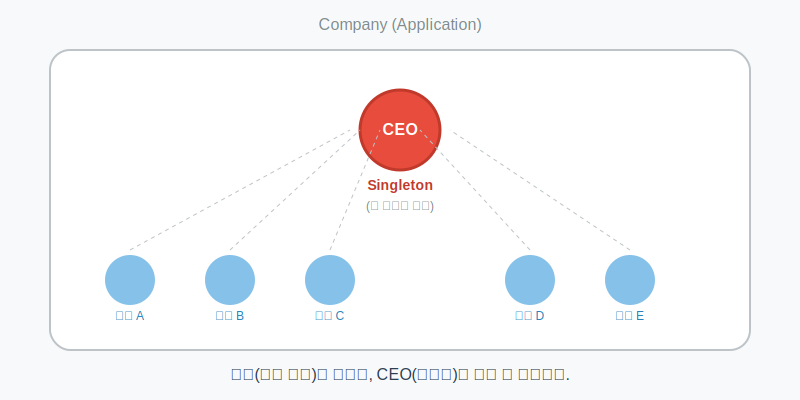

# 6.15 싱글톤 패턴 (유일한 객체)

<br>

## 6.15.1 싱글톤(Singleton)이란?

**"우리 회사의 CEO는 단 한 명뿐입니다."**

프로그램 전체에서 **단 하나의 객체만 생성해서 공유**하고 싶을 때 사용하는 디자인 패턴입니다.

> **비유: 회사의 CEO**
> *   **직원(일반 객체)**: 필요할 때마다 계속 채용(생성)할 수 있습니다.
> *   **CEO(싱글톤)**: 회사에 딱 한 명만 존재해야 합니다. 만약 CEO가 두 명이라면 회사가 혼란에 빠질 것입니다.



<br>
<br>

## 6.15.2 싱글톤 만들기 (CEO 집무실 만들기)

싱글톤을 만드는 핵심은 **"외부에서 마음대로 생성(`new`)하지 못하게 막는 것"**입니다.

### 💻 코드 예시

```java
public class Singleton {
    // 1. 자기 자신을 나타내는 단 하나의 객체 (CEO 본인)
    // private static으로 선언하여 외부 접근을 막고, 클래스 로딩 시 딱 한 번만 생성됨
    private static Singleton singleton = new Singleton();
    
    // 2. 생성자를 private으로 막기 (채용 공고 내리기)
    // 외부에서 'new Singleton()'을 호출할 수 없게 됨
    private Singleton() {}
    
    // 3. 외부에서 접근할 수 있는 유일한 통로 (비서실)
    public static Singleton getInstance() {
        return singleton;
    }
}
```

### 🔍 코드를 다시 한번 원리와 동작을 살펴봅니다

1.  **`private static` 필드**: 자신의 객체를 딱 하나만 만들어서 `singleton` 변수에 담아둡니다. `static`이므로 메모리에 딱 한 번만 올라갑니다.
2.  **`private` 생성자**: 생성앞에 `private`을 붙이면 외부 클래스에서 `new Singleton()`을 호출했을 때 **컴파일 에러**가 발생합니다. 즉, 외부에서는 객체를 만들 수 없습니다.
3.  **`public static getInstance()`**: 외부에서 CEO를 만날 수 있는 유일한 방법입니다. 이 메소드를 호출하면 미리 만들어둔 `singleton` 객체를 리턴해줍니다.


<br>
<br>

## 6.15.3 싱글톤 사용하기

외부에서는 `new` 대신 `getInstance()` 메소드를 사용해야 합니다.

### 💻 코드 예시

```java
public class SingletonExample {
    public static void main(String[] args) {
        // Singleton obj1 = new Singleton(); // (X) 컴파일 에러! 생성자 호출 불가
        
        // 올바른 사용법: getInstance() 호출
        Singleton obj1 = Singleton.getInstance();
        Singleton obj2 = Singleton.getInstance();
        
        // 두 변수가 같은 객체를 가리키는지 확인
        if (obj1 == obj2) {
            System.out.println("같은 CEO입니다."); 
        } else {
            System.out.println("다른 사람입니다.");
        }
    }
}
```

### 🔍 코드를 다시 한번 원리와 동작을 살펴봅니다

*   **실행 결과**: `같은 CEO입니다.` 가 출력됩니다.
*   **참조값 비교**: `obj1`과 `obj2`는 완전히 동일한 주소(메모리 위치)를 가리키고 있습니다. 즉, 객체는 하나뿐이고 변수 두 개가 그 하나를 바라보는 것입니다.

<br>
<br>

## 6.15.4 왜 싱글톤을 쓸까요?

*   **메모리 절약**: 객체를 매번 새로 만들지 않고 하나를 계속 쓰니까 메모리가 낭비되지 않습니다.
*   **데이터 공유**: 전역(Global)에서 사용되는 설정 정보나, 데이터베이스 연결 객체처럼 **모두가 공유해야 하는 데이터**를 관리할 때 유용합니다.
