# 6.10 정적 멤버 (공유하는 속성)

<br>

## 6.10.1 정적(static) 멤버란?

**"우리 모두의 것, 하나만 있으면 돼!"**

정적(static) 멤버는 객체마다 따로 만드는 것이 아니라, **클래스에 고정되어 딱 하나만 생성되고 모든 객체가 공유하는 멤버**입니다.

> **비유: 강의실 벽시계 vs 손목시계**
> *   **정적 멤버 (벽시계)**: 강의실 앞 벽에 하나만 걸려있고, 모든 학생이 그 시간을 봅니다. (공유)
> *   **인스턴스 멤버 (손목시계)**: 학생(객체)마다 각자 차고 있으며, 시간이 서로 다를 수 있습니다. (개별)



### 💻 코드 예시

```java
public class Calculator {
    // 정적 필드 (파이 값은 세상 모든 계산기에서 똑같음)
    static double pi = 3.14159; 
    
    // 인스턴스 필드 (색깔은 계산기마다 다름)
    String color; 
}
```

### 🔍 코드를 다시 한번 원리와 동작을 살펴봅니다

*   **메모리 위치 (Method Area)**: `static` 키워드가 붙은 멤버는 프로그램이 시작될 때 **메소드 영역(Method Area)**이라는 곳에 딱 한 번 저장됩니다. 이곳은 모든 스레드와 객체가 공유하는 공용 공간입니다.
*   **생명 주기 (Lifecycle)**: 정적 멤버는 **클래스가 메모리에 로딩될 때** 생성되어 프로그램이 끝날 때까지 살아있습니다. 반면 인스턴스 멤버(`color`)는 **객체가 생성(`new`)될 때** 힙(Heap) 영역에 생겼다가, 객체가 사라지면(GC) 같이 사라집니다.



<br>
<br>

## 6.10.2 정적 멤버 사용법

정적 멤버는 객체에 소속된 것이 아니라 클래스 자체에 소속되어 있습니다. 그래서 **객체를 생성하지 않고, 클래스 이름으로 바로 접근**하는 것이 정석입니다.

### 💻 코드 예시

```java
public class Calculator {
    static double pi = 3.14159;
    static int plus(int x, int y) { return x + y; }
}
```

```java
// 객체 생성 없이 바로 사용 가능!
double result = 10 * 10 * Calculator.pi; // 클래스이름.필드
int sum = Calculator.plus(10, 5);        // 클래스이름.메소드
```

### 🔍 코드를 다시 한번 원리와 동작을 살펴봅니다

*   **도트(.) 연산자**: `Calculator.pi`는 "Calculator 클래스에 있는 pi"를 가리킵니다. 객체 주소를 통하지 않고, 클래스 이름으로 주소를 바로 찾아갑니다.
*   **접근 권장사항**: `new Calculator().pi` 처럼 객체를 통해서도 접근할 수는 있지만, 이는 권장되지 않습니다. 코드만 봤을 때 이것이 공유 변수인지 개인 변수인지 헷갈릴 수 있기 때문입니다. 그래서 이클립스 같은 도구는 "클래스 이름으로 접근해라(Access static way)"라고 경고를 줍니다.

<br>
<br>

## 6.10.3 정적 블록 (static block)

정적 필드에 복잡한 초기화가 필요하다면 `static { ... }` 블록을 사용합니다. 생성자는 객체를 만들 때 실행되지만, 정적 블록은 클래스를 준비할 때 실행됩니다.

### 💻 코드 예시

```java
public class Television {
    static String company = "Samsung";
    static String model = "OLED";
    static String info;
    
    // 정적 블록: 복잡한 초기화 로직
    static {
        info = company + "-" + model; // "Samsung-OLED"
        // 여기서 로깅을 하거나 복잡한 계산을 수행할 수음
    }
}
```

### 🔍 코드를 다시 한번 원리와 동작을 살펴봅니다

*   **실행 시점**: 정적 블록은 클래스가 메모리로 로딩될 때 **자동으로, 딱 한 번** 실행됩니다. 객체를 100개 만들어도 정적 블록은 처음에 한 번만 실행됩니다.
*   **용도**: 주로 필드값들을 조합하거나, 초기 설정값 계산, 또는 드라이버 로딩과 같이 프로그램 시작 시 딱 한 번만 해야 하는 작업에 사용합니다.

<br>
<br>

## 6.10.4 정적 메소드 사용 시 주의할 점

**"공용 공간에서 개인 물건을 찾지 마세요!"**

정적 메소드는 객체 생성 없이 실행될 수 있습니다. 그런데 정적 메소드 안에서 갑자기 "내 이름은 뭐야?(`this.name`)"라고 묻는다면 컴퓨터는 대답할 수 없습니다. 왜냐하면 '나(this)'라는 객체가 아직 안 만들어졌을 수도 있기 때문입니다.

### 💻 코드 예시

```java
public class Car {
    int speed; // 인스턴스 필드 (개인 물건)
    
    static void run() { // 정적 메소드 (공용 기능)
        // [에러 발생 원인] 
        // run()은 객체 없이도 실행될 수 있는데, 
        // speed는 객체가 있어야만 존재합니다. 시점이 맞지 않습니다.
        // speed = 100; (X)
        // this.speed = 100; (X)
    }
    
    public static void main(String[] args) {
        // main도 정적 메소드입니다.
        // run(); // 바로 사용 불가 (아직 객체가 없음)
        
        Car myCar = new Car(); // 객체 생성 (이제 힙 영역에 speed가 생김)
        myCar.speed = 60;      // 이제 사용 가능
    }
}
```

### 🔍 코드를 다시 한번 원리와 동작을 살펴봅니다

*   **this 사용 불가**: `this`는 현재 실행 중인 객체의 주소를 가리킵니다. 하지만 정적 메소드는 객체 없이 실행되므로 참조할 주소(`this`)가 없습니다.
*   **인스턴스 멤버 접근 불가**: 같은 이유로 인스턴스 필드나 메소드는 사용할 수 없습니다. 이들은 객체 생성 후에 힙 영역에 생성되는데, 정적 메소드는 그보다 먼저(클래스 로딩 시) 메모드 영역에 존재하기 때문입니다.
*   **해결 방법**: 정적 메소드 안에서 인스턴스 멤버를 쓰고 싶다면, 반드시 **객체를 먼저 생성(`new`)** 하고 참조 변수를 통해 접근해야 합니다.
