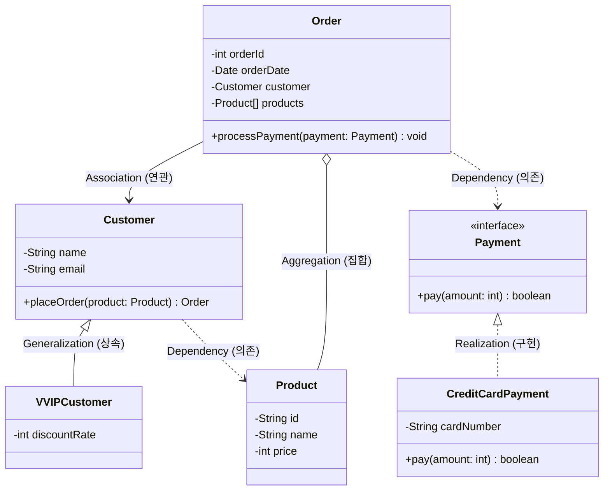
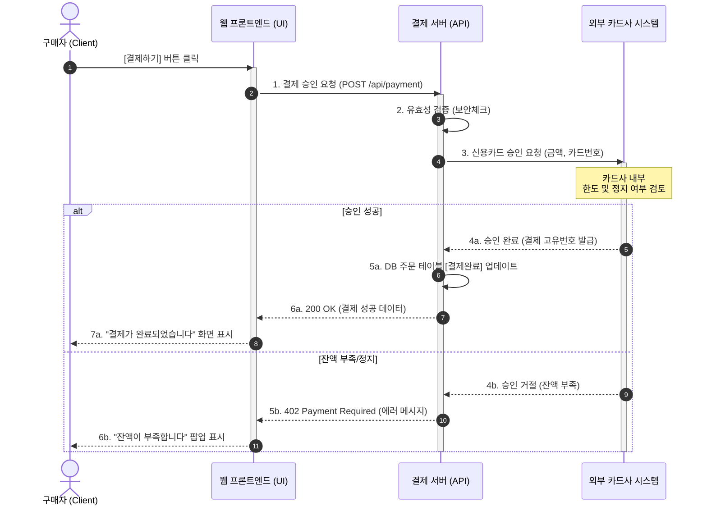
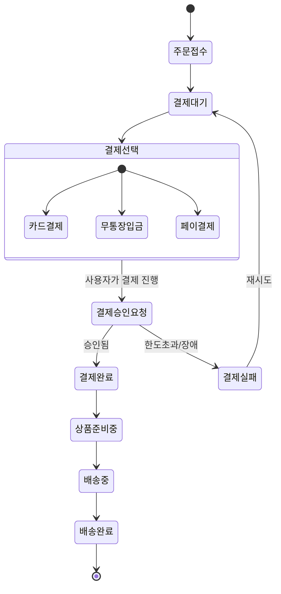

# Chapter 19. UML (Unified Modeling Language)

객체지향 설계와 구현의 뼈대를 시각적으로 표현하기 위해 사용되는 표준 모델링 언어인 UML의 기초를 상세한 예제와 함께 학습합니다.

## 1. UML 개요

UML은 소프트웨어 시스템의 산출물들을 명세화, 시각화, 구축, 문서화하는 데 사용되는 범용 모델링 언어입니다.

### UML의 필요성 (건축 설계도 비유)

```mermaid
flowchart LR
    Dev1[개발자 A\n(생각하는 구조)] -. "의사소통 오류 발생 가능성" .-> Dev2[개발자 B\n(생각하는 구조)]
    
    UML{UML 설계도\n(공통 언어)}
    
    Dev1 -->|규칙에 맞게 작성| UML
    UML -->|정확한 의도 파악| Dev2
    
    style UML fill:#fff2cc,stroke:#d6b656,stroke-width:2px
```

건축물을 지을 때 표준화된 설계도가 필요하듯, 소프트웨어를 구축할 때도 모든 팀원이 동일하게 이해할 수 있는 "표준화된 도면(UML)"이 필요합니다. 

---

## 2. 클래스 다이어그램 (Class Diagram)

시스템의 정적인 뼈대를 나타내는 가장 중요한 다이어그램입니다. 클래스의 구조와 클래스 간의 관계를 보여줍니다.

### 2.1 클래스 기본 표현
클래스는 이름(Name), 필드/속성(Attributes), 메소드/연산(Operations)의 3단 구획으로 표현합니다.
*   `+` : public (어디서나 접근 가능)
*   `-` : private (클래스 내부에서만 접근 가능)
*   `#` : protected (상속 관계 및 같은 패키지 내 접근 가능)
*   `~` : default/package (같은 패키지 내 접근 가능)

### 2.2 클래스 간의 관계 (Relationships)
객체지향 프로그래밍을 할 때 자바 코드로 클래스 간의 상호작용을 어떻게 맺느냐에 따라 다양한 다이어그램 기호가 사용됩니다.

1.  **일반화 (Generalization / 상속)**: 부모 클래스를 상속받는 관계 (`extends`). 속이 빈 실선 화살표.
2.  **실체화 (Realization / 인터페이스 구현)**: 인터페이스의 규격을 구현하는 관계 (`implements`). 속이 빈 점선 화살표.
3.  **의존 (Dependency)**: 메소드 매개변수나 지역 변수로 일시적으로 사용하는 관계. 실질적으로 계속 유지되지는 않음. 점선 화살표.
4.  **연관 (Association)**: 다른 객체의 참조를 필드로 계속 가지고 있는 관계. 실선 화살표.
5.  **집합 (Aggregation) & 합성 (Composition)**: 전체(Whole)와 부분(Part)의 관계. 합성은 부분이 전체에 완전히 종속된 강한 관계(예: 차와 엔진)이고, 집합은 독립적으로 존재할 수 있는 약한 관계(예: 동아리와 학생)입니다.

### 💡 클래스 다이어그램 종합 예제 (쇼핑몰 시스템)

다음은 쇼핑몰의 고객, 주문, 상품 관계를 나타내는 종합 다이어그램입니다.



---

## 3. 유스케이스 다이어그램 (Use Case Diagram)

시스템이 "무엇"을 하는지 사용자(Actor)의 관점에서 기술한 다이어그램입니다. 개발 초기 요구사항 분석 단계에서 가장 많이 사용됩니다.

### 💡 유스케이스 다이어그램 예제 (쇼핑몰 회원/비회원 기능)

*   **포함(Include)**: 특정 유스케이스를 실행하기 위해 반드시 실행되어야 하는 필수 관계. (예: `상품 결제`를 하려면 반드시 `로그인`이 선행되어야 함)
*   **확장(Extend)**: 특정 조건에서 선택적으로 실행되는 추가적인 관계. (예: `상품 검색` 시 검색 결과가 없으면 `유사 상품 추천` 기능이 실행될 수 있음)

```mermaid
flowchart LR
    %% 액터 정의
    Guest([비회원])
    User([일반 회원])
    Admin([관리자])
    
    %% 유스케이스 정의
    subgraph Shopping Mall System
        direction TB
        UC1(상품 조회)
        UC2(장바구니 담기)
        UC3(회원가입)
        UC4(로그인)
        UC5(상품 결제)
        UC6(결제 내역 조회)
        UC7(회원 등급 관리)
    end
    
    %% 액터와 유스케이스 연결
    Guest --> UC1
    Guest --> UC2
    Guest --> UC3
    
    Guest <|-- User %% 회원은 비회원이 할 수 있는 일을 다 할 수 있음
    
    User --> UC4
    User --> UC5
    User --> UC6
    
    Admin --> UC7
    
    %% 포함(Include) 및 확장(Extend) 관계
    UC5 -. "<<include>>\n(결제 전 필수)" .-> UC4
    UC6 -. "<<include>>\n(조회 전 필수)" .-> UC4
```

---

## 4. 시퀀스 다이어그램 (Sequence Diagram)

시스템의 구성 요소(객체)들이 시간의 흐름(위에서 아래로)에 따라 어떻게 메시지를 주고받는지 상호작용을 나타냅니다. 

### 💡 시퀀스 다이어그램 예제 (쇼핑몰 신용카드 결제 로직 단계)



---

## 5. 액티비티 다이어그램 (Activity Diagram)

알고리즘, 비즈니스 프로세스, 흐름도(Flowchart)와 매우 유사하게, 어떤 활동들이 순차적 혹은 분기되어 발생하는지를 표현합니다.

### 💡 액티비티 다이어그램 예제 (주문 처리 프로세스)



---

## 요약

*   **클래스 다이어그램**: 프로그램의 **"정적 구조(뼈대)"** (상속, 구현, 의존, 연관 등)
*   **유스케이스 다이어그램**: **"기능(요구사항)"** 중심 (사용자 관점)
*   **시퀀스 다이어그램**: **"객체 간의 상호작용(시간/흐름)"** (API 흐름 추적에 유용)
*   **액티비티 다이어그램**: **"로직(알고리즘)의 순서"** (알고리즘 분기점 파악)

효율적인 객체지향 설계를 위해서는 이러한 도구들을 상황에 맞게 적절히 혼합하여 사용하는 것이 중요합니다.
