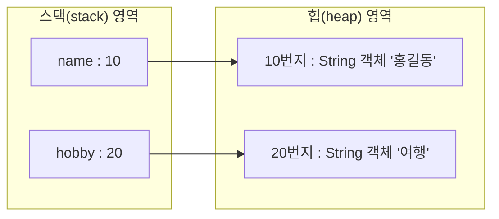
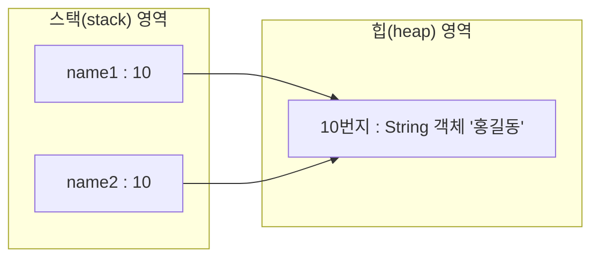
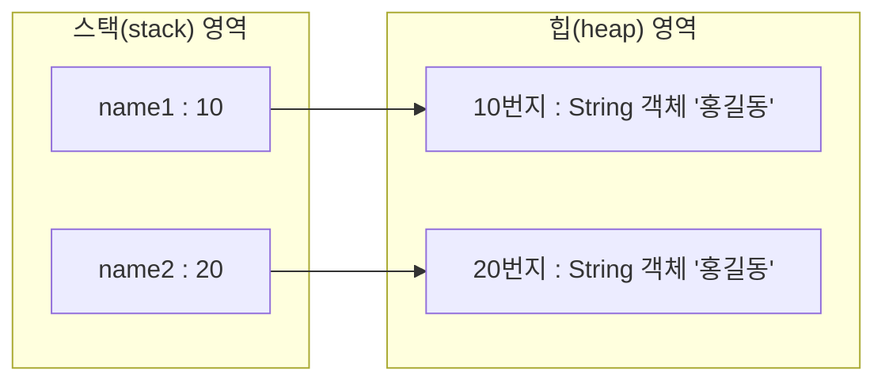
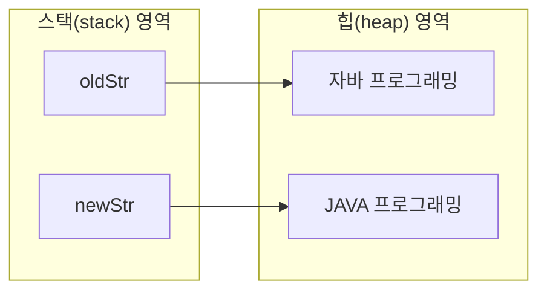

# 5.5 문자열(String) 타입

자바의 문자열은 `String` 객체로 생성된다. 다음은 두 개의 `String` 변수 `name`과 `hobby`를 선언하고 문자열 리터럴을 대입한 것이다. `name` 변수와 `hobby` 변수에 문자열 리터럴이 대입되면 문자열은 `String` 객체로 생성되고, 객체의 번지가 각각 대입된다. 

```java
String name;            //String 타입 변수 name 선언
name = "홍길동";        //name 변수에 문자열 대입
String hobby = "여행";  //String 타입 변수 hobby를 선언하고 문자열 대입

```





**문자열 비교**

자바는 문자열 리터럴이 동일하다면 `String` 객체를 공유하도록 설계되어 있다. 다음과 같이 `name1`과 `name2` 변수에 "홍길동"을 대입할 경우, `name1`과 `name2` 변수에는 동일한 `String` 객체의 번지가 저장된다. 

```java
String name1 = "홍길동";
String name2 = "홍길동";

```





`String` 변수에 문자열 리터럴을 대입하는 것이 일반적이지만, `new` 연산자로 직접 `String` 객체를 생성하고 대입할 수도 있다. `new` 연산자는 새로운 객체를 만드는 연산자로 객체 생성 연산자라고 한다. 

```java
String name1 = new String("홍길동");
String name2 = new String("홍길동");

```


이 경우 `name1`과 `name2` 변수는 서로 다른 `String` 객체의 번지를 가지게 된다. 




그렇기 때문에 문자열 리터럴로 생성하느냐 `new` 연산자로 생성하느냐에 따라 비교 연산자의 결과가 달라질 수 있다. 

```java
String name1 = "홍길동";
String name2 = "홍길동";
String name3 = new String("홍길동");

```


`name1`과 `name2`는 동일한 문자열 리터럴로 생성된 객체를 참조하기 때문에 `name1 == name2`의 결과는 `true`가 나오지만, `name3`은 `new` 연산자로 `String` 객체를 별도로 생성했기 때문에 `name1 == name3`의 결과는 `false`가 나온다. 

```java
name1 == name2 //결과: true
name1 == name3 //결과: false

```


동일한 `String` 객체든 다른 `String` 객체든 상관없이 내부 문자열만을 비교할 경우에는 `String` 객체의 `equals()` 메소드를 사용한다. 

```java
boolean result = str1.equals(str2); //문자열이 같은지 검사(대소문자 구분)
boolean result = !str1.equals(str2); //문자열이 다른지 검사

```


**[예제: EqualsExample.java]**

```java
package ch05.sec05;

public class EqualsExample {
    public static void main(String[] args) {
        String strVar1 = "홍길동";
        String strVar2 = "홍길동";

        if(strVar1 == strVar2) {
            System.out.println("strVar1과 strVar2는 참조가 같음");
        } else {
            System.out.println("strVar1과 strVar2는 참조가 다름");
        }

        if(strVar1.equals(strVar2)) {
            System.out.println("strVar1과 strVar2는 문자열이 같음");
        }

        String strVar3 = new String("홍길동");
        String strVar4 = new String("홍길동");

        if(strVar3 == strVar4) {
            System.out.println("strVar3과 strVar4는 참조가 같음");
        } else {
            System.out.println("strVar3과 strVar4는 참조가 다름");
        }

        if(strVar3.equals(strVar4)) {
            System.out.println("strVar3과 strVar4는 문자열이 같음");
        }
    }
}

```


**실행 결과**

```
strVar1과 strVar2는 참조가 같음
strVar1과 strVar2는 문자열이 같음
strVar3과 strVar4는 참조가 다름
strVar3과 strVar4는 문자열이 같음

```


`String` 변수에 빈 문자열("")을 대입할 수도 있다. 빈 문자열도 `String` 객체로 생성되기 때문에 변수가 빈 문자열을 참조하는지 조사하려면 다음과 같이 `equals()` 메소드를 사용해야 한다. 

**[예제: EmptyStringExample.java]**

```java
package ch05.sec05;

public class EmptyStringExample {
    public static void main(String[] args) {
        String hobby = "";
        if(hobby.equals("")) {
            System.out.println("hobby 변수가 참조하는 String 객체는 빈 문자열");
        }
    }
}

```


**실행 결과**

```
hobby 변수가 참조는 String 객체는 빈 문자열

```


**문자 추출**

문자열에서 특정 위치의 문자를 얻고 싶다면 `charAt()` 메소드를 이용할 수 있다. `charAt()` 메소드는 매개값으로 주어진 인덱스의 문자를 리턴한다. 여기서 인덱스란 0에서부터 '문자열의 길이-1'까지의 번호를 말한다. 다음 코드를 보자. 

```java
String subject = "자바 프로그래밍";
char charValue = subject.charAt(3);

```


"자바 프로그래밍"이라는 문자열은 다음과 같이 인덱스를 매길 수 있다. 따라서 `charAt(3)`은 3번 인덱스 위치에 있는 문자, 즉 '프'가 해당된다. 

| 자  | 바  |     | 프  | 로  | 그  | 래  | 밍  |
| --- | --- | --- | --- | --- | --- | --- | --- |
| 0   | 1   | 2   | 3   | 4   | 5   | 6   | 7   |
|     |

 |  |  |  |  |  |  |  |

다음 예제는 주민등록번호에서 성별에 해당하는 7번째 문자를 읽고 남자 또는 여자인지를 출력한다. 

**[예제: CharAtExample.java]**

```java
package ch05.sec05;

public class CharAtExample {
    public static void main(String[] args) {
        String ssn = "9506241230123";
        char sex = ssn.charAt(6);
        switch (sex) {
            case '1':
            case '3':
                System.out.println("남자입니다.");
                break;
            case '2':
            case '4':
                System.out.println("여자입니다.");
                break;
        }
    }
}

```


**실행 결과**

```
남자입니다.

```


**문자열 길이**

문자열에서 문자의 개수를 얻고 싶다면 `length()` 메소드를 사용한다. 다음 코드를 보자. 

```java
String subject = "자바 프로그래밍";
int length = subject.length();

```


`length` 변수에는 8이 저장된다. `subject` 객체의 문자열 길이는 공백을 포함해서 8개이기 때문이다. 

**[예제: LengthExample.java]**

```java
package ch05.sec05;

public class LengthExample {
    public static void main(String[] args) {
        String ssn = "9506241230123";
        int length = ssn.length();
        if(length == 13) {
            System.out.println("주민등록번호 자릿수가 맞습니다.");
        } else {
            System.out.println("주민등록번호 자릿수가 틀립니다.");
        }
    }
}

```


**실행 결과**

```
주민등록번호 자릿수가 맞습니다.

```


**문자열 대체**

문자열에서 특정 문자열을 다른 문자열로 대체하고 싶다면 `replace()` 메소드를 사용한다. `replace()` 메소드는 기존 문자열은 그대로 두고, 대체한 새로운 문자열을 리턴한다. 다음 코드를 보자. 

```java
String oldStr = "자바 프로그래밍";
String newStr = oldStr.replace("자바", "JAVA");

```


`String` 객체의 문자열은 변경이 불가한 특성을 갖기 때문에 `replace()` 메소드가 리턴하는 문자열은 원래 문자열의 수정본이 아니라 완전히 새로운 문자열이다. 따라서 `newStr` 변수는 다음 그림과 같이 새로 생성된 "JAVA 프로그래밍" 문자열을 참조한다. 




**[예제: ReplaceExample.java]**

```java
package ch05.sec05;

public class ReplaceExample {
    public static void main(String[] args) {
        String oldStr = "자바 문자열은 불변입니다. 자바 문자열은 String입니다.";
        String newStr = oldStr.replace("자바", "JAVA");

        System.out.println(oldStr);
        System.out.println(newStr);
    }
}

```


**실행 결과**

```
자바 문자열은 불변입니다. 자바 문자열은 String입니다.
JAVA 문자열은 불변입니다. JAVA 문자열은 String입니다.

```


**문자열 잘라내기**

문자열에서 특정 위치의 문자열을 잘라내어 가져오고 싶다면 `substring()` 메소드를 사용한다. 

| 메소드                                    | 설명                                    |
| ----------------------------------------- | --------------------------------------- |
| `substring(int beginIndex)`               | beginIndex에서 끝까지 잘라내기          |
| `substring(int beginIndex, int endIndex)` | beginIndex에서 endIndex 앞까지 잘라내기 |
|                                           |

 |  |

다음 코드를 보자. 

```java
String ssn = "880815-1234567";
String firstNum = ssn.substring(0, 6);
String secondNum = ssn.substring(7);

```


주어진 `ssn`의 문자열을 인덱싱하면 다음과 같다. 

| 8   | 8   | 0   | 8   | 1   | 5   | -   | 1   | 2   | 3   | 4   | 5   | 6   | 7   |
| --- | --- | --- | --- | --- | --- | --- | --- | --- | --- | --- | --- | --- | --- |
| 0   | 1   | 2   | 3   | 4   | 5   | 6   | 7   | 8   | 9   | 10  | 11  | 12  | 13  |
|     |

 |  |  |  |  |  |  |  |  |  |  |  |  |  |

따라서 `firstNum` 변수는 "880815" 문자열을 참조하고, `secondNum` 변수는 "1234567"을 참조한다. 

**[예제: SubStringExample.java]**

```java
package ch05.sec05;

public class SubStringExample {
    public static void main(String[] args) {
        String ssn = "880815-1234567";
        
        String firstNum = ssn.substring(0, 6);
        System.out.println(firstNum);
        
        String secondNum = ssn.substring(7);
        System.out.println(secondNum);
    }
}

```


**실행 결과**

```
880815
1234567

```


**문자열 찾기**

문자열에서 특정 문자열의 위치를 찾고자 할 때에는 `indexOf()` 메소드를 사용한다. `indexOf()` 메소드는 주어진 문자열이 시작되는 인덱스를 리턴한다. 다음 코드를 보자. 

```java
String subject = "자바 프로그래밍";
int index = subject.indexOf("프로그래밍");

```


`index` 변수에는 3이 저장되는데, 다음과 같이 "자바 프로그래밍"에서 "프로그래밍" 문자열의 인덱스 위치가 3번이기 때문이다. 

| 자  | 바  |     | 프  | 로  | 그  | 래  | 밍  |
| --- | --- | --- | --- | --- | --- | --- | --- |
| 0   | 1   | 2   | 3   | 4   | 5   | 6   | 7   |
|     |

 |  |  |  |  |  |  |  |

만약 주어진 문자열이 포함되어 있지 않으면 `indexOf()` 메소드는 -1을 리턴한다. 주어진 문자열이 포함되어 있는지 여부에 따라 실행 코드를 달리하고 싶다면 `if` 조건식을 사용해서 다음과 같이 코드를 작성할 수 있다. 

```java
int index = subject.indexOf("프로그래밍");
if(index == -1) {
    //포함되어 있지 않은 경우
} else {
    //포함되어 있는 경우
}

```


주어진 문자열이 단순히 포함되어 있는지만 조사하고 싶다면 `contains()` 메소드를 사용하면 편리하다. 원하는 문자열이 포함되어 있으면 `contains()` 메소드는 `true`를 리턴하고, 그렇지 않으면 `false`를 리턴한다. 

```java
boolean result = subject.contains("프로그래밍");

```


**[예제: IndexOfContainsExample.java]**

```java
package ch05.sec05;

public class IndexOfContainsExample {
    public static void main(String[] args) {
        String subject = "자바 프로그래밍";
        
        int location = subject.indexOf("프로그래밍");
        System.out.println(location);
        String substring = subject.substring(location);
        System.out.println(substring);
        
        location = subject.indexOf("자바");
        if(location != -1) {
            System.out.println("자바와 관련된 책이군요.");
        } else {
            System.out.println("자바와 관련 없는 책이군요.");
        }
        
        boolean result = subject.contains("자바");
        if(result) {
            System.out.println("자바와 관련된 책이군요.");
        } else {
            System.out.println("자바와 관련 없는 책이군요.");
        }
    }
}

```


**실행 결과**

```
3
프로그래밍
자바와 관련된 책이군요.
자바와 관련된 책이군요.

```


**문자열 분리**

문자열이 구분자를 사용하여 여러 개의 문자열로 구성되어 있을 경우, 이를 따로 분리해서 얻고 싶다면 `split()` 메소드를 사용한다. 다음 코드를 보자. 

```java
String board = "번호,제목,내용,성명";
String[] arr = board.split(",");

```


`board`는 쉼표로 구분된 문자열을 가지고 있다. `split()` 메소드를 호출할 때 쉼표를 제공하면 분리된 문자열로 구성된 배열(array)을 얻을 수 있다. 배열은 5.6절에서 학습한다. 

| arr[0] | arr[1] | arr[2] | arr[3] |
| ------ | ------ | ------ | ------ |
| "번호" | "제목" | "내용" | "성명" |
|        |

 |  |  |  |

**[예제: SplitExample.java]**

```java
package ch05.sec05;

public class SplitExample {
    public static void main(String[] args) {
        String board = "1,자바 학습,참조 타입 String을 학습합니다.,홍길동";
        
        //문자열 분리
        String[] tokens = board.split(",");
        
        //인덱스별로 읽기
        System.out.println("번호: " + tokens[0]);
        System.out.println("제목: " + tokens[1]);
        System.out.println("내용: " + tokens[2]);
        System.out.println("성명: " + tokens[3]);
        System.out.println();
        
        //for 문을 이용한 읽기
        for(int i=0; i<tokens.length; i++) {
            System.out.println(tokens[i]);
        }
    }
}

```


**실행 결과**

```
번호: 1
제목: 자바 학습
내용: 참조 타입 String을 학습합니다.
성명: 홍길동

1
자바 학습
참조 타입 String을 학습합니다.
홍길동

```
