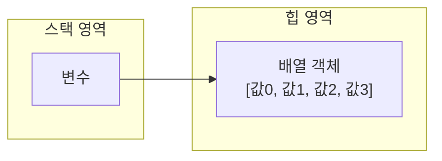

# 5.6 배열(Array) 타입

변수는 하나의 값만 저장할 수 있다. 따라서 저장해야 할 값의 수가 많아지면 그만큼 많은 변수가 필요하다. 예를 들어 학생 30명의 성적을 저장하고 평균값을 구한다고 가정해 보자. 먼저 학생 30명의 성적을 저장하기 위해 변수 30개를 선언해야 한다.

```java
int score1 = 83;
int score2 = 90;
int score3 = 87;
...
int score30 = 75;
```

그리고 평점을 구하기 위해 변수들을 아래와 같이 모두 더해야 한다. 이와 같은 방법은 매우 비효율적이고 지루한 코딩이 된다. 만약 전교 학생들에 대한 성적을 처리한다면 수백 개의 변수 선언으로 인해 코드는 끔찍해진다.

```java
int sum = score1;
sum += score2;
sum += score3;
...
sum += score30;
int avg = sum / 30;
```

따라서 많은 양의 값을 다루는 좀 더 효율적인 방법이 필요한데, 이것이 배열이다. 배열은 연속된 공간에 값을 나열시키고, 각 값에 인덱스(index)를 부여해 놓은 자료구조이다. 앞의 예에서 학생들의 성적은 다음과 같이 score 배열로 생성할 수 있다.

**score 배열**

| 인덱스 | 0    | 1    | 2    | 3    | 4    | ...  | 29   |
| :----- | :--- | :--- | :--- | :--- | :--- | :--- | :--- |
| **값** | 83   | 90   | 87   | 93   | 78   | ...  | 75   |

인덱스는 대괄호 `[]`와 함께 사용하여 각 항목의 값을 읽거나 저장하는데 사용한다. 예를 들어 `score[0]`은 83, `score[1]`은 90, `score[2]`는 87 값을 가진다. 이렇게 성적을 배열에 저장하면 평균값은 배열의 인덱스를 이용해서 for 문으로 쉽게 구할 수 있다.

```java
int sum = 0;
for (int i=0; i<30; i++) {
    sum += score[i];
}
int avg = sum / 30;
```

for 문이 30번 반복 실행하면서 `i`는 0~29까지 변한다. 따라서 `sum` 변수에는 `score[0]`~`score[29]`까지의 값이 더해지고, 마지막으로 얻은 `sum`을 배열의 길이 30으로 나누면 평균 `avg`를 얻을 수 있다. 이렇게 하면 학생 수가 30명이 아니라 수백 명이 되어도 for 문의 `i<30`만 변경하면 되므로 많은 양의 데이터를 적은 코드로 손쉽게 처리할 수 있다.

배열은 다음과 같은 특징을 가지고 있다.
* 배열은 같은 타입의 값만 관리한다.
* 배열의 길이는 늘리거나 줄일 수 없다.

`int` 배열은 `int` 타입의 값만 관리하고, `String` 배열은 문자열만 관리한다. 배열은 생성과 동시에 길어가 결정된다. 또한 한 번 결정된 배열의 길이는 늘리거나 줄일 수 없다.

## 배열 변수 선언

배열을 사용하기 위해서는 우선 배열 변수를 선언해야 한다. 배열 변수 선언은 다음과 같이 두 가지 형태로 작성할 수 있지만, 관례적으로 첫 번째 방법을 주로 사용한다.

```java
타입[] 변수;  // 관례적 방법
타입 변수[];
```

타입은 배열에 저장될 값의 타입을 말하는데, 다음은 타입별로 배열을 선언하는 방법이다.

```java
int[] intArray;
double[] doubleArray;
String[] strArray;

int intArray[];
double doubleArray[];
String strArray[];
```

배열 변수는 참조 변수이다. 배열도 객체이므로 힙 영역에 생성되고 배열 변수는 힙 영역의 배열 주소를 저장한다. 참조할 배열이 없다면 배열 변수도 `null`로 초기화할 수 있다.

```java
타입[] 변수 = null;
```

만약 배열 변수가 `null` 값을 가진 상태에서 `변수[인덱스]`로 값을 읽거나 저장하게 되면 `NullPointerException`이 발생한다.

## 값 목록으로 배열 생성

배열에 저장될 값의 목록이 있다면, 다음과 같이 간단하게 배열을 생성할 수 있다.

```java
타입[] 변수 = { 값0, 값1, 값2, 값3, ... };
```



중괄호 `{}`는 나열된 값들을 항목으로 가지는 배열을 힙에 생성하고, 번지를 리턴한다. 배열 변수는 리턴된 번지를 저장함으로써 참조가 이루어진다. "Spring", "Summer", "Fall", "Winter" 문자열을 갖는 배열은 다음과 같이 생성할 수 있다.

```java
String[] season = { "Spring", "Summer", "Fall", "Winter" };
```

이렇게 생성된 배열에서 "Spring"은 `season[0]`, "Fall"은 `season[2]`로 읽을 수 있다. `season[1]`의 "Summer"를 "여름"으로 바꾸고 싶다면 다음과 같이 대입 연산자를 사용하면 된다.

```java
season[1] = "여름";
```

**[예제: ArrayCreateByValueListExample1.java]**

```java
package ch05.sec06;

public class ArrayCreateByValueListExample1 {
    public static void main(String[] args) {
        //배열 변수 선언과 배열 생성
        String[] season = { "Spring", "Summer", "Fall", "Winter" };

        //배열의 항목값 읽기
        System.out.println("season[0] : " + season[0]);
        System.out.println("season[1] : " + season[1]);
        System.out.println("season[2] : " + season[2]);
        System.out.println("season[3] : " + season[3]);

        //인덱스 1번 항목의 값 변경
        season[1] = "여름";
        System.out.println("season[1] : " + season[1]);
        System.out.println();

        //배열 변수 선언과 배열 생성
        int[] scores = { 83, 90, 87 };

        //총합과 평균 구하기
        int sum = 0;
        for(int i=0; i<3; i++) {
            sum += scores[i];
        }
        System.out.println("총합 : " + sum);
        double avg = (double) sum / 3;
        System.out.println("평균 : " + avg);
    }
}
```

**실행 결과**

```
season[0] : Spring
season[1] : Summer
season[2] : Fall
season[3] : Winter
season[1] : 여름

총합 : 260
평균 : 86.66666666666667
```

중괄호 `{}`로 감싼 값의 목록을 배열 변수에 대입할 때 주의할 점이 있다. 배열 변수를 미리 선언한 후에는 값 목록을 변수에 대입할 수 없다.

```java
타입[] 변수;
변수 = { 값0, 값1, 값2, 값3, ... }; // 컴파일 에러
```

배열 변수를 선언한 시점과 값 목록이 대입되는 시점이 다르다면 다음과 같이 `new 타입[]`을 중괄호 앞에 붙여 주면 된다. 타입은 배열 변수를 선언할 때 사용한 타입과 동일하게 주면 된다.

```java
변수 = new 타입[] { 값0, 값1, 값2, 값3, ... };
```

예를 들어 String 배열 변수 `names`를 선언한 후에 값 목록을 대입할 경우에는 `new String[]`을 중괄호 앞에 붙여 줘야 한다.

```java
String[] names = null;
names = new String[] { "신용권", "홍길동", "김자바" };
```

메소드의 매개변수가 배열 타입일 경우에도 마찬가지다. 아래와 같이 매개변수로 `int[]` 배열 타입을 갖는 `printItem()` 메소드가 있다고 가정해 보자. `printItem()` 메소드를 호출할 때 매개값으로 중괄호로 감싼 값 목록을 주면 컴파일 에러가 발생한다.

```java
//메소드 선언
void printItem(int[] scores) { ... }

//잘못된 메소드 호출
printItem( {95, 85, 90} ); // 컴파일 에러
```

매개변수가 이미 선언되어 있고, 호출 시 값 목록을 제공하므로 다음과 같이 호출해야 한다.

```java
//올바른 메소드 호출
printItem( new int[] {95, 85, 90} );
```

> **메소드 선언과 호출**
>
> 메소드 선언과 호출은 6장에서 자세히 설명한다. 간단히 말하면 메소드 선언은 이름 있는 중괄호 블록을 만드는 것이고 메소드 호출은 해당 이름으로 중괄호 블록을 실행하는 것이다.

**[예제: ArrayCreateByValueListExample2.java]**

```java
package ch05.sec06;

public class ArrayCreateByValueListExample2 {
    public static void main(String[] args) {
        //배열 변수 선언
        int[] scores;
        
        //배열 변수에 배열을 대입
        scores = new int[] { 83, 90, 87 };
        
        //배열 항목의 총합을 구하고 출력
        int sum1 = 0;
        for(int i=0; i<3; i++) {
            sum1 += scores[i];
        }
        System.out.println("총합 : " + sum1);

        //배열을 매개값으로 주고, printItem() 메소드 호출
        printItem( new int[] { 83, 90, 87 } );
    }

    //printItem() 메소드 선언
    public static void printItem( int[] scores ) {
        //매개변수가 참조하는 배열의 항목을 출력
        for(int i=0; i<3; i++) {
            System.out.println("score[" + i + "]: " + scores[i]);
        }
    }
}
```

**실행 결과**

```
총합 : 260
score[0]: 83
score[1]: 90
score[2]: 87
```

## new 연산자로 배열 생성

값의 목록은 없지만 향후 값들을 저장할 목적으로 배열을 미리 생성할 수도 있다. `new` 연산자를 다음과 같이 사용하면 배열 객체를 생성시킨다. 길이는 배열이 저장할 수 있는 항목 수를 말한다.

```java
타입[] 변수 = new 타입[길이];
```

`new` 연산자는 해당 길이의 배열을 생성하고 배열의 번지를 리턴하기 때문에 배열 변수에 대입할 수 있다. 이미 배열 변수가 선언된 후에도 다음과 같이 대입이 가능하다.

```java
타입[] 변수 = null;
변수 = new 타입[길이];
```

다음은 길이 5인 `int[]` 배열을 생성하고, 배열 번지를 `intArray` 변수에 대입한다.

```java
int[] intArray = new int[5];
```

`new` 연산자로 배열을 처음 생성하면 배열 항목은 기본값으로 초기화된다. 다음 표는 타입별 배열의 초기값을 보여 준다.

| 분류          | 데이터 타입    | 초기값     |
| :------------ | :------------- | :--------- |
| **기본 타입** | `byte[]`       | 0          |
|               | `char[]`       | `'\u0000'` |
|               | `short[]`      | 0          |
|               | `int[]`        | 0          |
|               | `long[]`       | 0L         |
|               | `float[]`      | 0.0F       |
|               | `double[]`     | 0.0        |
|               | `boolean[]`    | `false`    |
| **참조 타입** | `클래스[]`     | `null`     |
|               | `인터페이스[]` | `null`     |

> **NOTE**
> 정수 배열은 0, 실수 배열은 0.0, 논리 배열은 false, 참조 배열은 null로 초기화된다.

`int[]` 배열을 다음과 같이 생성했다면 항목은 모두 0으로 초기화된다.

```java
int[] scores = new int[30];
```

`String` 배열을 다음과 같이 생성했다면 항목은 모두 `null`로 초기화된다.

```java
String[] names = new String[30];
```

배열을 생성하고 난 후 특정 인덱스 항목을 새로운 값으로 변경하는 방법은 동일하다.

```java
변수[인덱스] = 값;
```

**[예제: ArrayCreateByNewExample.java]**

```java
package ch05.sec06;

public class ArrayCreateByNewExample {
    public static void main(String[] args) {
        //배열 변수 선언과 배열 생성
        int[] arr1 = new int[3];
        //배열 항목의 초기값 출력
        for(int i=0; i<3; i++) {
            System.out.print("arr1[" + i + "] : " + arr1[i] + ", ");
        }
        System.out.println();
        
        //배열 항목의 값 변경
        arr1[0] = 10;
        arr1[1] = 20;
        arr1[2] = 30;
        //배열 항목의 변경 값 출력
        for(int i=0; i<3; i++) {
            System.out.print("arr1[" + i + "] : " + arr1[i] + ", ");
        }
        System.out.println("\n");
        
        //배열 변수 선언과 배열 생성
        double[] arr2 = new double[3];
        //배열 항목의 초기값 출력
        for(int i=0; i<3; i++) {
            System.out.print("arr2[" + i + "] : " + arr2[i] + ", ");
        }
        System.out.println();
        
        //배열 항목의 값 변경
        arr2[0] = 0.1;
        arr2[1] = 0.2;
        arr2[2] = 0.3;
        //배열 항목의 변경 값 출력
        for(int i=0; i<3; i++) {
            System.out.print("arr2[" + i + "] : " + arr2[i] + ", ");
        }
        System.out.println("\n");
        
        //배열 변수 선언과 배열 생성
        String[] arr3 = new String[3];
        //배열 항목의 초기값 출력
        for(int i=0; i<3; i++) {
            System.out.print("arr3[" + i + "] : " + arr3[i] + ", ");
        }
        System.out.println();
        
        //배열 항목의 값 변경
        arr3[0] = "1월";
        arr3[1] = "2월";
        arr3[2] = "3월";
        //배열 항목의 변경값 출력
        for(int i=0; i<3; i++) {
            System.out.print("arr3[" + i + "] : " + arr3[i] + ", ");
        }
    }
}
```

**실행 결과**

```
arr1[0] : 0, arr1[1] : 0, arr1[2] : 0, 
arr1[0] : 10, arr1[1] : 20, arr1[2] : 30, 

arr2[0] : 0.0, arr2[1] : 0.0, arr2[2] : 0.0, 
arr2[0] : 0.1, arr2[1] : 0.2, arr2[2] : 0.3, 

arr3[0] : null, arr3[1] : null, arr3[2] : null, 
arr3[0] : 1월, arr3[1] : 2월, arr3[2] : 3월, 
```

## 배열 길이

배열의 길이란 배열에 저장할 수 있는 항목 수를 말한다. 코드에서 배열의 길이를 얻으려면 도트(.) 연산자를 사용해서 참조하는 배열의 `length` 필드를 읽으면 된다.

```java
배열변수.length;
```

배열의 `length` 필드는 읽기만 가능하므로 다음과 같이 값을 변경할 수는 없다.

```java
intArray.length = 10; // 컴파일 에러 발생
```

배열 길이는 for 문을 사용해서 전체 배열 항목을 반복할 때 많이 사용된다.

**[예제: ArrayLengthExample.java]**

```java
package ch05.sec06;

public class ArrayLengthExample {
    public static void main(String[] args) {
        //배열 변수 선언과 배열 대입
        int[] scores = { 84, 90, 96 };
        
        //배열 항목의 총합 구하기
        int sum = 0;
        for(int i=0; i<scores.length; i++) {
            sum += scores[i];
        }
        System.out.println("총합 : " + sum);
        
        //배열 항목의 평균 구하기
        double avg = (double) sum / scores.length;
        System.out.println("평균 : " + avg);
    }
}
```

**실행 결과**

```
총합 : 270
평균 : 90.0
```

for 문의 조건식에서 `<` 연산자를 사용한 이유는 배열의 마지막 인덱스는 배열 길이보다 1이 적기 때문이다. 인덱스를 초과해서 사용하면 `ArrayIndexOutOfBoundsException`이 발생한다.
