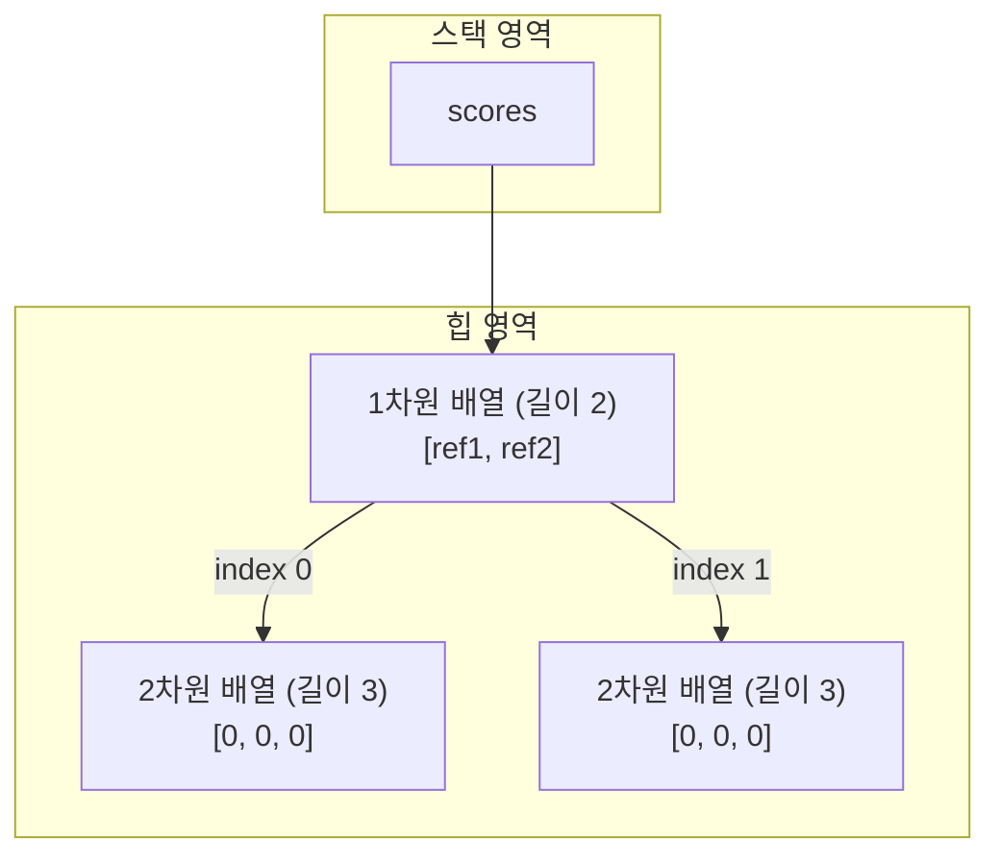

# 5.7 다차원 배열

배열 항목에는 또 다른 배열이 대입될 수 있는데, 이러한 배열을 다차원 배열이라고 부른다. 다음은 2차원과 3차원 배열의 모양을 보여 준다.

```java
// 2차원 배열
int[][] scores = new int[2][3];
```



배열 변수는 1차원 배열을 참조하고, `변수[0]`은 다시 2차원 배열을 참조하고, `변수[1]`은 또 다른 2차원 배열을 참조한다. 위 그림처럼 다차원 배열은 1차원 배열을 서로 연결한 것이라고 볼 수 있다. 다차원 배열에서 각 차원의 항목에 접근하는 방법은 다음과 같다.

```java
변수[1차원인덱스][2차원인덱스]...[n차원인덱스]
```

## 값 목록으로 다차원 배열 생성

값 목록으로 다차원 배열을 생성하려면 배열 변수 선언 시 타입 뒤에 대괄호 `[]`를 차원의 수만큼 붙이고, 값 목록도 마찬가지로 차원의 수만큼 중괄호를 중첩시킨다. 다음은 값 목록으로 2차원 배열을 생성하고 변수에 대입하는 방법을 보여 준다.

```java
타입[][] 변수 = {
    {값1, 값2, ...}, // 1차원 배열의 0 인덱스
    {값3, 값4, ...}, // 1차원 배열의 1 인덱스
    ...
};
```

두 반의 학생 점수를 저장하는 배열을 생성해 보자. 각 반은 1차원 배열이고, 해당 반의 학생 점수는 2차원 배열이라고 볼 수 있다.

```java
int[][] scores = {
    { 80, 90, 96 }, // 1차원 배열의 0 인덱스: 첫 번째 반 성적
    { 76, 88 }      // 1차원 배열의 1 인덱스: 두 번째 반 성적
};
```

각 반의 학생 점수는 다음과 같이 읽을 수 있다.

```java
int score = scores[0][2]; // 96
int score = scores[1][1]; // 88
```

반의 개수는 1차원 배열의 길이와 동일하고, 각 반의 학생 수는 2차원 배열의 길이와 동일하기 때문에 다음과 같이 배열의 `length` 필드로 반의 개수와 학생 수를 알 수 있다.

```java
scores.length;      // 반의 수: 2
scores[0].length;   // 첫 번째 반의 학생 수: 3
scores[1].length;   // 두 번째 반의 학생 수: 2
```

**[예제: MultidimensionalArrayByValueListExample.java]**

```java
package ch05.sec07;

public class MultidimensionalArrayByValueListExample {
    public static void main(String[] args) {
        //2차원 배열 생성
        int[][] scores = {
            { 80, 90, 96 },
            { 76, 88 }
        };

        //배열의 길이
        System.out.println("1차원 배열 길이(반의 수): " + scores.length);
        System.out.println("2차원 배열 길이(첫 번째 반의 학생 수): " + scores[0].length);
        System.out.println("2차원 배열 길이(두 번째 반의 학생 수): " + scores[1].length);

        //첫 번째 반의 세 번째 학생의 점수 읽기
        System.out.println("scores[0][2]: " + scores[0][2]);

        //두 번째 반의 두 번째 학생의 점수 읽기
        System.out.println("scores[1][1]: " + scores[1][1]);

        //첫 번째 반의 평균 점수 구하기
        int class1Sum = 0;
        for(int i=0; i<scores[0].length; i++) {
            class1Sum += scores[0][i];
        }
        double class1Avg = (double) class1Sum / scores[0].length;
        System.out.println("첫 번째 반의 평균 점수: " + class1Avg);

        //두 번째 반의 평균 점수 구하기
        int class2Sum = 0;
        for(int i=0; i<scores[1].length; i++) {
            class2Sum += scores[1][i];
        }
        double class2Avg = (double) class2Sum / scores[1].length;
        System.out.println("두 번째 반의 평균 점수: " + class2Avg);

        //전체 학생의 평균 점수 구하기
        int totalStudent = 0;
        int totalSum = 0;
        for(int i=0; i<scores.length; i++) {       // 반의 수만큼 반복
            totalStudent += scores[i].length;      // 반의 학생 수 합산
            for(int k=0; k<scores[i].length; k++) { // 해당 반의 학생 수만큼 반복
                totalSum += scores[i][k];           // 학생 점수 합산
            }
        }
        double totalAvg = (double) totalSum / totalStudent;
        System.out.println("전체 학생의 평균 점수: " + totalAvg);
    }
}
```

**실행 결과**

```
1차원 배열 길이(반의 수): 2
2차원 배열 길이(첫 번째 반의 학생 수): 3
2차원 배열 길이(두 번째 반의 학생 수): 2
scores[0][2]: 96
scores[1][1]: 88
첫 번째 반의 평균 점수: 88.66666666666667
두 번째 반의 평균 점수: 82.0
전체 학생의 평균 점수: 86.0
```

## new 연산자로 다차원 배열 생성

`new` 연산자로 다차원 배열을 생성하려면 배열 변수 선언 시 타입 뒤에 대괄호 `[]`를 차원의 수만큼 붙이고, `new` 타입 뒤에도 차원의 수만큼 대괄호 `[]`를 작성하면 된다. 다음은 2차원 배열을 생성하고 변수에 대입하는 방법을 보여 준다.

```java
타입[][] 변수 = new 타입[1차원수][2차원수];
```

마지막 차원의 항목의 값은 5.6절에서 설명한 것과 같이 초기값을 가지는데, 정수 타입은 0, 실수 타입은 0.0, 논리 타입은 `false`, 참조 타입은 `null`이 된다.

두 반의 학생 점수들을 저장하는 2차원 `int` 배열을 다음과 같이 생성하면 2차원 배열의 길이는 모두 3이고, 항목들은 0으로 초기화된다.

```java
int[][] scores = new int[2][3];
```

두 반의 학생 이름을 저장하는 2차원 `String` 배열을 다음과 같이 생성하면 2차원 배열의 길이는 모두 3이고 항목들은 `null`로 초기화된다.

```java
String[][] names = new String[2][3];
```

만약 두 반의 학생 수가 다를 경우 2차원 배열의 길이를 다르게 줄 수 있다. 1차원 배열의 길이를 2로 해서 배열 객체를 우선 생성하고, 각각의 항목 값으로 길이가 다른 2차원 배열을 대입하면 된다.

```java
int[][] scores = new int[2][];
scores[0] = new int[3]; // 첫 번째 반의 학생 수가 3명
scores[1] = new int[2]; // 두 번째 반의 학생 수가 2명
```

**[예제: MultidimensionalArrayByNewExample.java]**

```java
package ch05.sec07;

public class MultidimensionalArrayByNewExample {
    public static void main(String[] args) {
        //각 반의 학생 수가 3명으로 동일할 경우 점수 저장을 위한 2차원 배열 생성
        int[][] mathScores = new int[2][3];
        
        //배열 항목 초기값 출력
        for (int i = 0; i < mathScores.length; i++) {       // 반의 수만큼 반복
            for (int k = 0; k < mathScores[i].length; k++) { // 해당 반의 학생 수만큼 반복
                System.out.println("mathScores[" + i + "][" + k + "]: " + mathScores[i][k]);
            }
        }
        System.out.println();
        
        //배열 항목 값 변경
        mathScores[0][0] = 80;
        mathScores[0][1] = 83;
        mathScores[0][2] = 85;
        mathScores[1][0] = 86;
        mathScores[1][1] = 90;
        mathScores[1][2] = 92;
        
        //전체 학생의 수학 평균 구하기
        int totalStudent = 0;
        int totalMathSum = 0;
        for (int i = 0; i < mathScores.length; i++) {       // 반의 수만큼 반복
            totalStudent += mathScores[i].length;           // 반의 학생 수 합산
            for (int k = 0; k < mathScores[i].length; k++) { // 해당 반의 학생 수만큼 반복
                totalMathSum += mathScores[i][k];           // 학생 점수 합산
            }
        }
        double totalMathAvg = (double) totalMathSum / totalStudent;
        System.out.println("전체 학생의 수학 평균 점수: " + totalMathAvg);
        System.out.println();
        
        //각 반의 학생 수가 다를 경우 점수 저장을 위한 2차원 배열 생성
        int[][] englishScores = new int[2][];
        englishScores[0] = new int[2];
        englishScores[1] = new int[3];
        
        //배열 항목 초기값 출력
        for (int i = 0; i < englishScores.length; i++) {       // 반의 수만큼 반복
            for (int k = 0; k < englishScores[i].length; k++) { // 해당 반의 학생 수만큼 반복
                System.out.println("englishScores[" + i + "][" + k + "]: " + englishScores[i][k]);
            }
        }
        System.out.println();
        
        //배열 항목 값 변경
        englishScores[0][0] = 90;
        englishScores[0][1] = 91;
        englishScores[1][0] = 92;
        englishScores[1][1] = 93;
        englishScores[1][2] = 94;
        
        //전체 학생의 영어 평균 구하기
        totalStudent = 0;
        int totalEnglishSum = 0;
        for (int i = 0; i < englishScores.length; i++) {       // 반의 수만큼 반복
            totalStudent += englishScores[i].length;           // 반의 학생 수 합산
            for (int k = 0; k < englishScores[i].length; k++) { // 해당 반의 학생 수만큼 반복
                totalEnglishSum += englishScores[i][k];         // 학생 점수 합산
            }
        }
        double totalEnglishAvg = (double) totalEnglishSum / totalStudent;
        System.out.println("전체 학생의 영어 평균 점수: " + totalEnglishAvg);
    }
}
```

**실행 결과**

```
mathScores[0][0]: 0
mathScores[0][1]: 0
mathScores[0][2]: 0
mathScores[1][0]: 0
mathScores[1][1]: 0
mathScores[1][2]: 0

전체 학생의 수학 평균 점수: 86.0

englishScores[0][0]: 0
englishScores[0][1]: 0
englishScores[1][0]: 0
englishScores[1][1]: 0
englishScores[1][2]: 0

전체 학생의 영어 평균 점수: 92.0
```
