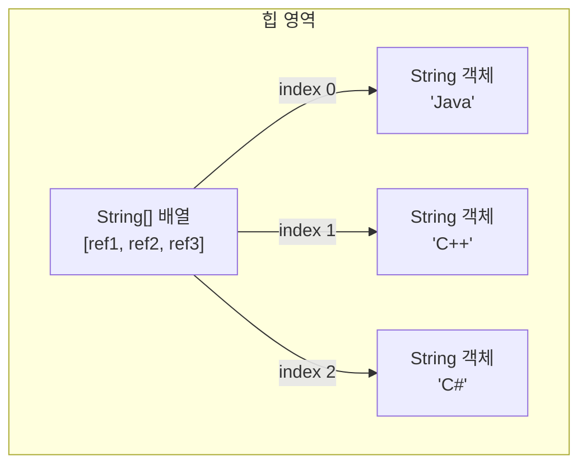

# 5.8 객체를 참조하는 배열

기본 타입(byte, char, short, int, long, float, double, boolean) 배열은 각 항목에 값을 직접 저장하지만, 참조 타입(클래스, 인터페이스) 배열은 각 항목에 객체의 번지를 저장한다. 다음과 같이 String 타입의 배열을 생성하고, 각 항목에 문자열을 대입했다고 가정해 보자.

```java
String[] strArray = new String[3];
strArray[0] = "Java";
strArray[1] = "C++";
strArray[2] = "C#";
```

`strArray` 변수와 `String[]` 배열을 그림으로 표현하면 다음과 같다. `String[]` 배열의 항목은 `String` 변수와 동일하게 참조 타입 변수로 취급된다.



`==`, `!=` 연산자를 사용하면 배열 항목이 참조하는 객체가 같은 객체인지 다른 객체인지를 확인할 수 있고, 문자열만 비교할 때는 `equals()` 메소드를 사용한다.

```java
String[] languages = new String[3];
languages[0] = "Java";
languages[1] = "Java";
languages[2] = new String("Java");

System.out.println( languages[0] == languages[1] );       // true: 같은 객체를 참조
System.out.println( languages[0] == languages[2] );       // false: 다른 객체를 참조
System.out.println( languages[0].equals(languages[2]) );  // true: 문자열이 동일
```

리터럴 문자열이 같기 때문에 `languages[0]`과 `languages[1]` 항목은 동일한 번지에 저장된다. 하지만 `languages[2]` 항목은 `new` 연산자로 생성된 String 객체가 대입되므로 다른 번지가 저장된다.

**[예제: ArrayReferenceObjectExample.java]**

```java
package ch05.sec08;

public class ArrayReferenceObjectExample {
    public static void main(String[] args) {
        String[] strArray = new String[3];
        strArray[0] = "Java";
        strArray[1] = "Java";
        strArray[2] = new String("Java");

        System.out.println( strArray[0] == strArray[1] ); // true: 같은 객체 참조
        System.out.println( strArray[0] == strArray[2] ); // false: 다른 객체를 참조
        System.out.println( strArray[0].equals(strArray[2]) ); // true: 문자열이 동일
    }
}
```

**실행 결과**

```
true
false
true
```
