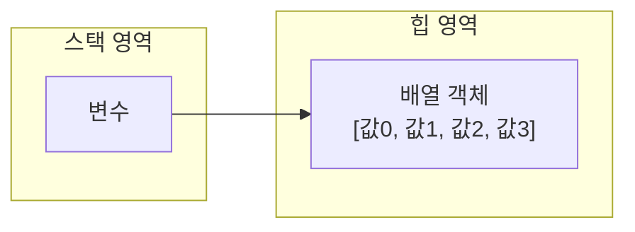
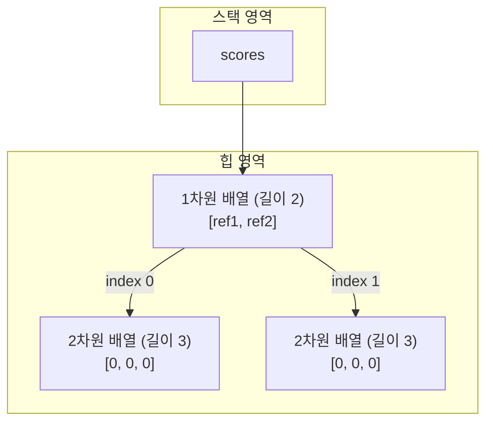
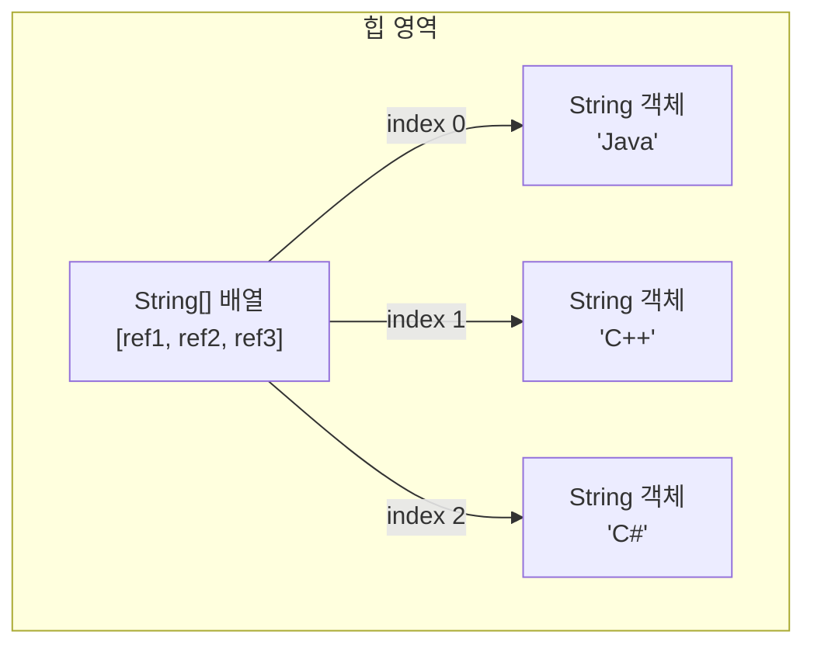

# Part 02

## 객체지향 프로그래밍

두 번째 파트는 객체지향 프로그래밍의 특징을 이해하고, 자바 언어로 객체지향 프로그래밍을 어떻게 하는지에 대해 다룬다. 클래스, 상속, 인터페이스, 다형성 등 객체지향 프로그래밍의 핵심 기술과 라이브러리 및 모듈을 생성하는 방법을 학습한다. 
또한 프로그램에서 예외가 발생했을 때 처리하는 방법도 익힌다. 본 파트를 이해하고 나면, 자바 프로그램 소스를 분석할 수 있는 능력이 한층 더 업그레이드될 것이다. 

---

# Chapter 05

## 참조 타입

**목차**

* 5.1 데이터 타입 분류 


* 5.2 메모리 사용 영역 


* 5.3 참조 타입 변수의 ==, != 연산 


* 5.4 null과 NullPointerException 


* 5.5 문자열(String) 타입 


* 5.6 배열(Array) 타입 


* 5.7 다차원 배열 


* 5.8 객체를 참조하는 배열 


* 5.9 배열 복사 


* 5.10 배열 항목 반복을 위한 향상된 for 문 


* 5.11 main() 메소드의 String[] 매개변수 용도 


* 5.12 열거(Enum) 타입 


* 확인문제 


---

### 5.1 데이터 타입 분류

자바의 데이터 타입은 크게 기본 타입(primitive type)과 참조 타입(reference type)으로 분류된다. 2장에서 기본 타입에 대해서 알아보았으니, 이번 장에서는 참조 타입에 대해 알아보자. 참조 타입이란 객체(object)의 번지를 참조하는 타입으로 배열, 열거, 클래스, 인터페이스 타입이 있다. 

**[데이터 타입(Data Type) 분류 도식]**

```mermaid
graph TD
    A[데이터 타입 (Data Type)] --> B[기본 타입 (primitive type)]
    A --> C[참조 타입 (reference type)]
    
    B --> B1[정수 타입]
    B1 --> B1_1[byte]
    B1 --> B1_2[char]
    B1 --> B1_3[short]
    B1 --> B1_4[int]
    B1 --> B1_5[long]
    
    B --> B2[실수 타입]
    B2 --> B2_1[float]
    B2 --> B2_2[double]
    
    B --> B3[논리 타입]
    B3 --> B3_1[boolean]
    
    C --> C1[배열 타입]
    C --> C2[열거 타입]
    C --> C3[클래스]
    C --> C4[인터페이스]

```


> **여기서 잠깐: 객체란?**
> 객체(object)는 데이터와 메소드로 구성된 덩어리라고 생각하면 된다.
> **객체 = 데이터(필드) + 메소드**
> 객체에 대한 자세한 설명은 6장에서 살펴본다. 
> 
> 

기본 타입으로 선언된 변수와 참조 타입으로 선언된 변수의 차이점은 저장되는 값이다. 기본 타입으로 선언된 변수는 값 자체를 저장하고 있지만, 참조 타입으로 선언된 변수는 객체가 생성된 메모리 번지를 저장한다. 

| 변수 종류          | 저장되는 값 | 예시                 |
| ------------------ | ----------- | -------------------- |
| **기본 타입 변수** | 값          | <br>`10`, `100.5` 등 |

 |
| **참조 타입 변수** | 객체 번지 | <br>`100번지` -> [객체] 

 |

다음은 기본 타입인 `int`와 `double`로 선언된 변수 `age`와 `price`에 값을 대입하고, 참조 타입인 `String` 클래스로 선언된 변수 `name`과 `hobby`에 문자열을 대입하는 코드이다. 

```java
// [기본 타입 변수]
int age = 25;
double price = 100.5;

// [참조 타입 변수]
String name = "신용권";
String hobby = "독서";

```


메모리상에서 이 변수들이 갖는 값을 그림으로 표현하면 다음과 같다. 

```mermaid
graph LR
    subgraph Stack [스택(stack) 영역]
        direction TB
        subgraph ReferenceVars [참조 타입 변수]
            name_var[name : 100]
            hobby_var[hobby : 200]
        end
        subgraph PrimitiveVars [기본 타입 변수]
            price_var[price : 100.5]
            age_var[age : 25]
        end
    end

    subgraph Heap [힙(heap) 영역]
        direction TB
        obj1[100번지 : String 객체 '신용권']
        obj2[200번지 : String 객체 '독서']
    end

    name_var -->|참조| obj1
    hobby_var -->|참조| obj2

```


변수들은 모두 스택(stack)이라는 메모리 영역에 생성된다. 기본 타입 변수인 `age`와 `price`는 직접 값을 저장하고 있지만, 참조 타입 변수인 `name`과 `hobby`는 힙 메모리 영역의 `String` 객체 번지를 저장하고 이 번지를 통해 `String` 객체를 참조한다. 

---

### 5.2 메모리 사용 영역

자바에서 사용하는 메모리 영역에 대해 간단히 알아보자. `java` 명령어로 JVM이 구동되면 JVM은 운영체제에서 할당받은 메모리 영역(Runtime Data Area)을 다음과 같이 구분해서 사용한다. 

**[메모리 영역(Runtime Data Area) 구조]**

```mermaid
graph TD
    subgraph MethodArea [메소드 영역(Method Area)]
        Class1[클래스-1: 상수, 정적 필드, 메소드 코드, 생성자 코드]
        ClassN[클래스-n: 상수, 메소드 코드, 생성자 코드]
    end

    subgraph HeapArea [힙 영역(Heap Area)]
        Obj1((객체-1))
        Arr2[배열-2]
        Obj3((객체-3))
        Obj4((객체-n...))
    end

    subgraph Threads [스레드(Thread)]
        subgraph Thread1 [스레드-1]
            subgraph Stack1 [스택(Stack) 영역]
                Frame1[프레임-1: 변수-1...변수-n]
                FrameN[프레임-n: 변수-1...변수-n]
            end
        end
         subgraph ThreadN [스레드-n]
            subgraph StackN [스택(Stack) 영역]
                FrameX[프레임...]
            end
        end
    end

```


**메소드 영역**
메소드(Method) 영역은 바이트코드 파일을 읽은 내용이 저장되는 영역으로 클래스별로 상수, 정적 필드, 메소드 코드, 생성자 코드 등이 저장된다. 
아직 이 용어들을 몰라도 상관없다. 단순히 바이트코드 파일의 내용이 저장되는 영역이라고만 알고 있자. 

**힙 영역**
힙(Heap) 영역은 객체가 생성되는 영역이다. 객체의 번지는 메소드 영역과 스택 영역의 상수와 변수에서 참조할 수 있다. 

**스택 영역**
스택(Stack) 영역은 메소드를 호출할 때마다 생성되는 프레임(Frame)이 저장되는 영역이다. 메소드 호출이 끝나면 프레임은 자동 제거된다. 
프레임 내부에는 로컬 변수 스택이 있다. 여기에서 기본 타입 변수와 참조 타입 변수가 생성되고 제거된다. 

---

### 5.3 참조 타입 변수의 ==, != 연산

`==`, `!=` 연산자는 변수의 값이 같은지, 아닌지를 조사한다. 참조 타입 변수의 값은 객체의 번지이므로 참조 타입 변수의 `==`, `!=` 연산자는 번지를 비교하는 것이 된다. 번지가 같다면 동일한 객체를 참조하는 것이고, 다르다면 다른 객체를 참조하는 것이다. 

```mermaid
graph LR
    subgraph Stack [스택(stack) 영역]
        refVar1[refVar1]
        refVar2[refVar2]
        refVar3[refVar3]
    end

    subgraph Heap [힙(heap) 영역]
        obj1[객체1]
        obj2[객체2]
    end

    refVar1 --> obj1
    refVar2 --> obj2
    refVar3 --> obj2

```


위 그림에서 `refVar1`과 `refVar2`는 서로 다른 객체를 참조하고 있으므로 `==` 및 `!=` 연산의 결과는 다음과 같다. 

```java
refVar1 == refVar2 //결과: false
refVar1 != refVar2 //결과: true

```


`refVar2`와 `refVar3`은 동일한 객체2를 참조하고 있으므로 `==` 및 `!=` 연산의 결과는 다음과 같다. 

```java
refVar2 == refVar3 //결과: true
refVar2 != refVar3 //결과: false

```


`==`, `!=` 연산자로 객체를 비교하는 코드는 `if` 문에서 많이 사용한다. 다음은 `refVar2`와 `refVar3` 변수가 같은 객체를 참조할 경우 `if` 블록을 실행하는 코드이다. 

```java
if(refVar2 == refVar3) { ... }

```


5.6절에서 학습하게 될 배열은 여러 개의 값을 저장하는 객체이다. 따라서 배열 변수는 참조 타입 변수가 된다. 다음 예제는 두 배열 변수를 `==`, `!=` 연산으로 같은 배열을 참조하는지 검사한다. 

**[예제: ReferenceVariableCompareExample.java]**

```java
package ch05.sec03;

public class ReferenceVariableCompareExample {
    public static void main(String[] args) {
        int[] arr1; //배열 변수 arr1 선언
        int[] arr2; //배열 변수 arr2 선언
        int[] arr3; //배열 변수 arr3 선언

        arr1 = new int[] { 1, 2, 3 }; //배열 {1, 2, 3}을 생성하고 arr1 변수에 대입
        arr2 = new int[] { 1, 2, 3 }; //배열 {1, 2, 3}을 생성하고 arr2 변수에 대입
        arr3 = arr2;                  //배열 변수 arr2의 값을 배열 변수 arr3에 대입

        System.out.println(arr1 == arr2); //arr1과 arr2 변수가 같은 배열을 참조하는지 검사
        System.out.println(arr2 == arr3); //arr2와 arr3 변수가 같은 배열을 참조하는지 검사
    }
}

```


**실행 결과**

```
false
true

```


```mermaid
graph LR
    subgraph Stack [스택(stack) 영역]
        arr1[arr1]
        arr2[arr2]
        arr3[arr3]
    end
    
    subgraph Heap [힙(heap) 영역]
        ArrObj1[10번지 : 배열 객체 {1, 2, 3}]
        ArrObj2[20번지 : 배열 객체 {1, 2, 3}]
    end

    arr1 --> ArrObj1
    arr2 --> ArrObj2
    arr3 --> ArrObj2

```


9라인에서 생성한 배열과 10라인에서 생성한 배열은 저장 항목은 같지만 서로 다른 배열 객체로 생성되므로 `arr1`과 `arr2` 변수에 대입되는 번지는 다르다. 
따라서 13라인의 결과는 `false`, 14라인의 결과는 `true`가 출력된다. `arr3`은 11라인에서 `arr2` 변수의 번지가 대입되었기 때문에 두 변수는 동일한 번지를 가지며 같은 배열을 참조한다. 


### 5.4 null과 NullPointerException

참조 타입 변수는 아직 번지를 저장하고 있지 않다는 뜻으로 `null`(널) 값을 가질 수 있다. `null`도 초기값으로 사용할 수 있기 때문에 `null`로 초기화된 참조 변수는 스택 영역에 생성된다. 

```java
String refVar1 = "자바";
String refVar2 = null;

```


```mermaid
graph LR
    subgraph Stack [스택(stack) 영역]
        refVar1[refVar1 : 50]
        refVar2[refVar2 : null]
    end

    subgraph Heap [힙(heap) 영역]
        obj1[50번지 : String 객체 '자바']
    end

    refVar1 --> obj1

```


참조 타입 변수가 `null` 값을 가지는지 확인하려면 다음과 같이 `==`, `!=` 연산을 수행할 수 있다. 

```java
refVar1 == null //결과: false
refVar1 != null //결과: true

refVar2 == null //결과: true
refVar2 != null //결과: false

```


자바는 프로그램 실행 도중에 발생하는 오류를 예외(Exception)라고 부른다. 참조 변수를 사용하면서 가장 많이 발생하는 예외 중 하나는 `NullPointerException`이다. 변수가 `null`인 상태에서 객체의 데이터나 메소드를 사용하려 할 때 이 예외가 발생한다. 다음 코드를 보자. 

```java
int[] intArray = null;
intArray[0] = 10; //NullPointerException

```


배열 변수 `intArray`에 `null`을 대입한 상태에서 배열 객체의 0 인덱스 항목에 10을 대입하는 코드를 실행하면 `NullPointerException`이 발생한다. 이유는 `intArray`가 참조하는 배열 객체가 없으므로 10을 저장할 수 없기 때문이다. 다음 코드도 보자. 

```java
String str = null;
System.out.println("총 문자 수: " + str.length()); //NullPointerException

```


`str` 변수에 `null`을 대입한 상태에서 문자열의 길이를 얻기 위해 `length()` 메소드를 호출하면 `NullPointerException`이 발생한다. 이유는 `str` 변수가 참조하는 `String` 객체가 없으므로 문자열의 길이를 구할 수 없기 때문이다. 

다음 예제에서 6라인과 9라인을 번갈아 가며 주석 처리하고 실행해 보면 `NullPointerException`이 발생하는 것을 알 수 있다. 

**[예제: NullPointerExceptionExample.java]**

```java
package ch05.sec04;

public class NullPointerExceptionExample {
    public static void main(String[] args) {
        int[] intArray = null;
        //intArray[0] = 10; //NullPointerException

        String str = null;
        //System.out.println("총 문자 수: " + str.length()); //NullPointerException
    }
}

```


**실행 결과**

```
Exception in thread "main" java.lang.NullPointerException: Cannot store to int array because "intArray" is null ...
Exception in thread "main" java.lang.NullPointerException: Cannot invoke "String.length()" because "str" is null ...

```


앞으로 `NullPointerException`이 발생하면 예외가 발생된 곳에서 `null`인 상태의 참조 변수가 사용되고 있음을 알아야 한다. 이것을 해결하려면 참조 변수가 객체를 정확히 참조하도록 번지를 대입해야 한다. 

경우에 따라서는 참조 타입 변수에 일부러 `null`을 대입하기도 한다. 프로그램에서 객체를 사용하려면 해당 객체를 참조하는 변수를 이용해야 하는데, 변수에 `null`을 대입하면 번지를 잃게 되므로 더 이상 객체를 사용할 수 없게 된다. 

```java
String hobby = "여행";
hobby = null;

```


```mermaid
graph LR
    subgraph Stack [스택(stack) 영역]
        direction TB
        hobby_old[hobby : 10]
        arrow[↓]
        hobby_new[hobby : null]
    end

    subgraph Heap [힙(heap) 영역]
        obj[10번지 : String 객체 '여행']
        garbage[쓰레기 객체]
    end

    hobby_old -.->|참조 끊김| obj
    hobby_new -.->|참조 없음| obj
    style obj stroke-dasharray: 5 5

```


어떤 변수에서도 객체를 참조하지 않으면 해당 객체는 프로그램에서 사용할 수 없는 객체가 된다. 즉 힙 메모리에는 있지만, 위치 정보를 모르기 때문에 사용할 수 없게 된다. 자바는 이러한 객체를 쓰레기로 취급하고, 쓰레기 수집기(Garbage Collector)를 실행시켜 자동으로 제거한다. 

사실 자바는 코드를 이용해서 객체를 직접 제거하는 방법을 제공하지 않는다. 객체를 제거하는 유일한 방법은 객체의 모든 참조를 없애는 것이다. 

다음 코드에서 "여행"에 해당하는 `String` 객체는 쓰레기가 된다. `hobby` 변수에 "영화"가 대입되면서 다른 `String` 객체의 번지가 대입되어 이전 번지를 잃어버리기 때문이다. 

```java
String hobby = "여행";
hobby = "영화";

```


```mermaid
graph LR
    subgraph Stack [스택(stack) 영역]
        direction TB
        hobby1[hobby : 10]
        hobby2[hobby : 20]
    end
    
    subgraph Heap [힙(heap) 영역]
        obj1[10번지 : '여행']
        obj2[20번지 : '영화']
        garbage[쓰레기 객체]
    end

    hobby1 -.->|참조 끊김| obj1
    hobby2 -->|참조| obj2
    style obj1 stroke-dasharray: 5 5

```


**[예제: GarbageObjectExample.java]**

```java
package ch05.sec04;

public class GarbageObjectExample {
    public static void main(String[] args) {
        String hobby = "여행";
        hobby = null; // "여행"에 해당하는 String 객체를 쓰레기로 만듦

        String kind1 = "자동차";
        String kind2 = kind1; // kind1 변수에 저장되어 있는 번지를 kind2 변수에 대입
        kind1 = null; // "자동차"에 해당하는 String 객체는 쓰레기가 아님
        System.out.println("kind2: " + kind2);
    }
}

```


**실행 결과**

```
kind2: 자동차

```


10라인에서 `kind1` 변수에 `null`을 대입한다고 해서 "자동차"에 해당하는 `String` 객체가 쓰레기가 되지는 않는다. 그 이유는 `kind2` 변수가 여전히 참조하고 있기 때문이다. 

---

### 5.5 문자열(String) 타입

자바의 문자열은 `String` 객체로 생성된다. 다음은 두 개의 `String` 변수 `name`과 `hobby`를 선언하고 문자열 리터럴을 대입한 것이다. `name` 변수와 `hobby` 변수에 문자열 리터럴이 대입되면 문자열은 `String` 객체로 생성되고, 객체의 번지가 각각 대입된다. 

```java
String name;            //String 타입 변수 name 선언
name = "홍길동";        //name 변수에 문자열 대입
String hobby = "여행";  //String 타입 변수 hobby를 선언하고 문자열 대입

```


```mermaid
graph LR
    subgraph Stack [스택(stack) 영역]
        name[name : 10]
        hobby[hobby : 20]
    end

    subgraph Heap [힙(heap) 영역]
        obj1[10번지 : String 객체 '홍길동']
        obj2[20번지 : String 객체 '여행']
    end

    name --> obj1
    hobby --> obj2

```


**문자열 비교**

자바는 문자열 리터럴이 동일하다면 `String` 객체를 공유하도록 설계되어 있다. 다음과 같이 `name1`과 `name2` 변수에 "홍길동"을 대입할 경우, `name1`과 `name2` 변수에는 동일한 `String` 객체의 번지가 저장된다. 

```java
String name1 = "홍길동";
String name2 = "홍길동";

```


```mermaid
graph LR
    subgraph Stack [스택(stack) 영역]
        name1[name1 : 10]
        name2[name2 : 10]
    end

    subgraph Heap [힙(heap) 영역]
        obj[10번지 : String 객체 '홍길동']
    end

    name1 --> obj
    name2 --> obj

```


`String` 변수에 문자열 리터럴을 대입하는 것이 일반적이지만, `new` 연산자로 직접 `String` 객체를 생성하고 대입할 수도 있다. `new` 연산자는 새로운 객체를 만드는 연산자로 객체 생성 연산자라고 한다. 

```java
String name1 = new String("홍길동");
String name2 = new String("홍길동");

```


이 경우 `name1`과 `name2` 변수는 서로 다른 `String` 객체의 번지를 가지게 된다. 

```mermaid
graph LR
    subgraph Stack [스택(stack) 영역]
        name1[name1 : 10]
        name2[name2 : 20]
    end

    subgraph Heap [힙(heap) 영역]
        obj1[10번지 : String 객체 '홍길동']
        obj2[20번지 : String 객체 '홍길동']
    end

    name1 --> obj1
    name2 --> obj2

```


그렇기 때문에 문자열 리터럴로 생성하느냐 `new` 연산자로 생성하느냐에 따라 비교 연산자의 결과가 달라질 수 있다. 

```java
String name1 = "홍길동";
String name2 = "홍길동";
String name3 = new String("홍길동");

```


`name1`과 `name2`는 동일한 문자열 리터럴로 생성된 객체를 참조하기 때문에 `name1 == name2`의 결과는 `true`가 나오지만, `name3`은 `new` 연산자로 `String` 객체를 별도로 생성했기 때문에 `name1 == name3`의 결과는 `false`가 나온다. 

```java
name1 == name2 //결과: true
name1 == name3 //결과: false

```


동일한 `String` 객체든 다른 `String` 객체든 상관없이 내부 문자열만을 비교할 경우에는 `String` 객체의 `equals()` 메소드를 사용한다. 

```java
boolean result = str1.equals(str2); //문자열이 같은지 검사(대소문자 구분)
boolean result = !str1.equals(str2); //문자열이 다른지 검사

```


**[예제: EqualsExample.java]**

```java
package ch05.sec05;

public class EqualsExample {
    public static void main(String[] args) {
        String strVar1 = "홍길동";
        String strVar2 = "홍길동";

        if(strVar1 == strVar2) {
            System.out.println("strVar1과 strVar2는 참조가 같음");
        } else {
            System.out.println("strVar1과 strVar2는 참조가 다름");
        }

        if(strVar1.equals(strVar2)) {
            System.out.println("strVar1과 strVar2는 문자열이 같음");
        }

        String strVar3 = new String("홍길동");
        String strVar4 = new String("홍길동");

        if(strVar3 == strVar4) {
            System.out.println("strVar3과 strVar4는 참조가 같음");
        } else {
            System.out.println("strVar3과 strVar4는 참조가 다름");
        }

        if(strVar3.equals(strVar4)) {
            System.out.println("strVar3과 strVar4는 문자열이 같음");
        }
    }
}

```


**실행 결과**

```
strVar1과 strVar2는 참조가 같음
strVar1과 strVar2는 문자열이 같음
strVar3과 strVar4는 참조가 다름
strVar3과 strVar4는 문자열이 같음

```


`String` 변수에 빈 문자열("")을 대입할 수도 있다. 빈 문자열도 `String` 객체로 생성되기 때문에 변수가 빈 문자열을 참조하는지 조사하려면 다음과 같이 `equals()` 메소드를 사용해야 한다. 

**[예제: EmptyStringExample.java]**

```java
package ch05.sec05;

public class EmptyStringExample {
    public static void main(String[] args) {
        String hobby = "";
        if(hobby.equals("")) {
            System.out.println("hobby 변수가 참조하는 String 객체는 빈 문자열");
        }
    }
}

```


**실행 결과**

```
hobby 변수가 참조는 String 객체는 빈 문자열

```


**문자 추출**

문자열에서 특정 위치의 문자를 얻고 싶다면 `charAt()` 메소드를 이용할 수 있다. `charAt()` 메소드는 매개값으로 주어진 인덱스의 문자를 리턴한다. 여기서 인덱스란 0에서부터 '문자열의 길이-1'까지의 번호를 말한다. 다음 코드를 보자. 

```java
String subject = "자바 프로그래밍";
char charValue = subject.charAt(3);

```


"자바 프로그래밍"이라는 문자열은 다음과 같이 인덱스를 매길 수 있다. 따라서 `charAt(3)`은 3번 인덱스 위치에 있는 문자, 즉 '프'가 해당된다. 

| 자  | 바  |     | 프  | 로  | 그  | 래  | 밍  |
| --- | --- | --- | --- | --- | --- | --- | --- |
| 0   | 1   | 2   | 3   | 4   | 5   | 6   | 7   |
|     |

 |  |  |  |  |  |  |  |

다음 예제는 주민등록번호에서 성별에 해당하는 7번째 문자를 읽고 남자 또는 여자인지를 출력한다. 

**[예제: CharAtExample.java]**

```java
package ch05.sec05;

public class CharAtExample {
    public static void main(String[] args) {
        String ssn = "9506241230123";
        char sex = ssn.charAt(6);
        switch (sex) {
            case '1':
            case '3':
                System.out.println("남자입니다.");
                break;
            case '2':
            case '4':
                System.out.println("여자입니다.");
                break;
        }
    }
}

```


**실행 결과**

```
남자입니다.

```


**문자열 길이**

문자열에서 문자의 개수를 얻고 싶다면 `length()` 메소드를 사용한다. 다음 코드를 보자. 

```java
String subject = "자바 프로그래밍";
int length = subject.length();

```


`length` 변수에는 8이 저장된다. `subject` 객체의 문자열 길이는 공백을 포함해서 8개이기 때문이다. 

**[예제: LengthExample.java]**

```java
package ch05.sec05;

public class LengthExample {
    public static void main(String[] args) {
        String ssn = "9506241230123";
        int length = ssn.length();
        if(length == 13) {
            System.out.println("주민등록번호 자릿수가 맞습니다.");
        } else {
            System.out.println("주민등록번호 자릿수가 틀립니다.");
        }
    }
}

```


**실행 결과**

```
주민등록번호 자릿수가 맞습니다.

```


**문자열 대체**

문자열에서 특정 문자열을 다른 문자열로 대체하고 싶다면 `replace()` 메소드를 사용한다. `replace()` 메소드는 기존 문자열은 그대로 두고, 대체한 새로운 문자열을 리턴한다. 다음 코드를 보자. 

```java
String oldStr = "자바 프로그래밍";
String newStr = oldStr.replace("자바", "JAVA");

```


`String` 객체의 문자열은 변경이 불가한 특성을 갖기 때문에 `replace()` 메소드가 리턴하는 문자열은 원래 문자열의 수정본이 아니라 완전히 새로운 문자열이다. 따라서 `newStr` 변수는 다음 그림과 같이 새로 생성된 "JAVA 프로그래밍" 문자열을 참조한다. 

```mermaid
graph LR
    subgraph Stack [스택(stack) 영역]
        oldStr[oldStr]
        newStr[newStr]
    end

    subgraph Heap [힙(heap) 영역]
        obj1[자바 프로그래밍]
        obj2[JAVA 프로그래밍]
    end

    oldStr --> obj1
    newStr --> obj2

```


**[예제: ReplaceExample.java]**

```java
package ch05.sec05;

public class ReplaceExample {
    public static void main(String[] args) {
        String oldStr = "자바 문자열은 불변입니다. 자바 문자열은 String입니다.";
        String newStr = oldStr.replace("자바", "JAVA");

        System.out.println(oldStr);
        System.out.println(newStr);
    }
}

```


**실행 결과**

```
자바 문자열은 불변입니다. 자바 문자열은 String입니다.
JAVA 문자열은 불변입니다. JAVA 문자열은 String입니다.

```


**문자열 잘라내기**

문자열에서 특정 위치의 문자열을 잘라내어 가져오고 싶다면 `substring()` 메소드를 사용한다. 

| 메소드                                    | 설명                                    |
| ----------------------------------------- | --------------------------------------- |
| `substring(int beginIndex)`               | beginIndex에서 끝까지 잘라내기          |
| `substring(int beginIndex, int endIndex)` | beginIndex에서 endIndex 앞까지 잘라내기 |
|                                           |

 |  |

다음 코드를 보자. 

```java
String ssn = "880815-1234567";
String firstNum = ssn.substring(0, 6);
String secondNum = ssn.substring(7);

```


주어진 `ssn`의 문자열을 인덱싱하면 다음과 같다. 

| 8   | 8   | 0   | 8   | 1   | 5   | -   | 1   | 2   | 3   | 4   | 5   | 6   | 7   |
| --- | --- | --- | --- | --- | --- | --- | --- | --- | --- | --- | --- | --- | --- |
| 0   | 1   | 2   | 3   | 4   | 5   | 6   | 7   | 8   | 9   | 10  | 11  | 12  | 13  |
|     |

 |  |  |  |  |  |  |  |  |  |  |  |  |  |

따라서 `firstNum` 변수는 "880815" 문자열을 참조하고, `secondNum` 변수는 "1234567"을 참조한다. 

**[예제: SubStringExample.java]**

```java
package ch05.sec05;

public class SubStringExample {
    public static void main(String[] args) {
        String ssn = "880815-1234567";
        
        String firstNum = ssn.substring(0, 6);
        System.out.println(firstNum);
        
        String secondNum = ssn.substring(7);
        System.out.println(secondNum);
    }
}

```


**실행 결과**

```
880815
1234567

```


**문자열 찾기**

문자열에서 특정 문자열의 위치를 찾고자 할 때에는 `indexOf()` 메소드를 사용한다. `indexOf()` 메소드는 주어진 문자열이 시작되는 인덱스를 리턴한다. 다음 코드를 보자. 

```java
String subject = "자바 프로그래밍";
int index = subject.indexOf("프로그래밍");

```


`index` 변수에는 3이 저장되는데, 다음과 같이 "자바 프로그래밍"에서 "프로그래밍" 문자열의 인덱스 위치가 3번이기 때문이다. 

| 자  | 바  |     | 프  | 로  | 그  | 래  | 밍  |
| --- | --- | --- | --- | --- | --- | --- | --- |
| 0   | 1   | 2   | 3   | 4   | 5   | 6   | 7   |
|     |

 |  |  |  |  |  |  |  |

만약 주어진 문자열이 포함되어 있지 않으면 `indexOf()` 메소드는 -1을 리턴한다. 주어진 문자열이 포함되어 있는지 여부에 따라 실행 코드를 달리하고 싶다면 `if` 조건식을 사용해서 다음과 같이 코드를 작성할 수 있다. 

```java
int index = subject.indexOf("프로그래밍");
if(index == -1) {
    //포함되어 있지 않은 경우
} else {
    //포함되어 있는 경우
}

```


주어진 문자열이 단순히 포함되어 있는지만 조사하고 싶다면 `contains()` 메소드를 사용하면 편리하다. 원하는 문자열이 포함되어 있으면 `contains()` 메소드는 `true`를 리턴하고, 그렇지 않으면 `false`를 리턴한다. 

```java
boolean result = subject.contains("프로그래밍");

```


**[예제: IndexOfContainsExample.java]**

```java
package ch05.sec05;

public class IndexOfContainsExample {
    public static void main(String[] args) {
        String subject = "자바 프로그래밍";
        
        int location = subject.indexOf("프로그래밍");
        System.out.println(location);
        String substring = subject.substring(location);
        System.out.println(substring);
        
        location = subject.indexOf("자바");
        if(location != -1) {
            System.out.println("자바와 관련된 책이군요.");
        } else {
            System.out.println("자바와 관련 없는 책이군요.");
        }
        
        boolean result = subject.contains("자바");
        if(result) {
            System.out.println("자바와 관련된 책이군요.");
        } else {
            System.out.println("자바와 관련 없는 책이군요.");
        }
    }
}

```


**실행 결과**

```
3
프로그래밍
자바와 관련된 책이군요.
자바와 관련된 책이군요.

```


**문자열 분리**

문자열이 구분자를 사용하여 여러 개의 문자열로 구성되어 있을 경우, 이를 따로 분리해서 얻고 싶다면 `split()` 메소드를 사용한다. 다음 코드를 보자. 

```java
String board = "번호,제목,내용,성명";
String[] arr = board.split(",");

```


`board`는 쉼표로 구분된 문자열을 가지고 있다. `split()` 메소드를 호출할 때 쉼표를 제공하면 분리된 문자열로 구성된 배열(array)을 얻을 수 있다. 배열은 5.6절에서 학습한다. 

| arr[0] | arr[1] | arr[2] | arr[3] |
| ------ | ------ | ------ | ------ |
| "번호" | "제목" | "내용" | "성명" |
|        |

 |  |  |  |

**[예제: SplitExample.java]**

```java
package ch05.sec05;

public class SplitExample {
    public static void main(String[] args) {
        String board = "1,자바 학습,참조 타입 String을 학습합니다.,홍길동";
        
        //문자열 분리
        String[] tokens = board.split(",");
        
        //인덱스별로 읽기
        System.out.println("번호: " + tokens[0]);
        System.out.println("제목: " + tokens[1]);
        System.out.println("내용: " + tokens[2]);
        System.out.println("성명: " + tokens[3]);
        System.out.println();
        
        //for 문을 이용한 읽기
        for(int i=0; i<tokens.length; i++) {
            System.out.println(tokens[i]);
        }
    }
}

```


**실행 결과**

```
번호: 1
제목: 자바 학습
내용: 참조 타입 String을 학습합니다.
성명: 홍길동

1
자바 학습
참조 타입 String을 학습합니다.
홍길동

```
### 5.6 배열(Array) 타입

변수는 하나의 값만 저장할 수 있다. 따라서 저장해야 할 값의 수가 많아지면 그만큼 많은 변수가 필요하다. 예를 들어 학생 30명의 성적을 저장하고 평균값을 구한다고 가정해 보자. 먼저 학생 30명의 성적을 저장하기 위해 변수 30개를 선언해야 한다.

```java
int score1 = 83;
int score2 = 90;
int score3 = 87;
...
int score30 = 75;
```

그리고 평점을 구하기 위해 변수들을 아래와 같이 모두 더해야 한다. 이와 같은 방법은 매우 비효율적이고 지루한 코딩이 된다. 만약 전교 학생들에 대한 성적을 처리한다면 수백 개의 변수 선언으로 인해 코드는 끔찍해진다.

```java
int sum = score1;
sum += score2;
sum += score3;
...
sum += score30;
int avg = sum / 30;
```

따라서 많은 양의 값을 다루는 좀 더 효율적인 방법이 필요한데, 이것이 배열이다. 배열은 연속된 공간에 값을 나열시키고, 각 값에 인덱스(index)를 부여해 놓은 자료구조이다. 앞의 예에서 학생들의 성적은 다음과 같이 score 배열로 생성할 수 있다.

**score 배열**

| 인덱스 | 0    | 1    | 2    | 3    | 4    | ...  | 29   |
| :----- | :--- | :--- | :--- | :--- | :--- | :--- | :--- |
| **값** | 83   | 90   | 87   | 93   | 78   | ...  | 75   |

인덱스는 대괄호 `[]`와 함께 사용하여 각 항목의 값을 읽거나 저장하는데 사용한다. 예를 들어 `score[0]`은 83, `score[1]`은 90, `score[2]`는 87 값을 가진다. 이렇게 성적을 배열에 저장하면 평균값은 배열의 인덱스를 이용해서 for 문으로 쉽게 구할 수 있다.

```java
int sum = 0;
for (int i=0; i<30; i++) {
    sum += score[i];
}
int avg = sum / 30;
```

for 문이 30번 반복 실행하면서 `i`는 0~29까지 변한다. 따라서 `sum` 변수에는 `score[0]`~`score[29]`까지의 값이 더해지고, 마지막으로 얻은 `sum`을 배열의 길이 30으로 나누면 평균 `avg`를 얻을 수 있다. 이렇게 하면 학생 수가 30명이 아니라 수백 명이 되어도 for 문의 `i<30`만 변경하면 되므로 많은 양의 데이터를 적은 코드로 손쉽게 처리할 수 있다.

배열은 다음과 같은 특징을 가지고 있다.
* 배열은 같은 타입의 값만 관리한다.
* 배열의 길이는 늘리거나 줄일 수 없다.

`int` 배열은 `int` 타입의 값만 관리하고, `String` 배열은 문자열만 관리한다. 배열은 생성과 동시에 길어가 결정된다. 또한 한 번 결정된 배열의 길이는 늘리거나 줄일 수 없다.

#### 배열 변수 선언

배열을 사용하기 위해서는 우선 배열 변수를 선언해야 한다. 배열 변수 선언은 다음과 같이 두 가지 형태로 작성할 수 있지만, 관례적으로 첫 번째 방법을 주로 사용한다.

```java
타입[] 변수;  // 관례적 방법
타입 변수[];
```

타입은 배열에 저장될 값의 타입을 말하는데, 다음은 타입별로 배열을 선언하는 방법이다.

```java
int[] intArray;
double[] doubleArray;
String[] strArray;

int intArray[];
double doubleArray[];
String strArray[];
```

배열 변수는 참조 변수이다. 배열도 객체이므로 힙 영역에 생성되고 배열 변수는 힙 영역의 배열 주소를 저장한다. 참조할 배열이 없다면 배열 변수도 `null`로 초기화할 수 있다.

```java
타입[] 변수 = null;
```

만약 배열 변수가 `null` 값을 가진 상태에서 `변수[인덱스]`로 값을 읽거나 저장하게 되면 `NullPointerException`이 발생한다.

#### 값 목록으로 배열 생성

배열에 저장될 값의 목록이 있다면, 다음과 같이 간단하게 배열을 생성할 수 있다.

```java
타입[] 변수 = { 값0, 값1, 값2, 값3, ... };
```



중괄호 `{}`는 나열된 값들을 항목으로 가지는 배열을 힙에 생성하고, 번지를 리턴한다. 배열 변수는 리턴된 번지를 저장함으로써 참조가 이루어진다. "Spring", "Summer", "Fall", "Winter" 문자열을 갖는 배열은 다음과 같이 생성할 수 있다.

```java
String[] season = { "Spring", "Summer", "Fall", "Winter" };
```

이렇게 생성된 배열에서 "Spring"은 `season[0]`, "Fall"은 `season[2]`로 읽을 수 있다. `season[1]`의 "Summer"를 "여름"으로 바꾸고 싶다면 다음과 같이 대입 연산자를 사용하면 된다.

```java
season[1] = "여름";
```

**[예제: ArrayCreateByValueListExample1.java]**

```java
package ch05.sec06;

public class ArrayCreateByValueListExample1 {
    public static void main(String[] args) {
        //배열 변수 선언과 배열 생성
        String[] season = { "Spring", "Summer", "Fall", "Winter" };

        //배열의 항목값 읽기
        System.out.println("season[0] : " + season[0]);
        System.out.println("season[1] : " + season[1]);
        System.out.println("season[2] : " + season[2]);
        System.out.println("season[3] : " + season[3]);

        //인덱스 1번 항목의 값 변경
        season[1] = "여름";
        System.out.println("season[1] : " + season[1]);
        System.out.println();

        //배열 변수 선언과 배열 생성
        int[] scores = { 83, 90, 87 };

        //총합과 평균 구하기
        int sum = 0;
        for(int i=0; i<3; i++) {
            sum += scores[i];
        }
        System.out.println("총합 : " + sum);
        double avg = (double) sum / 3;
        System.out.println("평균 : " + avg);
    }
}
```

**실행 결과**

```
season[0] : Spring
season[1] : Summer
season[2] : Fall
season[3] : Winter
season[1] : 여름

총합 : 260
평균 : 86.66666666666667
```

중괄호 `{}`로 감싼 값의 목록을 배열 변수에 대입할 때 주의할 점이 있다. 배열 변수를 미리 선언한 후에는 값 목록을 변수에 대입할 수 없다.

```java
타입[] 변수;
변수 = { 값0, 값1, 값2, 값3, ... }; // 컴파일 에러
```

배열 변수를 선언한 시점과 값 목록이 대입되는 시점이 다르다면 다음과 같이 `new 타입[]`을 중괄호 앞에 붙여 주면 된다. 타입은 배열 변수를 선언할 때 사용한 타입과 동일하게 주면 된다.

```java
변수 = new 타입[] { 값0, 값1, 값2, 값3, ... };
```

예를 들어 String 배열 변수 `names`를 선언한 후에 값 목록을 대입할 경우에는 `new String[]`을 중괄호 앞에 붙여 줘야 한다.

```java
String[] names = null;
names = new String[] { "신용권", "홍길동", "김자바" };
```

메소드의 매개변수가 배열 타입일 경우에도 마찬가지다. 아래와 같이 매개변수로 `int[]` 배열 타입을 갖는 `printItem()` 메소드가 있다고 가정해 보자. `printItem()` 메소드를 호출할 때 매개값으로 중괄호로 감싼 값 목록을 주면 컴파일 에러가 발생한다.

```java
//메소드 선언
void printItem(int[] scores) { ... }

//잘못된 메소드 호출
printItem( {95, 85, 90} ); // 컴파일 에러
```

매개변수가 이미 선언되어 있고, 호출 시 값 목록을 제공하므로 다음과 같이 호출해야 한다.

```java
//올바른 메소드 호출
printItem( new int[] {95, 85, 90} );
```

> **메소드 선언과 호출**
>
> 메소드 선언과 호출은 6장에서 자세히 설명한다. 간단히 말하면 메소드 선언은 이름 있는 중괄호 블록을 만드는 것이고 메소드 호출은 해당 이름으로 중괄호 블록을 실행하는 것이다.

**[예제: ArrayCreateByValueListExample2.java]**

```java
package ch05.sec06;

public class ArrayCreateByValueListExample2 {
    public static void main(String[] args) {
        //배열 변수 선언
        int[] scores;
        
        //배열 변수에 배열을 대입
        scores = new int[] { 83, 90, 87 };
        
        //배열 항목의 총합을 구하고 출력
        int sum1 = 0;
        for(int i=0; i<3; i++) {
            sum1 += scores[i];
        }
        System.out.println("총합 : " + sum1);

        //배열을 매개값으로 주고, printItem() 메소드 호출
        printItem( new int[] { 83, 90, 87 } );
    }

    //printItem() 메소드 선언
    public static void printItem( int[] scores ) {
        //매개변수가 참조하는 배열의 항목을 출력
        for(int i=0; i<3; i++) {
            System.out.println("score[" + i + "]: " + scores[i]);
        }
    }
}
```

**실행 결과**

```
총합 : 260
score[0]: 83
score[1]: 90
score[2]: 87
```

#### new 연산자로 배열 생성

값의 목록은 없지만 향후 값들을 저장할 목적으로 배열을 미리 생성할 수도 있다. `new` 연산자를 다음과 같이 사용하면 배열 객체를 생성시킨다. 길이는 배열이 저장할 수 있는 항목 수를 말한다.

```java
타입[] 변수 = new 타입[길이];
```

`new` 연산자는 해당 길이의 배열을 생성하고 배열의 번지를 리턴하기 때문에 배열 변수에 대입할 수 있다. 이미 배열 변수가 선언된 후에도 다음과 같이 대입이 가능하다.

```java
타입[] 변수 = null;
변수 = new 타입[길이];
```

다음은 길이 5인 `int[]` 배열을 생성하고, 배열 번지를 `intArray` 변수에 대입한다.

```java
int[] intArray = new int[5];
```

`new` 연산자로 배열을 처음 생성하면 배열 항목은 기본값으로 초기화된다. 다음 표는 타입별 배열의 초기값을 보여 준다.

| 분류          | 데이터 타입    | 초기값     |
| :------------ | :------------- | :--------- |
| **기본 타입** | `byte[]`       | 0          |
|               | `char[]`       | `'\u0000'` |
|               | `short[]`      | 0          |
|               | `int[]`        | 0          |
|               | `long[]`       | 0L         |
|               | `float[]`      | 0.0F       |
|               | `double[]`     | 0.0        |
|               | `boolean[]`    | `false`    |
| **참조 타입** | `클래스[]`     | `null`     |
|               | `인터페이스[]` | `null`     |

> **NOTE**
> 정수 배열은 0, 실수 배열은 0.0, 논리 배열은 false, 참조 배열은 null로 초기화된다.

`int[]` 배열을 다음과 같이 생성했다면 항목은 모두 0으로 초기화된다.

```java
int[] scores = new int[30];
```

`String` 배열을 다음과 같이 생성했다면 항목은 모두 `null`로 초기화된다.

```java
String[] names = new String[30];
```

배열을 생성하고 난 후 특정 인덱스 항목을 새로운 값으로 변경하는 방법은 동일하다.

```java
변수[인덱스] = 값;
```

**[예제: ArrayCreateByNewExample.java]**

```java
package ch05.sec06;

public class ArrayCreateByNewExample {
    public static void main(String[] args) {
        //배열 변수 선언과 배열 생성
        int[] arr1 = new int[3];
        //배열 항목의 초기값 출력
        for(int i=0; i<3; i++) {
            System.out.print("arr1[" + i + "] : " + arr1[i] + ", ");
        }
        System.out.println();
        
        //배열 항목의 값 변경
        arr1[0] = 10;
        arr1[1] = 20;
        arr1[2] = 30;
        //배열 항목의 변경 값 출력
        for(int i=0; i<3; i++) {
            System.out.print("arr1[" + i + "] : " + arr1[i] + ", ");
        }
        System.out.println("\n");
        
        //배열 변수 선언과 배열 생성
        double[] arr2 = new double[3];
        //배열 항목의 초기값 출력
        for(int i=0; i<3; i++) {
            System.out.print("arr2[" + i + "] : " + arr2[i] + ", ");
        }
        System.out.println();
        
        //배열 항목의 값 변경
        arr2[0] = 0.1;
        arr2[1] = 0.2;
        arr2[2] = 0.3;
        //배열 항목의 변경 값 출력
        for(int i=0; i<3; i++) {
            System.out.print("arr2[" + i + "] : " + arr2[i] + ", ");
        }
        System.out.println("\n");
        
        //배열 변수 선언과 배열 생성
        String[] arr3 = new String[3];
        //배열 항목의 초기값 출력
        for(int i=0; i<3; i++) {
            System.out.print("arr3[" + i + "] : " + arr3[i] + ", ");
        }
        System.out.println();
        
        //배열 항목의 값 변경
        arr3[0] = "1월";
        arr3[1] = "2월";
        arr3[2] = "3월";
        //배열 항목의 변경값 출력
        for(int i=0; i<3; i++) {
            System.out.print("arr3[" + i + "] : " + arr3[i] + ", ");
        }
    }
}
```

**실행 결과**

```
arr1[0] : 0, arr1[1] : 0, arr1[2] : 0, 
arr1[0] : 10, arr1[1] : 20, arr1[2] : 30, 

arr2[0] : 0.0, arr2[1] : 0.0, arr2[2] : 0.0, 
arr2[0] : 0.1, arr2[1] : 0.2, arr2[2] : 0.3, 

arr3[0] : null, arr3[1] : null, arr3[2] : null, 
arr3[0] : 1월, arr3[1] : 2월, arr3[2] : 3월, 
```

#### 배열 길이

배열의 길이란 배열에 저장할 수 있는 항목 수를 말한다. 코드에서 배열의 길이를 얻으려면 도트(.) 연산자를 사용해서 참조하는 배열의 `length` 필드를 읽으면 된다.

```java
배열변수.length;
```

배열의 `length` 필드는 읽기만 가능하므로 다음과 같이 값을 변경할 수는 없다.

```java
intArray.length = 10; // 컴파일 에러 발생
```

배열 길이는 for 문을 사용해서 전체 배열 항목을 반복할 때 많이 사용된다.

**[예제: ArrayLengthExample.java]**

```java
package ch05.sec06;

public class ArrayLengthExample {
    public static void main(String[] args) {
        //배열 변수 선언과 배열 대입
        int[] scores = { 84, 90, 96 };
        
        //배열 항목의 총합 구하기
        int sum = 0;
        for(int i=0; i<scores.length; i++) {
            sum += scores[i];
        }
        System.out.println("총합 : " + sum);
        
        //배열 항목의 평균 구하기
        double avg = (double) sum / scores.length;
        System.out.println("평균 : " + avg);
    }
}
```

**실행 결과**

```
총합 : 270
평균 : 90.0
```

for 문의 조건식에서 `<` 연산자를 사용한 이유는 배열의 마지막 인덱스는 배열 길이보다 1이 적기 때문이다. 인덱스를 초과해서 사용하면 `ArrayIndexOutOfBoundsException`이 발생한다.


### 5.7 다차원 배열

배열 항목에는 또 다른 배열이 대입될 수 있는데, 이러한 배열을 다차원 배열이라고 부른다. 다음은 2차원과 3차원 배열의 모양을 보여 준다.

```java
// 2차원 배열
int[][] scores = new int[2][3];
```



배열 변수는 1차원 배열을 참조하고, `변수[0]`은 다시 2차원 배열을 참조하고, `변수[1]`은 또 다른 2차원 배열을 참조한다. 위 그림처럼 다차원 배열은 1차원 배열을 서로 연결한 것이라고 볼 수 있다. 다차원 배열에서 각 차원의 항목에 접근하는 방법은 다음과 같다.

```java
변수[1차원인덱스][2차원인덱스]...[n차원인덱스]
```

#### 값 목록으로 다차원 배열 생성

값 목록으로 다차원 배열을 생성하려면 배열 변수 선언 시 타입 뒤에 대괄호 `[]`를 차원의 수만큼 붙이고, 값 목록도 마찬가지로 차원의 수만큼 중괄호를 중첩시킨다. 다음은 값 목록으로 2차원 배열을 생성하고 변수에 대입하는 방법을 보여 준다.

```java
타입[][] 변수 = {
    {값1, 값2, ...}, // 1차원 배열의 0 인덱스
    {값3, 값4, ...}, // 1차원 배열의 1 인덱스
    ...
};
```

두 반의 학생 점수를 저장하는 배열을 생성해 보자. 각 반은 1차원 배열이고, 해당 반의 학생 점수는 2차원 배열이라고 볼 수 있다.

```java
int[][] scores = {
    { 80, 90, 96 }, // 1차원 배열의 0 인덱스: 첫 번째 반 성적
    { 76, 88 }      // 1차원 배열의 1 인덱스: 두 번째 반 성적
};
```

각 반의 학생 점수는 다음과 같이 읽을 수 있다.

```java
int score = scores[0][2]; // 96
int score = scores[1][1]; // 88
```

반의 개수는 1차원 배열의 길이와 동일하고, 각 반의 학생 수는 2차원 배열의 길이와 동일하기 때문에 다음과 같이 배열의 `length` 필드로 반의 개수와 학생 수를 알 수 있다.

```java
scores.length;      // 반의 수: 2
scores[0].length;   // 첫 번째 반의 학생 수: 3
scores[1].length;   // 두 번째 반의 학생 수: 2
```

**[예제: MultidimensionalArrayByValueListExample.java]**

```java
package ch05.sec07;

public class MultidimensionalArrayByValueListExample {
    public static void main(String[] args) {
        //2차원 배열 생성
        int[][] scores = {
            { 80, 90, 96 },
            { 76, 88 }
        };

        //배열의 길이
        System.out.println("1차원 배열 길이(반의 수): " + scores.length);
        System.out.println("2차원 배열 길이(첫 번째 반의 학생 수): " + scores[0].length);
        System.out.println("2차원 배열 길이(두 번째 반의 학생 수): " + scores[1].length);

        //첫 번째 반의 세 번째 학생의 점수 읽기
        System.out.println("scores[0][2]: " + scores[0][2]);

        //두 번째 반의 두 번째 학생의 점수 읽기
        System.out.println("scores[1][1]: " + scores[1][1]);

        //첫 번째 반의 평균 점수 구하기
        int class1Sum = 0;
        for(int i=0; i<scores[0].length; i++) {
            class1Sum += scores[0][i];
        }
        double class1Avg = (double) class1Sum / scores[0].length;
        System.out.println("첫 번째 반의 평균 점수: " + class1Avg);

        //두 번째 반의 평균 점수 구하기
        int class2Sum = 0;
        for(int i=0; i<scores[1].length; i++) {
            class2Sum += scores[1][i];
        }
        double class2Avg = (double) class2Sum / scores[1].length;
        System.out.println("두 번째 반의 평균 점수: " + class2Avg);

        //전체 학생의 평균 점수 구하기
        int totalStudent = 0;
        int totalSum = 0;
        for(int i=0; i<scores.length; i++) {       // 반의 수만큼 반복
            totalStudent += scores[i].length;      // 반의 학생 수 합산
            for(int k=0; k<scores[i].length; k++) { // 해당 반의 학생 수만큼 반복
                totalSum += scores[i][k];           // 학생 점수 합산
            }
        }
        double totalAvg = (double) totalSum / totalStudent;
        System.out.println("전체 학생의 평균 점수: " + totalAvg);
    }
}
```

**실행 결과**

```
1차원 배열 길이(반의 수): 2
2차원 배열 길이(첫 번째 반의 학생 수): 3
2차원 배열 길이(두 번째 반의 학생 수): 2
scores[0][2]: 96
scores[1][1]: 88
첫 번째 반의 평균 점수: 88.66666666666667
두 번째 반의 평균 점수: 82.0
전체 학생의 평균 점수: 86.0
```

#### new 연산자로 다차원 배열 생성

`new` 연산자로 다차원 배열을 생성하려면 배열 변수 선언 시 타입 뒤에 대괄호 `[]`를 차원의 수만큼 붙이고, `new` 타입 뒤에도 차원의 수만큼 대괄호 `[]`를 작성하면 된다. 다음은 2차원 배열을 생성하고 변수에 대입하는 방법을 보여 준다.

```java
타입[][] 변수 = new 타입[1차원수][2차원수];
```

마지막 차원의 항목의 값은 5.6절에서 설명한 것과 같이 초기값을 가지는데, 정수 타입은 0, 실수 타입은 0.0, 논리 타입은 `false`, 참조 타입은 `null`이 된다.

두 반의 학생 점수들을 저장하는 2차원 `int` 배열을 다음과 같이 생성하면 2차원 배열의 길이는 모두 3이고, 항목들은 0으로 초기화된다.

```java
int[][] scores = new int[2][3];
```

두 반의 학생 이름을 저장하는 2차원 `String` 배열을 다음과 같이 생성하면 2차원 배열의 길이는 모두 3이고 항목들은 `null`로 초기화된다.

```java
String[][] names = new String[2][3];
```

만약 두 반의 학생 수가 다를 경우 2차원 배열의 길이를 다르게 줄 수 있다. 1차원 배열의 길이를 2로 해서 배열 객체를 우선 생성하고, 각각의 항목 값으로 길이가 다른 2차원 배열을 대입하면 된다.

```java
int[][] scores = new int[2][];
scores[0] = new int[3]; // 첫 번째 반의 학생 수가 3명
scores[1] = new int[2]; // 두 번째 반의 학생 수가 2명
```

**[예제: MultidimensionalArrayByNewExample.java]**

```java
package ch05.sec07;

public class MultidimensionalArrayByNewExample {
    public static void main(String[] args) {
        //각 반의 학생 수가 3명으로 동일할 경우 점수 저장을 위한 2차원 배열 생성
        int[][] mathScores = new int[2][3];
        
        //배열 항목 초기값 출력
        for (int i = 0; i < mathScores.length; i++) {       // 반의 수만큼 반복
            for (int k = 0; k < mathScores[i].length; k++) { // 해당 반의 학생 수만큼 반복
                System.out.println("mathScores[" + i + "][" + k + "]: " + mathScores[i][k]);
            }
        }
        System.out.println();
        
        //배열 항목 값 변경
        mathScores[0][0] = 80;
        mathScores[0][1] = 83;
        mathScores[0][2] = 85;
        mathScores[1][0] = 86;
        mathScores[1][1] = 90;
        mathScores[1][2] = 92;
        
        //전체 학생의 수학 평균 구하기
        int totalStudent = 0;
        int totalMathSum = 0;
        for (int i = 0; i < mathScores.length; i++) {       // 반의 수만큼 반복
            totalStudent += mathScores[i].length;           // 반의 학생 수 합산
            for (int k = 0; k < mathScores[i].length; k++) { // 해당 반의 학생 수만큼 반복
                totalMathSum += mathScores[i][k];           // 학생 점수 합산
            }
        }
        double totalMathAvg = (double) totalMathSum / totalStudent;
        System.out.println("전체 학생의 수학 평균 점수: " + totalMathAvg);
        System.out.println();
        
        //각 반의 학생 수가 다를 경우 점수 저장을 위한 2차원 배열 생성
        int[][] englishScores = new int[2][];
        englishScores[0] = new int[2];
        englishScores[1] = new int[3];
        
        //배열 항목 초기값 출력
        for (int i = 0; i < englishScores.length; i++) {       // 반의 수만큼 반복
            for (int k = 0; k < englishScores[i].length; k++) { // 해당 반의 학생 수만큼 반복
                System.out.println("englishScores[" + i + "][" + k + "]: " + englishScores[i][k]);
            }
        }
        System.out.println();
        
        //배열 항목 값 변경
        englishScores[0][0] = 90;
        englishScores[0][1] = 91;
        englishScores[1][0] = 92;
        englishScores[1][1] = 93;
        englishScores[1][2] = 94;
        
        //전체 학생의 영어 평균 구하기
        totalStudent = 0;
        int totalEnglishSum = 0;
        for (int i = 0; i < englishScores.length; i++) {       // 반의 수만큼 반복
            totalStudent += englishScores[i].length;           // 반의 학생 수 합산
            for (int k = 0; k < englishScores[i].length; k++) { // 해당 반의 학생 수만큼 반복
                totalEnglishSum += englishScores[i][k];         // 학생 점수 합산
            }
        }
        double totalEnglishAvg = (double) totalEnglishSum / totalStudent;
        System.out.println("전체 학생의 영어 평균 점수: " + totalEnglishAvg);
    }
}
```

**실행 결과**

```
mathScores[0][0]: 0
mathScores[0][1]: 0
mathScores[0][2]: 0
mathScores[1][0]: 0
mathScores[1][1]: 0
mathScores[1][2]: 0

전체 학생의 수학 평균 점수: 86.0

englishScores[0][0]: 0
englishScores[0][1]: 0
englishScores[1][0]: 0
englishScores[1][1]: 0
englishScores[1][2]: 0

전체 학생의 영어 평균 점수: 92.0
```

### 5.8 객체를 참조하는 배열

기본 타입(byte, char, short, int, long, float, double, boolean) 배열은 각 항목에 값을 직접 저장하지만, 참조 타입(클래스, 인터페이스) 배열은 각 항목에 객체의 번지를 저장한다. 다음과 같이 String 타입의 배열을 생성하고, 각 항목에 문자열을 대입했다고 가정해 보자.

```java
String[] strArray = new String[3];
strArray[0] = "Java";
strArray[1] = "C++";
strArray[2] = "C#";
```

`strArray` 변수와 `String[]` 배열을 그림으로 표현하면 다음과 같다. `String[]` 배열의 항목은 `String` 변수와 동일하게 참조 타입 변수로 취급된다.



`==`, `!=` 연산자를 사용하면 배열 항목이 참조하는 객체가 같은 객체인지 다른 객체인지를 확인할 수 있고, 문자열만 비교할 때는 `equals()` 메소드를 사용한다.

```java
String[] languages = new String[3];
languages[0] = "Java";
languages[1] = "Java";
languages[2] = new String("Java");

System.out.println( languages[0] == languages[1] );       // true: 같은 객체를 참조
System.out.println( languages[0] == languages[2] );       // false: 다른 객체를 참조
System.out.println( languages[0].equals(languages[2]) );  // true: 문자열이 동일
```

리터럴 문자열이 같기 때문에 `languages[0]`과 `languages[1]` 항목은 동일한 번지에 저장된다. 하지만 `languages[2]` 항목은 `new` 연산자로 생성된 String 객체가 대입되므로 다른 번지가 저장된다.

**[예제: ArrayReferenceObjectExample.java]**

```java
package ch05.sec08;

public class ArrayReferenceObjectExample {
    public static void main(String[] args) {
        String[] strArray = new String[3];
        strArray[0] = "Java";
        strArray[1] = "Java";
        strArray[2] = new String("Java");

        System.out.println( strArray[0] == strArray[1] ); // true: 같은 객체 참조
        System.out.println( strArray[0] == strArray[2] ); // false: 다른 객체를 참조
        System.out.println( strArray[0].equals(strArray[2]) ); // true: 문자열이 동일
    }
}
```

**실행 결과**

```
true
false
true
```

### 5.9 배열 복사

배열은 한 번 생성하면 길이를 변경할 수 없다. 더 많은 저장 공간이 필요하다면 더 큰 길이의 배열을 새로 만들고 이전 배열로부터 항목들을 복사해야 한다.
예를 들어 길이 3인 배열의 항목을 길이 5인 배열로 다음과 같이 복사할 수 있다.

가장 기본적인 복사 방법은 for 문을 이용해서 항목을 하나씩 읽고 새로운 배열에 저장하는 것이다.

**[예제: ArrayCopyByForExample.java]**

```java
package ch05.sec09;

public class ArrayCopyByForExample {
    public static void main(String[] args) {
        //길이 3인 배열
        int[] oldIntArray = { 1, 2, 3 };
        //길이 5인 배열을 새로 생성
        int[] newIntArray = new int[5];
        
        //배열 항목 복사
        for(int i=0; i<oldIntArray.length; i++) {
            newIntArray[i] = oldIntArray[i];
        }
        
        //배열 항목 출력
        for(int i=0; i<newIntArray.length; i++) {
            System.out.print(newIntArray[i] + ", ");
        }
    }
}
```

**실행 결과**

```
1, 2, 3, 0, 0, 
```

위 예제에서 `newIntArray` 변수가 참조하는 배열의 항목 초기값은 0이므로 복사되지 않은 3번 인덱스와 4번 인덱스 항목은 0을 유지하고 있다.

배열 복사를 위한 좀 더 간단한 방법이 있다. `System`의 `arraycopy()` 메소드를 이용하면 한 줄만으로도 배열 복사를 할 수 있다.

```java
System.arraycopy(Object src, int srcPos, Object dest, int destPos, int length);
```

* `src`: 원본 배열
* `srcPos`: 원본 배열 복사 시작 인덱스
* `dest`: 새 배열
* `destPos`: 새 배열 붙여넣기 시작 인덱스
* `length`: 복사 항목 수

원본 배열이 `arr1`이고 새 배열이 `arr2`일 경우 `arr1`의 모든 항목을 `arr2`에 복사하려면 다음과 같이 `System.arraycopy()` 메소드를 호출하면 된다.

```java
System.arraycopy(arr1, 0, arr2, 0, arr1.length);
```

**[예제: ArrayCopyExample.java]**

```java
package ch05.sec09;

public class ArrayCopyExample {
    public static void main(String[] args) {
        //길이 3인 배열
        String[] oldStrArray = { "java", "array", "copy" };
        //길이 5인 배열을 새로 생성
        String[] newStrArray = new String[5];
        
        //배열 항목 복사
        System.arraycopy( oldStrArray, 0, newStrArray, 0, oldStrArray.length );
        
        //배열 항목 출력
        for(int i=0; i<newStrArray.length; i++) {
            System.out.print(newStrArray[i] + ", ");
        }
    }
}
```

**실행 결과**

```
java, array, copy, null, null, 
```

위 예제에서 `newStrArray` 변수가 참조하는 배열의 항목 초기값은 `null`이므로 복사되지 않은 3번 인덱스와 4번 인덱스 항목은 `null`을 유지하고 있다. 그리고 항목의 값이 String 객체의 번지이므로 번지 복사가 되어 참조하는 String 객체는 변함이 없다.


### 5.10 배열 항목 반복을 위한 향상된 for 문

자바는 배열 및 컬렉션을 좀 더 쉽게 처리할 목적으로 다음과 같은 for 문을 제공한다. 카운터 변수와 증감식을 사용하지 않고, 항목의 개수만큼 반복한 후 자동으로 for 문을 빠져나간다.

```java
for ( 타입 변수 : 배열 ) {
    실행문;
}
```

for 문이 실행되면 배열에서 가져올 항목이 있을 경우 변수에 항목을 저장하고, 실행문을 실행한다. 다시 반복해서 배열에서 가져올 다음 항목이 존재하면 계속 진행하고, 가져올 다음 항목이 없으면 for 문을 종료한다.

**[예제: AdvancedForExample.java]**

```java
package ch05.sec10;

public class AdvancedForExample {
    public static void main(String[] args) {
        //배열 변수 선언과 배열 생성
        int[] scores = { 95, 71, 84, 93, 87 };
        
        //배열 항목 전체 합 구하기
        int sum = 0;
        for (int score : scores) {
            sum = sum + score;
        }
        System.out.println("점수 총합 = " + sum);
        
        //배열 항목 전체 평균 구하기
        double avg = (double) sum / scores.length;
        System.out.println("점수 평균 = " + avg);
    }
}
```

**실행 결과**

```
점수 총합 = 430
점수 평균 = 86.0
```

### 5.11 main() 메소드의 String[] 매개변수 용도

자바 프로그램을 실행하기 위해 지금까지 `main()` 메소드를 작성했는데, 여기에서 문자열 배열 형태인 `String[] args` 매개변수가 왜 필요한지 알아보자.
윈도우의 명령 프롬프트나 맥OS의 터미널에서 프로그램을 실행할 때는 요구하는 값이 있을 수 있다. 예를 들어 두 수를 입력받고 덧셈을 수행하는 Sum 프로그램은 실행할 때 다음과 같이 두 수를 요구할 수 있다.

```bash
java Sum 10 20
```

공백으로 구분된 "10"과 "20"은 문자열로 취급되며 `String[]` 배열의 항목 값으로 구성된다. 그리고 `main()` 메소드 호출 시 매개값으로 전달된다.

```java
public static void main(String[] args) { ... }
```

`main()` 메소드 중괄호 `{}` 내에서 문자열 "10"과 "20"은 다음과 같이 얻을 수 있다.

```java
String x = args[0];
String y = args[1];
```

문자열 "10"과 "20"을 `int` 타입으로 변환하려면 다음과 같이 강제 타입 변환을 한다.

```java
int x = Integer.parseInt(args[0]);
int y = Integer.parseInt(args[1]);
```

Sum을 실행할 때 몇 개의 값이 입력되었는지 확인하려면 `main()` 메소드에서 배열의 `length` 필드를 읽으면 된다. 두 개의 값이 입력되지 않았다면 다음과 같이 출력 메시지를 보여줄 수도 있다.

```java
if (args.length != 2) {
    System.out.println("실행 시 두 개의 값이 필요합니다.");
}
```

만약 다음과 같이 값을 주지 않고 실행하면 `args.length`는 0이 된다.

```bash
java Sum
```

다음 예제는 Sum 실행 입력값이 2개가 아닐 경우 입력값이 부족함을 알리고 강제 종료한다. 그리고 2개의 값이 입력되었을 때만 덧셈의 결과를 출력한다.

**[예제: MainStringArrayArgument.java]**

```java
package ch05.sec11;

public class MainStringArrayArgument {
    public static void main(String[] args) {
        if(args.length != 2) {
            System.out.println("프로그램 입력값이 부족");
            System.exit(0); //프로그램 강제 종료
        }
        
        String strNum1 = args[0];
        String strNum2 = args[1];
        
        int num1 = Integer.parseInt(strNum1);
        int num2 = Integer.parseInt(strNum2);
        
        int result = num1 + num2;
        System.out.println(num1 + " + " + num2 + " = " + result);
    }
}
```

**실행 결과 (입력값이 없을 때)**

```
프로그램 입력값이 부족
```

**실행 결과 (입력값 10 20)**

```
10 + 20 = 30
```

이클립스에서 바로 실행하면 '프로그램 입력값이 부족'이라고 출력된다. 실행 시 입력값을 주지 않았기 때문에 `args`는 길이 0인 `String` 배열을 참조한다. 따라서 5라인의 `if` 조건식이 `true`가 되어 `if` 블록이 실행된다. 이클립스에서 입력값을 주고 실행하려면 다음 순서대로 진행하면 된다.

01 이클립스 상단 메뉴에서 [Run] - [Run Configurations]을 선택하면 나오는 대화상자에서 Project 입력란에 'thisisjava', Main class 입력란에 'ch05.sec11.MainStringArrayArgument'로 되어 있는지 확인한다.

02 [Arguments] 탭을 클릭하고 Program arguments 입력란에 10과 20을 입력한다. 그리고 [Run] 버튼을 클릭한다.

**명령 프롬프트나 터미널에서 입력값 주기**

윈도우의 명령 프롬프트 또는 터미널에서 입력값을 주고 실행하고 싶다면 `cd` 명령을 사용해서 'thisisjava' 프로젝트 디렉토리 밑에 있는 bin 폴더까지 이동 후 다음과 같이 java 명령어를 실행하면 된다.

```bash
C:\...\bin> java ch05.sec11.MainStringArrayArgument 10 20
```

### 5.12 열거(Enum) 타입

데이터 중에는 몇 가지로 한정된 값을 갖는 경우가 있다. 예를 들어 요일은 월, 화, 수, 목, 금, 토, 일이라는 7개의 값을, 계절은 봄, 여름, 가을, 겨울이라는 4개의 값을 갖는다. 이와 같이 한정된 값을 갖는 타입을 열거 타입(enumeration type)이라고 한다.

열거 타입을 사용하기 위해서는 먼저 열거 타입 이름으로 소스 파일(.java)을 생성하고 한정된 값을 코드로 정의해야 한다. 열거 타입 이름은 첫 문자를 대문자로 하고 다음과 같이 캐멀(Camel) 스타일로 지어 주는 것이 관례이다.

```
Week.java
MemberGrade.java
ProductKind.java
```

요일을 저장할 수 있는 열거 타입인 `Week`를 이클립스에서 생성해 보자.

01 먼저 ch05.sec12 패키지를 생성 및 선택한 후 마우스 오른쪽 버튼으로 클릭하여 [New] - [Enum]을 선택한다.

02 [New Enum Type] 대화상자에서 Name 입력란에 'Week'라고 입력하고 [Finish] 버튼을 클릭한다.

03 요일 값은 7개이므로 다음과 같이 열거 상수 목록을 작성한다.

**[예제: Week.java]**

```java
package ch05.sec12;

public enum Week {
    MONDAY,
    TUESDAY,
    WEDNESDAY,
    THURSDAY,
    FRIDAY,
    SATURDAY,
    SUNDAY
}
```

**열거 상수 목록(한정된 값 목록)**

열거 상수는 열거 타입으로 사용할 수 있는 한정된 값을 말한다. 관례적으로 알파벳으로 정의하며, 모두 대문자로 작성한다. 만약 열거 상수가 여러 단어로 구성될 경우에는 다음과 같이 단어와 단어 사이를 언더바(`_`)로 연결하는 것이 관례이다.

```java
public enum LoginResult {
    LOGIN_SUCCESS,
    LOGIN_FAILED
}
```

열거 타입도 하나의 데이터 타입이므로 변수를 선언하고 사용해야 한다. 열거 타입 `Week`로 변수를 선언하면 다음과 같다.

```java
Week today;
Week reservationDay;
```

열거 타입 변수에는 열거 상수를 대입할 수 있는데, '열거타입.열거상수' 형태로 작성한다. `Week` 변수에 열거 상수인 `SUNDAY`를 대입하는 코드는 다음과 같다.

```java
Week today = Week.SUNDAY;
```

열거 타입은 참조 타입이므로 `Week` 변수에 다음과 같이 `null`도 대입할 수 있다.

```java
Week birthday = null;
```

열거 변수의 값이 특정 열거 상수인지 비교할 때는 `==`와 `!=` 연산자를 사용한다. `Week` 변수값이 `SUNDAY`인지 비교하는 코드는 다음과 같다.

```java
Week today = Week.SUNDAY;
boolean result = (today == Week.SUNDAY); // 결과: true
```

컴퓨터의 날짜 및 요일, 시간을 얻을 때는 `Calendar`를 이용한다. `Calendar`에 대해서는 10장에서 자세히 알아보기로 하고, 여기서는 오늘의 연, 월, 일, 요일, 시간, 분, 초를 다음과 같이 얻을 수 있다는 것만 알아두자.

```java
Calendar now = Calendar.getInstance(); // Calendar 객체 얻기
int year    = now.get(Calendar.YEAR);            // 연
int month   = now.get(Calendar.MONTH) + 1;       // 월(1~12)
int day     = now.get(Calendar.DAY_OF_MONTH);    // 일
int week    = now.get(Calendar.DAY_OF_WEEK);     // 요일(1~7)
int hour    = now.get(Calendar.HOUR);            // 시간
int minute  = now.get(Calendar.MINUTE);          // 분
int second  = now.get(Calendar.SECOND);          // 초
```

다음은 `Calendar`를 이용해서 오늘의 요일을 얻는 예제이다. 요일은 1~7 사이의 숫자이므로 코드 가독성을 위해 열거 상수로 변환해서 `Week` 변수에 대입하고 사용하는 방법을 보여 준다.

**[예제: WeekExample.java]**

```java
package ch05.sec12;

import java.util.Calendar;

public class WeekExample {
    public static void main(String[] args) {
        //Week 열거 타입 변수 선언
        Week today = null;
        
        //Calendar 얻기
        Calendar cal = Calendar.getInstance();
        
        //오늘의 요일 얻기(1~7)
        int week = cal.get(Calendar.DAY_OF_WEEK);
        
        //숫자를 열거 상수로 변환해서 변수에 대입
        switch(week) {
            case 1: today = Week.SUNDAY;    break;
            case 2: today = Week.MONDAY;    break;
            case 3: today = Week.TUESDAY;   break;
            case 4: today = Week.WEDNESDAY; break;
            case 5: today = Week.THURSDAY;  break;
            case 6: today = Week.FRIDAY;    break;
            case 7: today = Week.SATURDAY;  break;
        }
        
        //열거 타입 변수를 사용
        if(today == Week.SUNDAY) {
            System.out.println("일요일에는 축구를 합니다.");
        } else {
            System.out.println("열심히 자바를 공부합니다.");
        }
    }
}
```

**실행 결과**

```
열심히 자바를 공부합니다.
```

### 확인문제

1. 참조 타입에 대한 설명으로 틀린 것은 무엇입니까?
   1. 참조 타입에는 배열, 열거, 클래스, 인터페이스가 있다.
   2. 참조 타입 변수의 메모리 생성 위치는 스택이다.
   3. 참조 타입에서 `==`, `!=` 연산자는 객체 번지를 비교한다.
   4. 참조 타입은 `null` 값으로 초기화할 수 없다.

2. 자바에서 메모리 사용에 대한 설명으로 틀린 것은 무엇입니까?
   1. 로컬 변수는 스택 영역에 생성되며 실행 블록이 끝나면 소멸된다.
   2. 메소드 코드나 상수, 열거 상수는 정적(메소드) 영역에 생성된다.
   3. 참조되지 않는 객체는 프로그램에서 직접 소멸 코드를 작성하는 것이 좋다.
   4. 배열 및 객체는 힙 영역에 생성된다.

3. `String` 타입에 대한 설명으로 틀린 것은 무엇입니까?
   1. `String`은 클래스이므로 참조 타입이다.
   2. `String` 타입의 문자열 비교는 `==`를 사용해야 한다.
   3. 동일한 문자열 리터럴을 저장하는 변수는 동일한 `String` 객체를 참조한다.
   4. `new String("문자열")`은 문자열이 동일하더라도 다른 `String` 객체를 생성한다.

4. 배열을 생성하는 방법으로 틀린 것은 무엇입니까?
   1. `int[] array = { 1, 2, 3 };`
   2. `int[] array; array = { 1, 2, 3 };`
   3. `int[] array = new int[3];`
   4. `int[][] array = new int[3][2];`

5. 배열의 기본 초기값에 대한 설명으로 틀린 것은 무엇입니까?
   1. 정수 타입 배열 항목의 기본 초기값은 0이다.
   2. 실수 타입 배열 항목의 기본 초기값은 `0.0f` 또는 `0.0`이다.
   3. `boolean` 타입 배열 항목의 기본 초기값은 `true`이다.
   4. 참조 타입 배열 항목의 기본 초기값은 `null`이다.

6. 다음은 배열 길이를 출력하는 코드입니다. 실행 결과를 작성해 보세요.
    ```java
    int[][] array = {
        {95, 86},
        {83, 92, 96},
        {78, 83, 93, 87, 88}
    };
    System.out.println(array.length);
    System.out.println(array[2].length);
    ```

7. 주어진 배열 항목에서 최대값을 출력하는 코드를 작성해 보세요 (for 문 이용).
    ```java
    int[] array = { 1, 5, 3, 8, 2 };
    ```

8. 주어진 배열 항목의 전체 합과 평균을 구해 출력하는 코드를 작성해 보세요 (중첩 for 문 이용).
    ```java
    int[][] array = {
        {95, 86},
        {83, 92, 96},
        {78, 83, 93, 87, 88}
    };
    ```

9. 학생들의 점수를 분석하는 프로그램을 만들려고 합니다. 키보드로부터 학생 수와 각 학생들의 점수를 입력받고, while 문과 Scanner의 `nextLine()` 메소드를 이용해서 최고 점수 및 평균 점수를 출력하는 코드를 작성해 보세요.

    ```
    --------------------------------------------------------------
    1. 학생수 | 2. 점수입력 | 3. 점수리스트 | 4. 분석 | 5. 종료
    --------------------------------------------------------------
    선택> 1
    학생수> 3

    --------------------------------------------------------------
    1. 학생수 | 2. 점수입력 | 3. 점수리스트 | 4. 분석 | 5. 종료
    --------------------------------------------------------------
    선택> 2
    scores[0]> 85
    scores[1]> 95
    scores[2]> 93

    --------------------------------------------------------------
    1. 학생수 | 2. 점수입력 | 3. 점수리스트 | 4. 분석 | 5. 종료
    --------------------------------------------------------------
    선택> 3
    scores[0]: 85
    scores[1]: 95
    scores[2]: 93

    --------------------------------------------------------------
    1. 학생수 | 2. 점수입력 | 3. 점수리스트 | 4. 분석 | 5. 종료
    --------------------------------------------------------------
    선택> 4
    최고 점수: 95
    평균 점수: 91.0

    --------------------------------------------------------------
    1. 학생수 | 2. 점수입력 | 3. 점수리스트 | 4. 분석 | 5. 종료
    --------------------------------------------------------------
    선택> 5
    프로그램 종료
    ```
