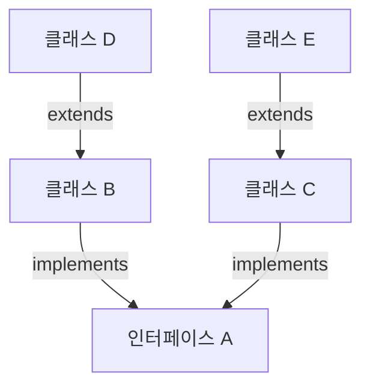

# 8.10 타입 변환

인터페이스의 타입 변환은 인터페이스와 구현 클래스 간에 발생한다. 인터페이스 변수에 구현 객체를 대입하면 구현 객체는 인터페이스 타입으로 자동 타입 변환된다. 반대로 인터페이스 타입을 구현 클래스 타입으로 변환시킬 수 있는데, 이때는 강제 타입 변환이 필요하다.

## 자동 타입 변환

자동 타입 변환(Promotion)은 의미 그대로 자동으로 타입 변환이 일어나는 것을 말한다. 자동 타입 변환은 다음과 같은 조건에서 일어난다.

```java
인터페이스 변수 = 구현객체;
```

부모 클래스가 인터페이스를 구현하고 있다면 자식 클래스도 인터페이스 타입으로 자동 타입 변환될 수 있다. 다음 그림을 보면서 이해해 보자. 인터페이스 A를 구현한 B, C 클래스가 있고, B를 상속한 D 클래스, C를 상속한 E 클래스가 있다.



```java
B b = new B();
C c = new C();
D d = new D();
E e = new E();

A a;
a = b; // (가능)
a = c; // (가능)
a = d; // (가능)
a = e; // (가능)
```

B, C, D, E로부터 생성된 객체는 모두 인터페이스 A로 자동 타입 변환될 수 있다. 모두 인터페이스 A를 직·간접적으로 구현하고 있기 때문이다.

**PromotionExample.java**
```java
package ch08.sec10.exam01;

public class PromotionExample {
	public static void main(String[] args) {
		// 구현 객체 생성
		B b = new B();
		C c = new C();
		D d = new D();
		E e = new E();
		
		// 인터페이스 변수 선언
		A a;
		
		// 변수에 구현 객체 대입
		a = b; // A <- B (자동 타입 변환)
		a = c; // A <- C (자동 타입 변환)
		a = d; // A <- D (자동 타입 변환)
		a = e; // A <- E (자동 타입 변환)
	}
}
```

## 강제 타입 변환

강제 타입 변환은 캐스팅(Casting) 기호를 사용해서 인터페이스 타입을 구현 클래스 타입으로 변환시키는 것을 말한다.

```java
구현클래스 변수 = (구현클래스) 인터페이스변수;
```

구현 객체가 인터페이스 타입으로 자동 변환되면, 인터페이스에 선언된 메소드만 사용 가능하다. `RemoteControl` 인터페이스에는 3개의 메소드, `Television` 클래스에는 5개의 메소드가 선언되어 있다면 `RemoteControl` 인터페이스로 호출 가능한 메소드는 3개뿐이다.

자동 타입 변환 후에 `Television`의 `setTime()`과 `record()` 메소드를 호출하고 싶다면 다음과 같이 캐스팅 기호를 사용해서 원래 `Television`으로 강제 타입 변환해야 한다.

```java
RemoteControl rc = new Television();
rc.turnOn();
rc.turnOff();
rc.setVolume(5);

Television tv = (Television) rc;
tv.turnOn();
tv.turnOff();
tv.setVolume(5);
tv.setTime();
tv.record();
```

또 다른 예를 보자. `Vehicle` 인터페이스를 구현한 `Bus`를 `Vehicle`로 자동 타입 변환하면 `checkFare()` 메소드를 호출할 수 없지만, 강제 타입 변환해서 `Bus`로 변환하면 호출이 가능해진다.

**Vehicle.java**
```java
package ch08.sec10.exam02;

public interface Vehicle {
	// 추상 메소드
	void run();
}
```

**Bus.java**
```java
package ch08.sec10.exam02;

public class Bus implements Vehicle {
	// 추상 메소드 재정의
	@Override
	public void run() {
		System.out.println("버스가 달립니다.");
	}
	
	// 추가 메소드
	public void checkFare() {
		System.out.println("승차요금을 체크합니다.");
	}
}
```

**CastingExample.java**
```java
package ch08.sec10.exam02;

public class CastingExample {
	public static void main(String[] args) {
		// 인터페이스 변수 선언과 구현 객체 대입
		Vehicle vehicle = new Bus();
		
		// 인터페이스를 통해서 호출
		vehicle.run();
		// vehicle.checkFare(); // (x)
		
		// 강제 타입 변환 후 호출
		Bus bus = (Bus) vehicle;
		bus.run();
		bus.checkFare();
	}
}
```

**실행 결과**
```
버스가 달립니다.
버스가 달립니다.
승차요금을 체크합니다.
```
