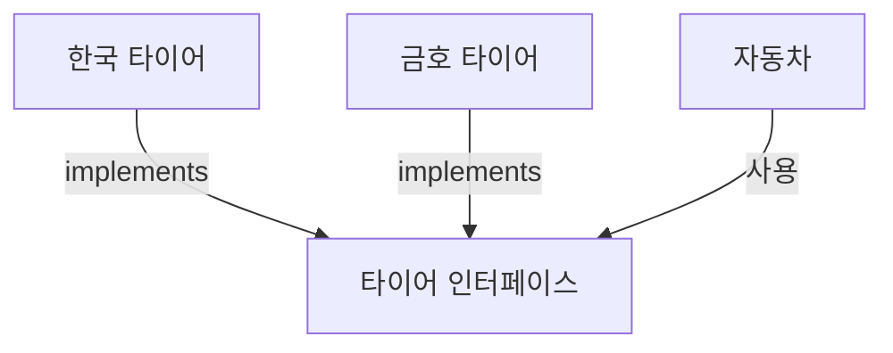

# 8.11 다형성

우리는 7장 상속에서 다형성에 대해 살펴보았다. 인터페이스 또한 다형성을 구현하는 주된 기술로 사용된다. 현업에서는 상속보다는 인터페이스를 통해서 다형성을 구현하는 경우가 더 많다.

다형성(Polymorphism)이란 사용 방법은 동일하지만 다양한 결과가 나오는 성질을 말한다. 구현 객체 B와 구현 객체 C 둘 중 어느 객체가 인터페이스에 대입되었느냐에 따라서 객체 A의 메소드 호출 결과는 달라질 수 있다.

상속의 다형성과 마찬가지로 인터페이스 역시 다형성을 구현하기 위해 재정의와 자동 타입 변환 기능을 이용한다.

> 메소드 재정의 + 자동 타입 변환 -> 다형성

인터페이스의 추상 메소드는 구현 클래스에서 재정의를 해야 하며, 재정의되는 내용은 구현 클래스마다 다르다. 구현 객체는 인터페이스 타입으로 자동 타입 변환이 되고, 인터페이스 메소드 호출 시 구현 객체의 재정의된 메소드가 호출되어 다양한 실행 결과를 얻을 수 있다.

## 필드의 다형성

다음 그림은 7장 상속에서 다형성을 설명할 때 보여준 그림과 유사하다. 상속에서는 부모 타이어 클래스 타입에 자식 객체인 한국 타이어 또는 금호 타이어를 대입해서 다형성을 보여주었지만, 이번에는 부모 타입이 클래스 타입이 아니고 인터페이스라는 점이 다르다.



자동차를 설계할 때 다음과 같이 필드 타입으로 타이어 인터페이스를 선언하면 필드값으로 한국 타이어 또는 금호 타이어 객체를 대입할 수 있다. 자동 타입 변환 때문이다.

```java
public class Car {
    Tire tire1 = new HankookTire();
    Tire tire2 = new KumhoTire();
}
```

`Car` 객체를 생성한 후 다른 구현 객체를 대입할 수도 있다. 이것이 타이어 교체에 해당된다.

```java
Car myCar = new Car();
myCar.tire1 = new KumhoTire();
```

`tire1`과 `tire2` 필드에 어떠한 타이어 구현 객체가 대입되어도 `Car` 객체는 타이어 인터페이스에 선언된 메소드만 사용하므로 전혀 문제가 되지 않는다.

**Tire.java**
```java
package ch08.sec11.exam01;

public interface Tire {
	// 추상 메소드
	void roll();
}
```

**HankookTire.java**
```java
package ch08.sec11.exam01;

public class HankookTire implements Tire {
	// 추상 메소드 재정의
	@Override
	public void roll() {
		System.out.println("한국 타이어가 굴러갑니다.");
	}
}
```

**KumhoTire.java**
```java
package ch08.sec11.exam01;

public class KumhoTire implements Tire {
	// 추상 메소드 재정의
	@Override
	public void roll() {
		System.out.println("금호 타이어가 굴러갑니다.");
	}
}
```

**Car.java**
```java
package ch08.sec11.exam01;

public class Car {
	// 필드
	Tire tire1 = new HankookTire();
	Tire tire2 = new HankookTire();
	
	// 메소드
	void run() {
		tire1.roll();
		tire2.roll();
	}
}
```

**CarExample.java**
```java
package ch08.sec11.exam01;

public class CarExample {
	public static void main(String[] args) {
		// 자동차 객체 생성
		Car myCar = new Car();
		
		// run() 메소드 실행
		myCar.run();
		
		// 타이어 객체 교체
		myCar.tire1 = new KumhoTire();
		myCar.tire2 = new KumhoTire();
		
		// run() 메소드 실행(다형성: 실행 결과가 다름)
		myCar.run();
	}
}
```

**실행 결과**
```
한국 타이어가 굴러갑니다.
한국 타이어가 굴러갑니다.
금호 타이어가 굴러갑니다.
금호 타이어가 굴러갑니다.
```

## 매개변수의 다형성

메소드 호출 시 매개값을 다양화하기 위해 상속에서는 매개변수 타입을 부모 타입으로 선언하고 호출할 때에는 다양한 자식 객체를 대입했다. 이것은 자동 타입 변환 때문인데, 비슷한 원리로 매개변수 타입을 인터페이스로 선언하면 메소드 호출 시 다양한 구현 객체를 대입할 수 있다.

`Vehicle` 인터페이스가 다음과 같이 선언되었다고 가정해 보자.

```java
public interface Vehicle {
    void run();
}
```

운전자 클래스인 `Driver`는 다양한 `Vehicle` 구현 객체를 운전하기 위해 `Vehicle` 인터페이스를 매개변수로 가지는 `drive()` 메소드를 다음과 같이 선언했다.

```java
public class Driver {
    void drive(Vehicle vehicle) {
        vehicle.run(); // 인터페이스의 추상 메소드 호출
    }
}
```

`Bus`가 `Vehicle`의 구현 클래스라면 다음과 같이 `Driver`의 `drive()` 메소드를 호출할 때 `Bus` 객체를 생성해서 매개값으로 줄 수 있다.

```java
Driver driver = new Driver();
Bus bus = new Bus();
driver.drive(bus);
```

`drive()` 메소드를 호출할 때 인터페이스 `Vehicle`을 구현하는 어떠한 객체라도 매개값으로 줄 수 있는데, 어떤 객체를 주느냐에 따라 `run()` 메소드의 실행 결과는 다르게 나온다. 이유는 구현 객체에서 재정의된 `run()` 메소드의 실행 내용이 다르기 때문이다. 이것이 매개변수의 다형성이다.

**Vehicle.java**
```java
package ch08.sec11.exam02;

public interface Vehicle {
	// 추상 메소드
	void run();
}
```

**Driver.java**
```java
package ch08.sec11.exam02;

public class Driver {
	void drive(Vehicle vehicle) {
		vehicle.run();
	}
}
```

**Bus.java**
```java
package ch08.sec11.exam02;

public class Bus implements Vehicle {
	// 추상 메소드 재정의
	@Override
	public void run() {
		System.out.println("버스가 달립니다.");
	}
}
```

**Taxi.java**
```java
package ch08.sec11.exam02;

public class Taxi implements Vehicle {
	// 추상 메소드 재정의
	@Override
	public void run() {
		System.out.println("택시가 달립니다.");
	}
}
```

**DriverExample.java**
```java
package ch08.sec11.exam02;

public class DriverExample {
	public static void main(String[] args) {
		// Driver 객체 생성
		Driver driver = new Driver();
		
		// Vehicle 구현 객체 생성
		Bus bus = new Bus();
		Taxi taxi = new Taxi();
		
		// 매개값으로 구현 객체 대입(다형성: 실행 결과가 다름)
		driver.drive(bus);
		driver.drive(taxi);
	}
}
```

**실행 결과**
```
버스가 달립니다.
택시가 달립니다.
```
