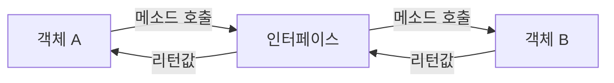
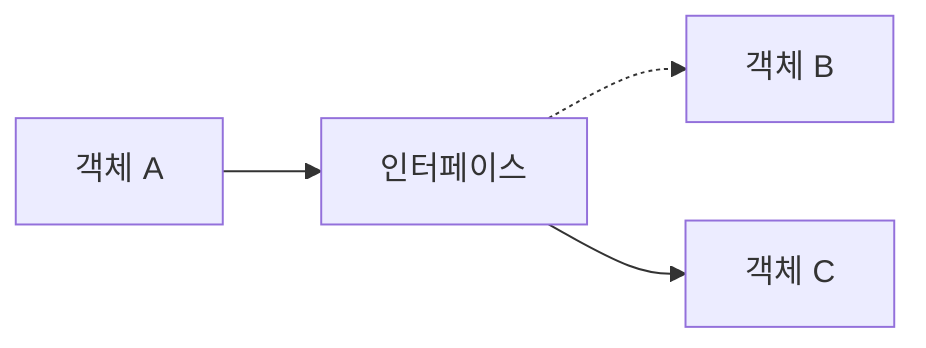
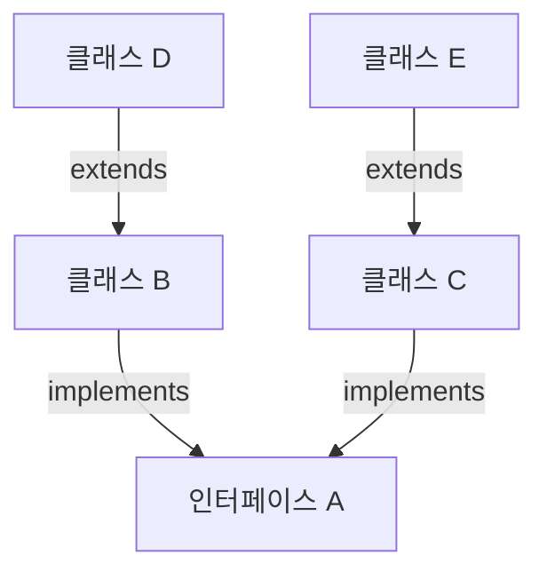
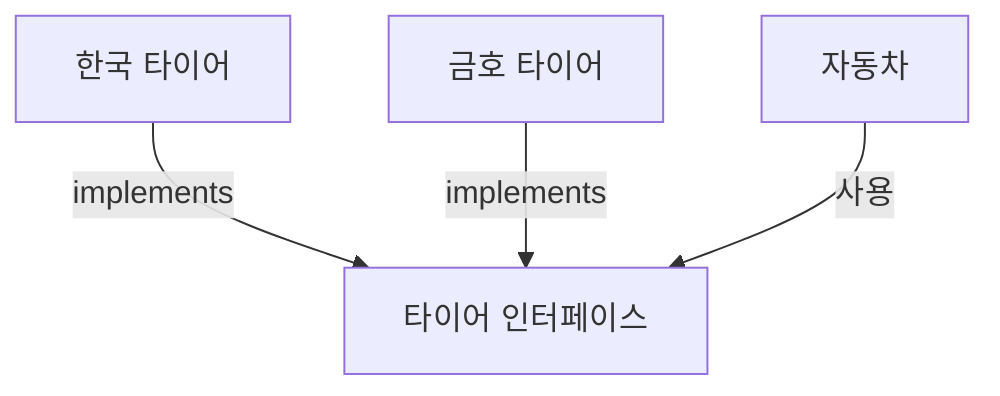

# Chapter 08. 인터페이스

## 8.1 인터페이스의 역할

인터페이스(Interface)는 사전적인 의미로 두 장치를 연결하는 접속기를 말한다. 여기서 두 장치를 서로 다른 객체로 본다면, 인터페이스는 이 두 객체를 연결하는 역할을 한다. 다음 그림과 같이 객체 A는 인터페이스를 통해 객체 B를 사용할 수 있다.



객체 A가 인터페이스의 메소드를 호출하면, 인터페이스는 객체 B의 메소드를 호출하고 그 결과를 받아 객체 A로 전달해 준다. 객체 A가 객체 B의 메소드를 직접 호출하면 간단할텐데 왜 중간에 인터페이스를 거치도록 하는 것일까? 다음 그림과 같이 객체 B가 객체 C로 교체된다고 가정해 보자.



객체 A는 인터페이스의 메소드만 사용하므로 객체 B가 객체 C로 변경된 것에는 관심이 없다. 만약 인터페이스 없이 객체 A가 객체 B를 직접 사용한다면 객체 A의 소스 코드를 객체 B에서 객체 C로 변경하는 작업이 추가로 필요할 것이다.

객체 A가 인터페이스의 메소드를 호출하면 실제로 실행되는 것은 인터페이스 뒤편의 객체 B 또는 객체 C의 메소드이다. 만약 객체 B의 메소드 실행 결과와 객체 C의 메소드 실행 결과가 다르다면, 객체 A는 객체 교체로 인해 다른 결과를 얻게 된다.

이 특징으로 인해 인터페이스는 다형성 구현에 주된 기술로 이용된다. 상속을 이용해서 다형성을 구현할 수도 있지만, 인터페이스를 이용해서 다형성을 구현하는 경우가 더 많다.

## 8.2 인터페이스와 구현 클래스 선언

인터페이스는 `*.java` 형태의 소스 파일로 작성되고 `*.class` 형태로 컴파일되기 때문에 물리적 형태는 클래스와 동일하다. 단, 소스를 작성할 때 선언하는 방법과 구성 멤버가 클래스와 다르다.

### 인터페이스 선언

인터페이스 선언은 `class` 키워드 대신 `interface` 키워드를 사용한다. 접근 제한자로는 클래스와 마찬가지로 같은 패키지 내에서만 사용 가능한 `default`, 패키지와 상관없이 사용하는 `public`을 붙일 수 있다.

```java
interface 인터페이스명 { ... } // default 접근 제한
public interface 인터페이스명 { ... } // public 접근 제한
```

중괄호 안에는 인터페이스가 가지는 멤버들을 선언할 수 있는데, 다음과 같은 종류가 있다.

```java
public interface 인터페이스명 {
    // public 상수 필드
    // public 추상 메소드
    // public 디폴트 메소드
    // public 정적 메소드
    // private 메소드
    // private 정적 메소드
}
```

각 멤버의 역할은 다음 절부터 하나씩 살펴보기로 하고, 여기서는 이클립스에서 인터페이스를 선언하는 방법을 알아보자.

1.  Package Explorer 뷰에서 `thisisjava` 프로젝트의 `src` 폴더에 `ch08.sec02` 패키지를 생성하고, 마우스 오른쪽 버튼으로 클릭하여 [New] - [Interface]를 선택한다.
2.  [New Java Interface] 대화상자가 나타나면 Name 입력란에 인터페이스명으로 `RemoteControl`을 입력하고, [Finish] 버튼을 클릭한다.
3.  그리고 다음과 같이 `public` 추상 메소드인 `turnOn()`을 하나 작성한다. 추상 메소드란 선언부만 있고 실행부인 중괄호가 없는 메소드를 말한다.

**RemoteControl.java**
```java
package ch08.sec02;

public interface RemoteControl {
	// public 추상 메소드
	public void turnOn();
}
```

### 구현 클래스 선언

다음 그림을 다시 보자. 객체 A가 인터페이스의 추상 메소드를 호출하면 인터페이스는 객체 B의 메소드를 실행한다. 그렇다면 객체 B는 인터페이스에 선언된 추상 메소드와 동일한 선언부를 가진(재정의된) 메소드를 가지고 있어야 한다.

여기서 객체 B를 인터페이스를 구현한(implement) 객체라고 한다. 인터페이스에 정의된 추상 메소드에 대한 실행 내용이 구현(작성)되어 있기 때문이다. 객체 B와 같은 구현 객체는 다음과 같이 인터페이스를 구현하고 있음을 선언부에 명시해야 한다.

```java
public class B implements 인터페이스명 { ... }
```

`implements` 키워드는 해당 클래스가 인터페이스를 통해 사용할 수 있다는 표시이며, 인터페이스의 추상 메소드를 재정의한 메소드가 있다는 뜻이다.

앞에서 선언한 `RemoteControl` 인터페이스로 `Television`을 사용할 수 있도록 `Television` 구현 클래스를 선언해 보자.

`ch08.sec02` 패키지에서 `RemoteControl`의 추상 메소드인 `turnOn()`을 다음과 같이 재정의한다.

**Television.java**
```java
package ch08.sec02;

public class Television implements RemoteControl {
	@Override
	public void turnOn() {
		System.out.println("TV를 켭니다.");
	}
}
```

또는

```java
package ch08.sec02;

public class Audio implements RemoteControl {
	@Override
	public void turnOn() {
		System.out.println("Audio를 켭니다.");
	}
}
```

### 변수 선언과 구현 객체 대입

인터페이스도 하나의 타입이므로 변수의 타입으로 사용할 수 있다. 인터페이스는 참조 타입에 속하므로 인터페이스 변수에는 객체를 참조하고 있지 않다는 뜻으로 `null`을 대입할 수 있다.

```java
RemoteControl rc;
RemoteControl rc = null;
```

인터페이스를 통해 구현 객체를 사용하려면, 인터페이스 변수에 구현 객체를 대입해야 한다. 정확히 말하면 구현 객체의 번지를 대입해야 한다. 다음은 `Television` 객체를 생성하고 번지를 대입하는 코드이다.

```java
rc = new Television();
```

만약 `Television`이 `implements RemoteControl`로 선언되지 않았다면 `RemoteControl` 타입의 변수 `rc`에 대입할 수 없다. 인터페이스 변수에 구현 객체가 대입이 되었다면 변수를 통해 인터페이스의 추상 메소드를 호출할 수 있게 된다.

```java
rc.turnOn();
```

인터페이스 변수를 통해 `turnOn()` 메소드가 호출되면, 실제로 실행되는 것은 `Television`에서 재정의된 `turnOn()` 메소드이다. 이를 확인하기 위해 다음과 같이 `RemoteControlExample`을 작성하고 실행해 보자.

**RemoteControlExample.java**
```java
package ch08.sec02;

public class RemoteControlExample {
	public static void main(String[] args) {
		RemoteControl rc;
		
		// rc 변수에 Television 객체를 대입
		rc = new Television();
		rc.turnOn();
		
		// rc 변수에 Audio 객체를 대입(교체시킴)
		rc = new Audio();
		rc.turnOn();
	}
}
```

**실행 결과**
```
TV를 켭니다.
Audio를 켭니다.
```

5~6라인처럼 변수를 먼저 선언한 다음에 구현 객체를 대입해도 되지만, 다음과 같이 변수 선언과 동시에 구현 객체를 대입할 수도 있다.

```java
RemoteControl rc = new Television();
```

`rc` 변수에는 `RemoteControl`을 구현한 어떠한 객체든 대입이 가능하다. 만약 `Audio` 객체가 구현 객체라면 다음과 같이 `Audio` 객체로 교체해서 대입할 수도 있다.

```java
rc = new Audio();
rc.turnOn();
```

이 경우, 실제 실행되는 것은 `Audio`에서 재정의된 `turnOn()` 메소드이다.

## 8.3 상수 필드

인터페이스는 `public static final` 특성을 갖는 불변의 상수 필드를 멤버로 가질 수 있다.

```java
[public static final] 타입 상수명 = 값;
```

인터페이스에 선언된 필드는 모두 `public static final` 특성을 갖기 때문에 `public static final`을 생략하더라도 자동적으로 컴파일 과정에서 붙게 된다. 상수명은 대문자로 작성하되, 서로 다른 단어로 구성되어 있을 경우에는 언더바(`_`)로 연결하는 것이 관례이다.

다음과 같이 `RemoteControl` 인터페이스에 `MAX_VOLUME`과 `MIN_VOLUME` 상수를 선언해 보자.

**RemoteControl.java**
```java
package ch08.sec03;

public interface RemoteControl {
	int MAX_VOLUME = 10;
	int MIN_VOLUME = 0;
}
```

상수는 구현 객체와 관련 없는 인터페이스 소속 멤버이므로 다음과 같이 인터페이스로 바로 접근해서 상수값을 읽을 수 있다.

**RemoteControlExample.java**
```java
package ch08.sec03;

public class RemoteControlExample {
	public static void main(String[] args) {
		System.out.println("리모콘 최대 볼륨: " + RemoteControl.MAX_VOLUME);
		System.out.println("리모콘 최저 볼륨: " + RemoteControl.MIN_VOLUME);
	}
}
```

## 8.4 추상 메소드

인터페이스는 구현 클래스가 재정의해야 하는 `public` 추상 메소드(abstract method)를 멤버로 가질 수 있다. 추상 메소드는 리턴 타입, 메소드명, 매개변수만 기술되고 중괄호 `{}`를 붙이지 않는 메소드를 말한다. `public abstract`를 생략하더라도 컴파일 과정에서 자동으로 붙게 된다.

```java
[public abstract] 리턴타입 메소드명(매개변수, ...);
```

추상 메소드는 객체 A가 인터페이스를 통해 어떻게 메소드를 호출할 수 있는지 방법을 알려주는 역할을 한다. 인터페이스 구현 객체 B는 추상 메소드의 실행부를 갖는 재정의된 메소드가 있어야 한다.

`RemoteControl` 인터페이스에서 `turnOn()`, `turnOff()`, `setVolume()` 추상 메소드를 각각 선언해 보자.

**RemoteControl.java**
```java
package ch08.sec04;

public interface RemoteControl {
	// 상수 필드
	int MAX_VOLUME = 10;
	int MIN_VOLUME = 0;
	
	// 추상 메소드
	void turnOn();
	void turnOff();
	void setVolume(int volume);
}
```

`RemoteControl` 인터페이스를 통해서 다음과 같이 구현 객체인 `Television`과 `Audio`를 사용한다고 가정해 보자.

구현 클래스인 `Television`과 `Audio`는 인터페이스에 선언된 모든 추상 메소드를 재정의해서 실행 코드를 가져야 한다. 다음과 같이 `Television`과 `Audio` 구현 클래스를 선언해 보자.

**Television.java**
```java
package ch08.sec04;

public class Television implements RemoteControl {
	// 필드
	private int volume;
	
	// turnOn() 추상 메소드 오버라이딩
	@Override
	public void turnOn() {
		System.out.println("TV를 켭니다.");
	}
	
	// turnOff() 추상 메소드 오버라이딩
	@Override
	public void turnOff() {
		System.out.println("TV를 끕니다.");
	}
	
	// setVolume() 추상 메소드 오버라이딩
	@Override
	public void setVolume(int volume) {
		if (volume > RemoteControl.MAX_VOLUME) {
			this.volume = RemoteControl.MAX_VOLUME;
		} else if (volume < RemoteControl.MIN_VOLUME) {
			this.volume = RemoteControl.MIN_VOLUME;
		} else {
			this.volume = volume;
		}
		System.out.println("현재 TV 볼륨: " + this.volume);
	}
}
```

**Audio.java**
```java
package ch08.sec04;

public class Audio implements RemoteControl {
	// 필드
	private int volume;
	
	// turnOn() 추상 메소드 오버라이딩
	@Override
	public void turnOn() {
		System.out.println("Audio를 켭니다.");
	}
	
	// turnOff() 추상 메소드 오버라이딩
	@Override
	public void turnOff() {
		System.out.println("Audio를 끕니다.");
	}
	
	// setVolume() 추상 메소드 오버라이딩
	@Override
	public void setVolume(int volume) {
		if (volume > RemoteControl.MAX_VOLUME) {
			this.volume = RemoteControl.MAX_VOLUME;
		} else if (volume < RemoteControl.MIN_VOLUME) {
			this.volume = RemoteControl.MIN_VOLUME;
		} else {
			this.volume = volume;
		}
		System.out.println("현재 Audio 볼륨: " + this.volume);
	}
}
```

구현 클래스에서 추상 메소드를 재정의할 때 주의할 점은 인터페이스의 추상 메소드는 기본적으로 `public` 접근 제한을 갖기 때문에 `public`보다 더 낮은 접근 제한으로 재정의할 수 없다. 그래서 재정의되는 메소드에는 모두 `public`이 추가되어 있다.

인터페이스로 구현 객체를 사용하려면 다음과 같이 인터페이스 변수를 선언하고 구현 객체를 대입해야 한다. 인터페이스 변수는 참조 타입이기 때문에 구현 객체가 대입되면 구현 객체의 번지를 저장한다.

```java
RemoteControl rc;
rc = new Television();
rc = new Audio();
```

구현 객체가 대입되면 인터페이스 변수로 추상 메소드를 호출할 수 있게 된다. 이때 어떤 구현 객체가 대입되었는지에 따라 실행 내용이 달라진다. `Television`이 대입되었다면 `Television`의 재정의된 메소드가, `Audio`가 대입되었다면 `Audio`의 재정의된 메소드가 실행된다.

**RemoteControlExample.java**
```java
package ch08.sec04;

public class RemoteControlExample {
	public static void main(String[] args) {
		// 인터페이스 변수 선언
		RemoteControl rc;
		
		// Television 객체를 생성하고 인터페이스 변수에 대입
		rc = new Television();
		rc.turnOn();
		rc.setVolume(5);
		rc.turnOff();
		
		// Audio 객체를 생성하고 인터페이스 변수에 대입
		rc = new Audio();
		rc.turnOn();
		rc.setVolume(5);
		rc.turnOff();
	}
}
```

**실행 결과**
```
TV를 켭니다.
현재 TV 볼륨: 5
TV를 끕니다.
Audio를 켭니다.
현재 Audio 볼륨: 5
Audio를 끕니다.
```

## 8.5 디폴트 메소드

인터페이스에는 완전한 실행 코드를 가진 디폴트 메소드를 선언할 수 있다. 추상 메소드는 실행부(중괄호)가 없지만, 디폴트 메소드는 실행부가 있다. 선언 방법은 클래스 메소드와 동일한데, 차이점은 `default` 키워드가 리턴 타입 앞에 붙는다.

```java
[public] default 리턴타입 메소드명(매개변수, ...) { ... }
```

디폴트 메소드의 실행부에는 상수 필드를 읽거나 추상 메소드를 호출하는 코드를 작성할 수 있다. `RemoteControl` 인터페이스에서 무음 처리 기능을 제공하는 `setMute()` 디폴트 메소드를 선언해 보자.

**RemoteControl.java**
```java
package ch08.sec05;

public interface RemoteControl {
	// 상수 필드
	int MAX_VOLUME = 10;
	int MIN_VOLUME = 0;
	
	// 추상 메소드
	void turnOn();
	void turnOff();
	void setVolume(int volume);
	
	// 디폴트 인스턴스 메소드
	default void setMute(boolean mute) {
		if (mute) {
			System.out.println("무음 처리합니다.");
			// 추상 메소드 호출하면서 상수 필드 사용
			setVolume(MIN_VOLUME);
		} else {
			System.out.println("무음 해제합니다.");
		}
	}
}
```

디폴트 메소드는 구현 객체가 필요한 메소드이다. 따라서 `RemoteControl`의 `setMute()` 메소드를 호출하려면 구현 객체인 `Television` 객체를 다음과 같이 인터페이스 변수에 대입하고 나서 `setMute()`를 호출해야 한다.

**RemoteControlExample.java**
```java
package ch08.sec05;

public class RemoteControlExample {
	public static void main(String[] args) {
		// 인터페이스 변수 선언
		RemoteControl rc;
		
		// Television 객체를 생성하고 인터페이스 변수에 대입
		rc = new Television();
		rc.turnOn();
		rc.setVolume(5);
		
		// 디폴트 메소드 호출
		rc.setMute(true);
		rc.setMute(false);
		
		System.out.println();
		
		// Audio 객체를 생성하고 인터페이스 변수에 대입
		rc = new Audio();
		rc.turnOn();
		rc.setVolume(5);
		
		// 디폴트 메소드 호출
		rc.setMute(true);
		rc.setMute(false);
	}
}
```

**실행 결과**
```
TV를 켭니다.
현재 TV 볼륨: 5
무음 처리합니다.
현재 TV 볼륨: 0
무음 해제합니다.

Audio를 켭니다.
현재 Audio 볼륨: 5
무음 처리합니다.
현재 Audio 볼륨: 0
무음 해제합니다.
```

구현 클래스는 디폴트 메소드를 재정의해서 자신에게 맞게 수정할 수도 있다. 재정의 시 주의할 점은 `public` 접근 제한자를 반드시 붙여야 하고, `default` 키워드를 생략해야 한다. `Audio` 구현 클래스에서 `setMute()` 메소드를 재정의해 원래 볼륨으로 복원해 보자.

**Audio.java**
```java
package ch08.sec05;

public class Audio implements RemoteControl {
	// 필드
	private int volume;
	
	// turnOn() 추상 메소드 오버라이딩
	@Override
	public void turnOn() {
		System.out.println("Audio를 켭니다.");
	}
	
	// turnOff() 추상 메소드 오버라이딩
	@Override
	public void turnOff() {
		System.out.println("Audio를 끕니다.");
	}
	
	// setVolume() 추상 메소드 오버라이딩
	@Override
	public void setVolume(int volume) {
		if (volume > RemoteControl.MAX_VOLUME) {
			this.volume = RemoteControl.MAX_VOLUME;
		} else if (volume < RemoteControl.MIN_VOLUME) {
			this.volume = RemoteControl.MIN_VOLUME;
		} else {
			this.volume = volume;
		}
		System.out.println("현재 Audio 볼륨: " + this.volume);
	}
	
	// 필드
	private int memoryVolume;
	
	// 디폴트 메소드 재정의
	@Override
	public void setMute(boolean mute) {
		if (mute) {
			this.memoryVolume = this.volume;
			System.out.println("무음 처리합니다.");
			setVolume(RemoteControl.MIN_VOLUME);
		} else {
			System.out.println("무음 해제합니다.");
			setVolume(this.memoryVolume);
		}
	}
}
```

**RemoteControlExample.java** (실행 결과)
```
...
Audio를 켭니다.
현재 Audio 볼륨: 5
무음 처리합니다.
현재 Audio 볼륨: 0
무음 해제합니다.
현재 Audio 볼륨: 5
```

## 8.6 정적 메소드

인터페이스에는 정적 메소드도 선언이 가능하다. 추상 메소드와 디폴트 메소드는 구현 객체가 필요하지만, 정적 메소드는 구현 객체가 없어도 인터페이스만으로 호출할 수 있다. 선언 방법은 클래스 정적 메소드와 완전 동일하다. 단, `public`을 생략하더라도 자동으로 컴파일 과정에서 붙는 것이 차이점이다.

```java
[public | private] static 리턴타입 메소드명(매개변수, ...) { ... }
```

`RemoteControl` 인터페이스에서 배터리를 교환하는 기능을 가진 `changeBattery()` 정적 메소드를 선언해 보자.

**RemoteControl.java**
```java
package ch08.sec06;

public interface RemoteControl {
	// 상수 필드
	int MAX_VOLUME = 10;
	int MIN_VOLUME = 0;
	
	// 추상 메소드
	void turnOn();
	void turnOff();
	void setVolume(int volume);
	
	// 디폴트 메소드
	default void setMute(boolean mute) {
		if (mute) {
			System.out.println("무음 처리합니다.");
			setVolume(MIN_VOLUME);
		} else {
			System.out.println("무음 해제합니다.");
		}
	}
	
	// 정적 메소드
	static void changeBattery() {
		System.out.println("리모콘 건전지를 교환합니다.");
	}
}
```

인터페이스에 선언된 정적 메소드는 구현 객체 없이 인터페이스명으로 접근해서 호출할 수 있다. 따라서 `RemoteControl`의 `changeBattery()` 메소드는 `RemoteControl.changeBattery()`로 호출할 수 있다.

**RemoteControlExample.java**
```java
package ch08.sec06;

public class RemoteControlExample {
	public static void main(String[] args) {
		// 인터페이스 변수 선언
		RemoteControl rc;
		
		// Television 객체를 생성하고 인터페이스 변수에 대입
		rc = new Television();
		rc.turnOn();
		rc.setVolume(5);
		
		// 디폴트 메소드 호출
		rc.setMute(true);
		rc.setMute(false);
		
		System.out.println();
		
		// Audio 객체를 생성하고 인터페이스 변수에 대입
		rc = new Audio();
		rc.turnOn();
		rc.setVolume(5);
		
		// 디폴트 메소드 호출
		rc.setMute(true);
		rc.setMute(false);
		
		System.out.println();
		
		// 정적 메소드 호출
		RemoteControl.changeBattery();
	}
}
```

**실행 결과**
```
...
리모콘 건전지를 교환합니다.
```

정적 메소드의 실행부(중괄호)를 작성할 때 주의할 점은 상수 필드를 제외한 추상 메소드, 디폴트 메소드, `private` 메소드 등을 호출할 수 없다는 것이다. 이 메소드는 구현 객체가 필요한 인스턴스 메소드이기 때문이다.

## 8.7 private 메소드

인터페이스의 상수 필드, 추상 메소드, 디폴트 메소드, 정적 메소드는 모두 `public` 접근 제한을 갖는다. 이 멤버들을 선언할 때에는 `public`을 생략하더라도 컴파일 과정에서 `public` 접근 제한자가 붙어 항상 외부에서 접근이 가능하다. 또한 인터페이스에 외부에서 접근할 수 없는 `private` 메소드 선언도 가능하다.

| 종류                  | 설명                         |
| :-------------------- | :--------------------------- |
| `private` 메소드      | 구현 객체가 필요한 메소드    |
| `private` 정적 메소드 | 구현 객체가 필요 없는 메소드 |

`private` 메소드는 디폴트 메소드 안에서만 호출이 가능한 반면, `private` 정적 메소드는 디폴트 메소드뿐만 아니라 정적 메소드 안에서도 호출이 가능하다. `private` 메소드의 용도는 디폴트와 정적 메소드들의 중복 코드를 줄이기 위함이다.

다음 예제는 `Service` 인터페이스에서 2개의 디폴트 메소드와 2개의 정적 메소드 중 중복 코드 부분을 각각 `private` 메소드와 `private` 정적 메소드로 선언하고 호출하는 방법을 보여 준다.

**Service.java**
```java
package ch08.sec07;

public interface Service {
	// 디폴트 메소드
	default void defaultMethod1() {
		System.out.println("defaultMethod1 종속 코드");
		defaultCommon();
	}
	
	default void defaultMethod2() {
		System.out.println("defaultMethod2 종속 코드");
		defaultCommon();
	}
	
	// private 메소드
	private void defaultCommon() {
		System.out.println("defaultMethod 중복 코드A");
		System.out.println("defaultMethod 중복 코드B");
	}
	
	// 정적 메소드
	static void staticMethod1() {
		System.out.println("staticMethod1 종속 코드");
		staticCommon();
	}
	
	static void staticMethod2() {
		System.out.println("staticMethod2 종속 코드");
		staticCommon();
	}
	
	// private 정적 메소드
	private static void staticCommon() {
		System.out.println("staticMethod 중복 코드C");
		System.out.println("staticMethod 중복 코드D");
	}
}
```

**ServiceImpl.java**
```java
package ch08.sec07;

public class ServiceImpl implements Service {
}
```

**ServiceExample.java**
```java
package ch08.sec07;

public class ServiceExample {
	public static void main(String[] args) {
		// 인터페이스 변수 선언과 구현 객체 대입
		Service service = new ServiceImpl();
		
		// 디폴트 메소드 호출
		service.defaultMethod1();
		System.out.println();
		service.defaultMethod2();
		System.out.println();
		
		// 정적 메소드 호출
		Service.staticMethod1();
		System.out.println();
		Service.staticMethod2();
		System.out.println();
	}
}
```

**실행 결과**
```
defaultMethod1 종속 코드
defaultMethod 중복 코드A
defaultMethod 중복 코드B

defaultMethod2 종속 코드
defaultMethod 중복 코드A
defaultMethod 중복 코드B

staticMethod1 종속 코드
staticMethod 중복 코드C
staticMethod 중복 코드D

staticMethod2 종속 코드
staticMethod 중복 코드C
staticMethod 중복 코드D
```

## 8.8 다중 인터페이스 구현

구현 객체는 여러 개의 인터페이스를 `implements`할 수 있다. 구현 객체가 인터페이스 A와 인터페이스 B를 구현하고 있다면, 각각의 인터페이스를 통해 구현 객체를 사용할 수 있다.


구현 클래스는 다음과 같이 인터페이스 A와 인터페이스 B를 `implements` 뒤에 쉼표로 구분해서 작성해, 모든 인터페이스가 가진 추상 메소드를 재정의해야 한다.

```java
public class 구현클래스명 implements 인터페이스A, 인터페이스B {
    // 모든 추상 메소드 재정의
}
```

인터페이스 A와 인터페이스 B를 구현한 객체는 다음과 같이 두 인터페이스 타입의 변수에 각각 대입될 수 있다.

```java
인터페이스A 변수 = new 구현클래스명(...);
인터페이스B 변수 = new 구현클래스명(...);
```

구현 객체가 어떤 인터페이스 변수에 대입되느냐에 따라 변수를 통해 호출할 수 있는 추상 메소드가 결정된다. 다음과 같이 `RemoteControl` 인터페이스와 `Searchable` 인터페이스를 모두 구현한 `SmartTelevision` 클래스를 작성해 보자.

**RemoteControl.java**
```java
package ch08.sec08;

public interface RemoteControl {
	// 추상 메소드
	void turnOn();
	void turnOff();
}
```

**Searchable.java**
```java
package ch08.sec08;

public interface Searchable {
	// 추상 메소드
	void search(String url);
}
```

**SmartTelevision.java**
```java
package ch08.sec08;

public class SmartTelevision implements RemoteControl, Searchable {
	// turnOn() 추상 메소드 오버라이딩
	@Override
	public void turnOn() {
		System.out.println("TV를 켭니다.");
	}
	
	// turnOff() 추상 메소드 오버라이딩
	@Override
	public void turnOff() {
		System.out.println("TV를 끕니다.");
	}
	
	// search() 추상 메소드 오버라이딩
	@Override
	public void search(String url) {
		System.out.println(url + "을 검색합니다.");
	}
}
```

**MultiInterfaceImplExample.java**
```java
package ch08.sec08;

public class MultiInterfaceImplExample {
	public static void main(String[] args) {
		// RemoteControl 인터페이스 변수 선언 및 구현 객체 대입
		RemoteControl rc = new SmartTelevision();
		// RemoteControl 인터페이스에 선언된 추상 메소드만 호출 가능
		rc.turnOn();
		rc.turnOff();
		
		// Searchable 인터페이스 변수 선언 및 구현 객체 대입
		Searchable searchable = new SmartTelevision();
		// Searchable 인터페이스에 선언된 추상 메소드만 호출 가능
		searchable.search("https://www.youtube.com");
	}
}
```

**실행 결과**
```
TV를 켭니다.
TV를 끕니다.
https://www.youtube.com을 검색합니다.
```

## 8.9 인터페이스 상속

인터페이스도 다른 인터페이스를 상속할 수 있으며, 클래스와는 달리 다중 상속을 허용한다. 다음과 같이 `extends` 키워드 뒤에 상속할 인터페이스들을 나열하면 된다.

```java
public interface 자식인터페이스 extends 부모인터페이스1, 부모인터페이스2 { ... }
```

자식 인터페이스의 구현 클래스는 자식 인터페이스의 메소드뿐만 아니라 부모 인터페이스의 모든 추상 메소드를 재정의해야 한다. 그리고 구현 객체는 다음과 같이 자식 및 부모 인터페이스 변수에 대입될 수 있다.

```java
자식인터페이스 변수 = new 구현클래스(...);
부모인터페이스1 변수 = new 구현클래스(...);
부모인터페이스2 변수 = new 구현클래스(...);
```

구현 객체가 자식 인터페이스 변수에 대입되면 자식 및 부모 인터페이스의 추상 메소드를 모두 호출할 수 있으나, 부모 인터페이스 변수에 대입되면 부모 인터페이스에 선언된 추상 메소드만 호출 가능하다. 다음 예제를 통해 확인해 보자.

**InterfaceA.java**
```java
package ch08.sec09;

public interface InterfaceA {
	// 추상 메소드
	void methodA();
}
```

**InterfaceB.java**
```java
package ch08.sec09;

public interface InterfaceB {
	// 추상 메소드
	void methodB();
}
```

**InterfaceC.java**
```java
package ch08.sec09;

public interface InterfaceC extends InterfaceA, InterfaceB {
	// 추상 메소드
	void methodC();
}
```

**InterfaceCImpl.java**
```java
package ch08.sec09;

public class InterfaceCImpl implements InterfaceC {
	public void methodA() {
		System.out.println("InterfaceCImpl-methodA() 실행");
	}
	
	public void methodB() {
		System.out.println("InterfaceCImpl-methodB() 실행");
	}
	
	public void methodC() {
		System.out.println("InterfaceCImpl-methodC() 실행");
	}
}
```

**ExtendsExample.java**
```java
package ch08.sec09;

public class ExtendsExample {
	public static void main(String[] args) {
		InterfaceCImpl impl = new InterfaceCImpl();
		
		InterfaceA ia = impl;
		ia.methodA();
		// ia.methodB(); // (x)
		System.out.println();
		
		InterfaceB ib = impl;
		// ib.methodA(); // (x)
		ib.methodB();
		System.out.println();
		
		InterfaceC ic = impl;
		ic.methodA();
		ic.methodB();
		ic.methodC();
	}
}
```

**실행 결과**
```
InterfaceCImpl-methodA() 실행

InterfaceCImpl-methodB() 실행

InterfaceCImpl-methodA() 실행
InterfaceCImpl-methodB() 실행
InterfaceCImpl-methodC() 실행
```

## 8.10 타입 변환

인터페이스의 타입 변환은 인터페이스와 구현 클래스 간에 발생한다. 인터페이스 변수에 구현 객체를 대입하면 구현 객체는 인터페이스 타입으로 자동 타입 변환된다. 반대로 인터페이스 타입을 구현 클래스 타입으로 변환시킬 수 있는데, 이때는 강제 타입 변환이 필요하다.

### 자동 타입 변환

자동 타입 변환(Promotion)은 의미 그대로 자동으로 타입 변환이 일어나는 것을 말한다. 자동 타입 변환은 다음과 같은 조건에서 일어난다.

```java
인터페이스 변수 = 구현객체;
```

부모 클래스가 인터페이스를 구현하고 있다면 자식 클래스도 인터페이스 타입으로 자동 타입 변환될 수 있다. 다음 그림을 보면서 이해해 보자. 인터페이스 A를 구현한 B, C 클래스가 있고, B를 상속한 D 클래스, C를 상속한 E 클래스가 있다.



```java
B b = new B();
C c = new C();
D d = new D();
E e = new E();

A a;
a = b; // (가능)
a = c; // (가능)
a = d; // (가능)
a = e; // (가능)
```

B, C, D, E로부터 생성된 객체는 모두 인터페이스 A로 자동 타입 변환될 수 있다. 모두 인터페이스 A를 직·간접적으로 구현하고 있기 때문이다.

**PromotionExample.java**
```java
package ch08.sec10.exam01;

public class PromotionExample {
	public static void main(String[] args) {
		// 구현 객체 생성
		B b = new B();
		C c = new C();
		D d = new D();
		E e = new E();
		
		// 인터페이스 변수 선언
		A a;
		
		// 변수에 구현 객체 대입
		a = b; // A <- B (자동 타입 변환)
		a = c; // A <- C (자동 타입 변환)
		a = d; // A <- D (자동 타입 변환)
		a = e; // A <- E (자동 타입 변환)
	}
}
```

### 강제 타입 변환

강제 타입 변환은 캐스팅(Casting) 기호를 사용해서 인터페이스 타입을 구현 클래스 타입으로 변환시키는 것을 말한다.

```java
구현클래스 변수 = (구현클래스) 인터페이스변수;
```

구현 객체가 인터페이스 타입으로 자동 변환되면, 인터페이스에 선언된 메소드만 사용 가능하다. `RemoteControl` 인터페이스에는 3개의 메소드, `Television` 클래스에는 5개의 메소드가 선언되어 있다면 `RemoteControl` 인터페이스로 호출 가능한 메소드는 3개뿐이다.

자동 타입 변환 후에 `Television`의 `setTime()`과 `record()` 메소드를 호출하고 싶다면 다음과 같이 캐스팅 기호를 사용해서 원래 `Television`으로 강제 타입 변환해야 한다.

```java
RemoteControl rc = new Television();
rc.turnOn();
rc.turnOff();
rc.setVolume(5);

Television tv = (Television) rc;
tv.turnOn();
tv.turnOff();
tv.setVolume(5);
tv.setTime();
tv.record();
```

또 다른 예를 보자. `Vehicle` 인터페이스를 구현한 `Bus`를 `Vehicle`로 자동 타입 변환하면 `checkFare()` 메소드를 호출할 수 없지만, 강제 타입 변환해서 `Bus`로 변환하면 호출이 가능해진다.

**Vehicle.java**
```java
package ch08.sec10.exam02;

public interface Vehicle {
	// 추상 메소드
	void run();
}
```

**Bus.java**
```java
package ch08.sec10.exam02;

public class Bus implements Vehicle {
	// 추상 메소드 재정의
	@Override
	public void run() {
		System.out.println("버스가 달립니다.");
	}
	
	// 추가 메소드
	public void checkFare() {
		System.out.println("승차요금을 체크합니다.");
	}
}
```

**CastingExample.java**
```java
package ch08.sec10.exam02;

public class CastingExample {
	public static void main(String[] args) {
		// 인터페이스 변수 선언과 구현 객체 대입
		Vehicle vehicle = new Bus();
		
		// 인터페이스를 통해서 호출
		vehicle.run();
		// vehicle.checkFare(); // (x)
		
		// 강제 타입 변환 후 호출
		Bus bus = (Bus) vehicle;
		bus.run();
		bus.checkFare();
	}
}
```

**실행 결과**
```
버스가 달립니다.
버스가 달립니다.
승차요금을 체크합니다.
```

## 8.11 다형성

우리는 7장 상속에서 다형성에 대해 살펴보았다. 인터페이스 또한 다형성을 구현하는 주된 기술로 사용된다. 현업에서는 상속보다는 인터페이스를 통해서 다형성을 구현하는 경우가 더 많다.

다형성(Polymorphism)이란 사용 방법은 동일하지만 다양한 결과가 나오는 성질을 말한다. 구현 객체 B와 구현 객체 C 둘 중 어느 객체가 인터페이스에 대입되었느냐에 따라서 객체 A의 메소드 호출 결과는 달라질 수 있다.

상속의 다형성과 마찬가지로 인터페이스 역시 다형성을 구현하기 위해 재정의와 자동 타입 변환 기능을 이용한다.

> 메소드 재정의 + 자동 타입 변환 -> 다형성

인터페이스의 추상 메소드는 구현 클래스에서 재정의를 해야 하며, 재정의되는 내용은 구현 클래스마다 다르다. 구현 객체는 인터페이스 타입으로 자동 타입 변환이 되고, 인터페이스 메소드 호출 시 구현 객체의 재정의된 메소드가 호출되어 다양한 실행 결과를 얻을 수 있다.

### 필드의 다형성

다음 그림은 7장 상속에서 다형성을 설명할 때 보여준 그림과 유사하다. 상속에서는 부모 타이어 클래스 타입에 자식 객체인 한국 타이어 또는 금호 타이어를 대입해서 다형성을 보여주었지만, 이번에는 부모 타입이 클래스 타입이 아니고 인터페이스라는 점이 다르다.



자동차를 설계할 때 다음과 같이 필드 타입으로 타이어 인터페이스를 선언하면 필드값으로 한국 타이어 또는 금호 타이어 객체를 대입할 수 있다. 자동 타입 변환 때문이다.

```java
public class Car {
    Tire tire1 = new HankookTire();
    Tire tire2 = new KumhoTire();
}
```

`Car` 객체를 생성한 후 다른 구현 객체를 대입할 수도 있다. 이것이 타이어 교체에 해당된다.

```java
Car myCar = new Car();
myCar.tire1 = new KumhoTire();
```

`tire1`과 `tire2` 필드에 어떠한 타이어 구현 객체가 대입되어도 `Car` 객체는 타이어 인터페이스에 선언된 메소드만 사용하므로 전혀 문제가 되지 않는다.

**Tire.java**
```java
package ch08.sec11.exam01;

public interface Tire {
	// 추상 메소드
	void roll();
}
```

**HankookTire.java**
```java
package ch08.sec11.exam01;

public class HankookTire implements Tire {
	// 추상 메소드 재정의
	@Override
	public void roll() {
		System.out.println("한국 타이어가 굴러갑니다.");
	}
}
```

**KumhoTire.java**
```java
package ch08.sec11.exam01;

public class KumhoTire implements Tire {
	// 추상 메소드 재정의
	@Override
	public void roll() {
		System.out.println("금호 타이어가 굴러갑니다.");
	}
}
```

**Car.java**
```java
package ch08.sec11.exam01;

public class Car {
	// 필드
	Tire tire1 = new HankookTire();
	Tire tire2 = new HankookTire();
	
	// 메소드
	void run() {
		tire1.roll();
		tire2.roll();
	}
}
```

**CarExample.java**
```java
package ch08.sec11.exam01;

public class CarExample {
	public static void main(String[] args) {
		// 자동차 객체 생성
		Car myCar = new Car();
		
		// run() 메소드 실행
		myCar.run();
		
		// 타이어 객체 교체
		myCar.tire1 = new KumhoTire();
		myCar.tire2 = new KumhoTire();
		
		// run() 메소드 실행(다형성: 실행 결과가 다름)
		myCar.run();
	}
}
```

**실행 결과**
```
한국 타이어가 굴러갑니다.
한국 타이어가 굴러갑니다.
금호 타이어가 굴러갑니다.
금호 타이어가 굴러갑니다.
```

### 매개변수의 다형성

메소드 호출 시 매개값을 다양화하기 위해 상속에서는 매개변수 타입을 부모 타입으로 선언하고 호출할 때에는 다양한 자식 객체를 대입했다. 이것은 자동 타입 변환 때문인데, 비슷한 원리로 매개변수 타입을 인터페이스로 선언하면 메소드 호출 시 다양한 구현 객체를 대입할 수 있다.

`Vehicle` 인터페이스가 다음과 같이 선언되었다고 가정해 보자.

```java
public interface Vehicle {
    void run();
}
```

운전자 클래스인 `Driver`는 다양한 `Vehicle` 구현 객체를 운전하기 위해 `Vehicle` 인터페이스를 매개변수로 가지는 `drive()` 메소드를 다음과 같이 선언했다.

```java
public class Driver {
    void drive(Vehicle vehicle) {
        vehicle.run(); // 인터페이스의 추상 메소드 호출
    }
}
```

`Bus`가 `Vehicle`의 구현 클래스라면 다음과 같이 `Driver`의 `drive()` 메소드를 호출할 때 `Bus` 객체를 생성해서 매개값으로 줄 수 있다.

```java
Driver driver = new Driver();
Bus bus = new Bus();
driver.drive(bus);
```

`drive()` 메소드를 호출할 때 인터페이스 `Vehicle`을 구현하는 어떠한 객체라도 매개값으로 줄 수 있는데, 어떤 객체를 주느냐에 따라 `run()` 메소드의 실행 결과는 다르게 나온다. 이유는 구현 객체에서 재정의된 `run()` 메소드의 실행 내용이 다르기 때문이다. 이것이 매개변수의 다형성이다.

**Vehicle.java**
```java
package ch08.sec11.exam02;

public interface Vehicle {
	// 추상 메소드
	void run();
}
```

**Driver.java**
```java
package ch08.sec11.exam02;

public class Driver {
	void drive(Vehicle vehicle) {
		vehicle.run();
	}
}
```

**Bus.java**
```java
package ch08.sec11.exam02;

public class Bus implements Vehicle {
	// 추상 메소드 재정의
	@Override
	public void run() {
		System.out.println("버스가 달립니다.");
	}
}
```

**Taxi.java**
```java
package ch08.sec11.exam02;

public class Taxi implements Vehicle {
	// 추상 메소드 재정의
	@Override
	public void run() {
		System.out.println("택시가 달립니다.");
	}
}
```

**DriverExample.java**
```java
package ch08.sec11.exam02;

public class DriverExample {
	public static void main(String[] args) {
		// Driver 객체 생성
		Driver driver = new Driver();
		
		// Vehicle 구현 객체 생성
		Bus bus = new Bus();
		Taxi taxi = new Taxi();
		
		// 매개값으로 구현 객체 대입(다형성: 실행 결과가 다름)
		driver.drive(bus);
		driver.drive(taxi);
	}
}
```

**실행 결과**
```
버스가 달립니다.
택시가 달립니다.
```

## 8.12 객체 타입 확인

우리는 상속에서 객체 타입을 확인하기 위해 `instanceof` 연산자를 사용했는데, 인터페이스에서도 사용할 수 있다. 예를 들어 `Vehicle` 인터페이스 변수에 대입된 객체가 `Bus`인지 확인하는 코드는 다음과 같다.

```java
if (vehicle instanceof Bus) {
    // vehicle에 대입된 객체가 Bus일 경우 실행
}
```

메소드의 매개변수가 인터페이스 타입일 경우, 메소드 호출 시 매개값은 해당 인터페이스를 구현하는 모든 객체가 될 수 있다. 만약 매개값이 특정 구현 객체일 경우에만 강제 타입 변환을 하고 싶다면 `instanceof` 연산자를 사용해서 매개값의 타입을 검사해야 한다.

```java
public void method(Vehicle vehicle) {
    if (vehicle instanceof Bus) {
        Bus bus = (Bus) vehicle;
        // bus 변수 사용
    }
}
```

Java 12부터는 `instanceof` 연산의 결과가 true일 경우, 우측 타입 변수를 사용할 수 있기 때문에 강제 타입 변환이 필요 없다.

```java
if (vehicle instanceof Bus bus) {
    // bus 변수 사용
}
```

다음은 `ride()` 메소드의 매개값으로 `Bus`를 제공했을 경우에만 `checkFare()` 메소드를 호출하는 예제이다.

**InstanceofExample.java**
```java
package ch08.sec12;

public class InstanceofExample {
	public static void main(String[] args) {
		// 구현 객체 생성
		Taxi taxi = new Taxi();
		Bus bus = new Bus();
		
		// ride() 메소드 호출 시 구현 객체를 매개값으로 전달
		ride(taxi);
		System.out.println();
		ride(bus);
	}
	
	// 인터페이스 매개변수를 갖는 메소드
	public static void ride(Vehicle vehicle) {
		// 방법 1
		/*
		if (vehicle instanceof Bus) {
			Bus bus = (Bus) vehicle;
			bus.checkFare();
		}
		*/
		
		// 방법 2
		if (vehicle instanceof Bus bus) {
			bus.checkFare();
		}
		
		vehicle.run();
	}
}
```

**Vehicle.java**
```java
package ch08.sec12;

public interface Vehicle {
	void run();
}
```

**Bus.java**
```java
package ch08.sec12;

public class Bus implements Vehicle {
	@Override
	public void run() {
		System.out.println("버스가 달립니다.");
	}
	
	public void checkFare() {
		System.out.println("승차요금을 체크합니다.");
	}
}
```

**Taxi.java**
```java
package ch08.sec12;

public class Taxi implements Vehicle {
	@Override
	public void run() {
		System.out.println("택시가 달립니다.");
	}
}
```

**실행 결과**
```
택시가 달립니다.

승차요금을 체크합니다.
버스가 달립니다.
```

## 8.13 봉인된 인터페이스

Java 15부터는 무분별한 자식 인터페이스 생성을 방지하기 위해 봉인된(sealed) 인터페이스를 사용할 수 있다. `InterfaceA`의 자식 인터페이스는 `InterfaceB`만 가능하고, 그 이외는 자식 인터페이스가 될 수 없도록 다음과 같이 `InterfaceA`를 봉인된 인터페이스로 선언할 수 있다.

```java
public sealed interface InterfaceA permits InterfaceB { ... }
```

`sealed` 키워드를 사용하면 `permits` 키워드 뒤에 상속 가능한 자식 인터페이스를 지정해야 한다. 봉인된 `InterfaceA`를 상속하는 `InterfaceB`는 `non-sealed` 키워드로 다음과 같이 선언하거나, `sealed` 키워드를 사용해서 또 다른 봉인 인터페이스로 선언해야 한다.

```java
public non-sealed interface InterfaceB extends InterfaceA { ... }
```

`non-sealed`는 봉인을 해제한다는 뜻이다. 따라서 `InterfaceB`는 다른 자식 인터페이스를 만들 수 있다.

```java
public interface InterfaceC extends InterfaceB { ... }
```

설명한 내용을 실습으로 확인해 보자.

**InterfaceA.java**
```java
package ch08.sec13;

public sealed interface InterfaceA permits InterfaceB {
	void methodA();
}
```

**InterfaceB.java**
```java
package ch08.sec13;

public non-sealed interface InterfaceB extends InterfaceA {
	void methodB();
}
```

**InterfaceC.java**
```java
package ch08.sec13;

public interface InterfaceC extends InterfaceB {
	void methodC();
}
```

**ImplClass.java**
```java
package ch08.sec13;

public class ImplClass implements InterfaceC {
	public void methodA() {
		System.out.println("methodA() 실행");
	}
	
	public void methodB() {
		System.out.println("methodB() 실행");
	}
	
	@Override
	public void methodC() {
		System.out.println("methodC() 실행");
	}
}
```

**SealedExample.java**
```java
package ch08.sec13;

public class SealedExample {
	public static void main(String[] args) {
		ImplClass impl = new ImplClass();
		
		InterfaceA ia = impl;
		ia.methodA();
		System.out.println();
		
		InterfaceB ib = impl;
		ib.methodA();
		ib.methodB();
		System.out.println();
		
		InterfaceC ic = impl;
		ic.methodA();
		ic.methodB();
		ic.methodC();
	}
}
```

**실행 결과**
```
methodA() 실행

methodA() 실행
methodB() 실행

methodA() 실행
methodB() 실행
methodC() 실행
```

## 확인문제

1. 인터페이스에 대한 설명으로 틀린 것은 무엇입니까?
   - ① 인터페이스로 객체(인스턴스)를 생성할 수 있다.
   - ② 인터페이스는 다형성의 주된 기술로 사용된다.
   - ③ 인터페이스를 구현한 객체는 인터페이스로 동일하게 사용할 수 있다.
   - ④ 인터페이스를 사용함으로써 객체 교체가 쉬워진다.

   **정답:** ① (인터페이스는 추상적이므로 직접 객체 생성이 불가능하다.)

2. 인터페이스의 구성 멤버에 대한 설명으로 틀린 것은 무엇입니까?
   - ① 인터페이스는 인스턴스 필드가 없고 상수를 멤버로 가진다.
   - ② 추상 메소드는 구현 클래스가 재정의해야 하는 멤버이다.
   - ③ 디폴트 메소드는 구현 클래스에서 재정의할 수 없다.
   - ④ 정적 멤버는 구현 객체가 없어도 사용할 수 있는 멤버이다.

   **정답:** ③ (디폴트 메소드는 구현 클래스에서 `public`을 붙여 재정의할 수 있다.)

3. 인터페이스 다형성에 대한 설명으로 틀린 것은 무엇입니까?
   - ① 필드가 인터페이스 타입일 경우 다양한 구현 객체를 대입할 수 있다.
   - ② 매개변수가 인터페이스 타입일 경우 다양한 구현 객체를 대입할 수 있다.
   - ③ 배열이 인터페이스 타입일 경우 다양한 구현 객체를 저장할 수 있다.
   - ④ 구현 객체를 인터페이스 타입으로 변환하려면 강제 타입 변환을 해야 한다.

   **정답:** ④ (자동 타입 변환됨)

4. 인터페이스 A를 B와 C가 구현하고 B를 상속해서 D 클래스를, C를 상속해서 E 클래스를 만들었습니다. 다음 빈칸에 들어올 수 있는 것을 모두 선택하세요.

```java
// 인터페이스 A
interface A {}
// 메소드 선언
void method(A a) { ... }

// 메소드 호출
method( _____ );
```

   - ① `new C()`
   - ② `new E()`
   - ③ `new B()`
   - ④ `new D()`

   **정답:** ①, ②, ③, ④ (모두 가능)

5. TV 클래스를 실행했을 때 "TV를 켰습니다." 라고 출력되도록 밑줄과 박스에 들어갈 코드를 작성해 보세요.

```java
public interface Remocon {
    public void powerOn();
}

public class TV implements Remocon {
    @Override
    public void powerOn() {
        System.out.println("TV를 켰습니다.");
    }
    
    public static void main(String[] args) {
        Remocon r = new TV();
        r.powerOn();
    }
}
```

6. `Soundable` 인터페이스는 다음과 같은 `sound()` 추상 메소드를 가지고 있습니다. `SoundableExample` 클래스의 `printSound()` 메소드는 매개변수 타입으로 `Soundable` 인터페이스를 가집니다. `printSound()`를 호출할 때 `Cat`과 `Dog` 객체를 주고 실행하면 각각 "야옹"과 "멍멍"이 출력되도록 `Cat`과 `Dog` 클래스를 작성해 보세요.

```java
public interface Soundable {
    public String sound();
}

public class SoundableExample {
    public static void printSound(Soundable soundable) {
        System.out.println(soundable.sound());
    }
    
    public static void main(String[] args) {
        printSound(new Cat());
        printSound(new Dog());
    }
}
```

**정답:**

```java
public class Cat implements Soundable {
    @Override
    public String sound() {
        return "야옹";
    }
}

public class Dog implements Soundable {
    @Override
    public String sound() {
        return "멍멍";
    }
}
```

7. `DaoExample` 클래스의 `main()` 메소드에서 `dbWork()` 메소드를 호출할 때 `OracleDao`와 `MySqlDao` 객체를 매개값으로 주고 호출했습니다. `dbWork()` 메소드는 두 객체를 모두 매개값으로 받기 위해 `DataAccessObject` 타입의 매개변수를 가지고 있습니다. 실행 결과를 보고 `DataAccessObject` 인터페이스와 `OracleDao`, `MySqlDao` 구현 클래스를 각각 작성해 보세요.

```java
public class DaoExample {
    public static void dbWork(DataAccessObject dao) {
        dao.select();
        dao.insert();
        dao.update();
        dao.delete();
    }
    
    public static void main(String[] args) {
        dbWork(new OracleDao());
        dbWork(new MySqlDao());
    }
}
```

**DataAccessObject.java**
```java
public interface DataAccessObject {
    void select();
    void insert();
    void update();
    void delete();
}
```

**OracleDao.java**
```java
public class OracleDao implements DataAccessObject {
    @Override
    public void select() { System.out.println("Oracle DB에서 검색"); }
    @Override
    public void insert() { System.out.println("Oracle DB에 삽입"); }
    @Override
    public void update() { System.out.println("Oracle DB를 수정"); }
    @Override
    public void delete() { System.out.println("Oracle DB에서 삭제"); }
}
```

**MySqlDao.java**
```java
public class MySqlDao implements DataAccessObject {
    @Override
    public void select() { System.out.println("MySql DB에서 검색"); }
    @Override
    public void insert() { System.out.println("MySql DB에 삽입"); }
    @Override
    public void update() { System.out.println("MySql DB를 수정"); }
    @Override
    public void delete() { System.out.println("MySql DB에서 삭제"); }
}
```

8. 다음과 같이 인터페이스와 클래스가 선언되어 있습니다. `action()` 메소드를 호출할 때 매개값이 `C` 객체일 경우에만 `method2()`가 호출되도록 밑줄에 들어갈 코드를 작성해 보세요.

```java
public interface A {
    public void method1();
}

public class B implements A {
    @Override
    public void method1() {
        System.out.println("B - method1()");
    }
}

public class C implements A {
    @Override
    public void method1() {
        System.out.println("C - method1()");
    }
    public void method2() {
        System.out.println("C - method2()");
    }
}

public class Example {
    public static void action(A a) {
        a.method1();
        if (_______________) {
            c.method2();
        }
    }
    
    public static void main(String[] args) {
        action(new B());
        action(new C());
    }
}
```

**정답:** `a instanceof C c`

