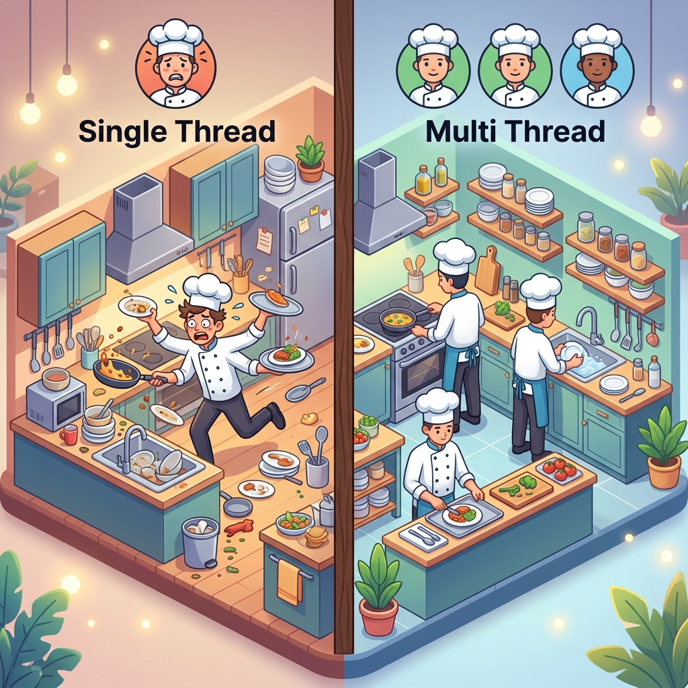
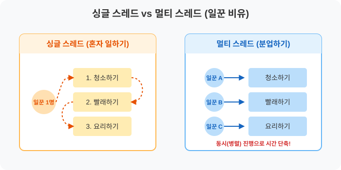

# 14.1 멀티 스레드(Multi-Thread)란 무엇인가요?

컴퓨터 프로그래밍에서 **'스레드(Thread)'**라는 단어를 처음 접하면 굉장히 어렵게 느껴질 수 있습니다. 하지만 식당의 주방(Kitchen)을 떠올려 보면 아주 쉽게 이해할 수 있습니다.

## 🍳 식당 주방 비유로 이해하는 스레드

프로그램을 하나의 **'식당 주방'**이라고 생각해 봅시다. 손님들이 주문을 하면 주방에서는 요리를 하고, 설거지를 하고, 서빙을 해야 합니다.

### 1. 싱글 스레드 (Single Thread): 혼자서 모든 걸 다 하는 요리사
만약 주방에 **요리사가 딱 1명**밖에 없다면 어떻게 될까요?
요리사는 요리를 하다가, 잠시 멈추고 설거지를 하고, 다시 손을 씻고 서빙을 나가야 합니다. 혼자서 모든 일을 순서대로 처리해야 하므로 시간이 오래 걸리고 몹시 지칠 것입니다. 이것이 바로 컴퓨터의 **싱글 스레드** 방식입니다.

### 2. 멀티 스레드 (Multi Thread): 분업하는 여러 명의 요리사
이번에는 주방에 **요리사 3명**이 있다고 상상해 보세요.
한 명은 요리만 하고, 한 명은 설거지만 하고, 나머지 한 명은 서빙만 전담합니다. 3명이 **동시에(병렬로)** 각자의 일을 처리하므로 주방이 훨씬 빠르고 효율적으로 돌아갑니다. 이것이 바로 여러 개의 코드 흐름이 동시에 실행되는 컴퓨터의 **멀티 스레드** 방식입니다!

---

### 🎨 직관적인 생성형 이미지로 이해하기

*(좌측: 혼자서 모든 일을 처리하느라 과부하가 걸린 싱글 스레드 / 우측: 3명이 각자 일을 분담하여 효율적으로 일하는 멀티 스레드)*

---

### 📊 논리적인 구조 도식 (SVG)

위의 식당 비유를 실제 컴퓨터의 작업(Task) 구조로 다시 그려보면 아래와 같습니다.

- **프로세스(Process)**: 식당 주방 그 자체 (실행 중인 하나의 프로그램)
- **스레드(Thread)**: 주방에서 일하는 요리사 (실제 코드를 실행하는 일꾼)

컴퓨터에서 워드와 엑셀을 동시에 켜놓고 작업할 수 있는 것도, 메신저에서 파일을 전송하면서 동시에 채팅을 할 수 있는 것도 모두 이 **멀티 스레드** 기술 덕분입니다!

> 💡 **참고 (자바 21의 가상 스레드)**
> 자바 21부터는 기존보다 훨씬 가볍고 빠르게 수만 명의 요리사(가상 스레드)를 고용할 수 있는 혁신적인 **가상 스레드(Virtual Thread)** 기술이 추가되었습니다. 이에 대해서는 14.10장에서 자세히 배웁니다.
