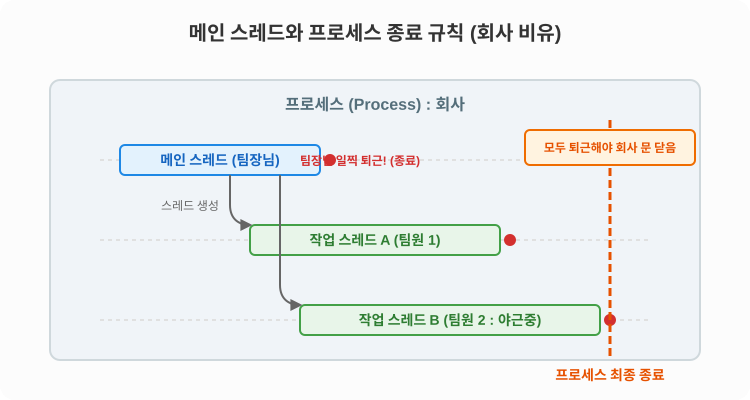

# 14.2 메인 스레드 (Main Thread)란?

자바 프로그램을 하나의 **'회사 팀'**이라고 상상해 봅시다.


## 팀장님과 팀원들

회사가 아침에 문을 열면, 가장 먼저 출근해서 작업을 지시하는 **팀장님**이 있습니다. 자바 프로그래밍에서는 이 팀장님을 바로 **'메인 스레드(Main Thread)'**라고 부릅니다.


*(중앙의 팀장님이 메인 스레드, 업무 폴더를 받아 각자의 자리에서 일하는 팀원들이 작업 스레드를 의미합니다.)*

메인 스레드(팀장님)는 혼자서 일하기 버거울 때, 여러 명의 팀원(작업 스레드)을 추가로 채용해서 일을 분배할 수 있습니다. 이것이 바로 멀티 스레드의 시작입니다.

## 👨‍💼 프로그램의 시작, 메인 스레드

모든 자바 프로그램은 메인 스레드가 `main()` 메소드를 실행하면서부터 시작됩니다. 
메인 스레드는 `main()` 메소드의 첫 번째 줄부터 코드를 차례대로 읽어 내려가며 실행하고, 마지막 코드를 실행하거나 `return`을 만나면 퇴근(종료)합니다.

```java
public static void main(String[] args) {
	// 메인 스레드(팀장님) 출근! 여기서부터 코드를 순서대로 실행합니다.
	String data = null;
	if (...) {
		// 작업 지시
	}
	while (...) {
		// 작업 반복
	}
	System.out.println("모든 작업 끝! 팀장님 퇴근!");
}
```

---


---

## 📊 스레드 종료 규칙 도식 (SVG)

회사(프로세스)는 언제 완전히 문을 닫고 종료될까요? 팀장님이 먼저 퇴근한다고 해서 회사가 바로 문을 닫을까요? 
아닙니다! **팀원들이 아직 야근 중이라면, 회사의 불은 꺼지지 않습니다.**



싱글 스레드에서는 메인 스레드가 종료되면 프로그램도 바로 종료됩니다.
하지만 멀티 스레드에서는 **실행 중인 스레드가 단 하나라도 남아 있다면 프로세스는 절대로 종료되지 않습니다.**
메인 스레드가 작업을 일찍 마치고 먼저 퇴근(종료)하더라도, 작업 스레드가 계속 실행 중이라면 프로세스는 끝까지 유지됩니다.
