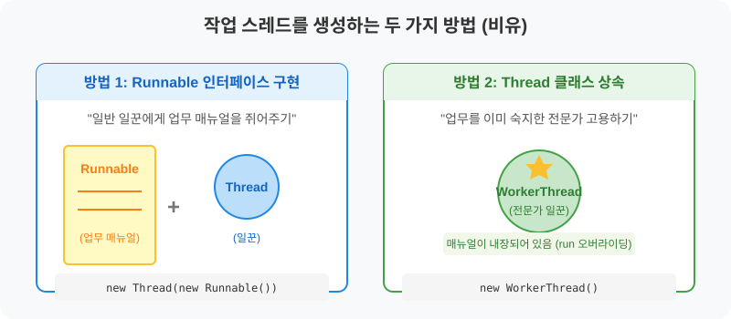

# 14.3 작업 스레드 생성과 실행

메인 스레드(팀장님) 혼자서 모든 일을 처리하기 힘들 때, 어떻게 하면 새로운 **작업 스레드(팀원)**를 추가로 고용해서 일을 맡길 수 있을까요?

## 스레드 객체
자바에서는 스레드도 하나의 '객체'로 관리합니다. 

일꾼을 고용하는 방법은 크게 두 가지가 있습니다. 일꾼(Thread)에게 **업무 매뉴얼(Runnable)**을 쥐어주는 방법과, 처음부터 업무를 완벽히 숙지한 **전문가(Thread 상속)**를 고용하는 방법입니다.

---

### 스레드를 생성하는 2가지 방법



---

## 스레드를 위하여 Runnable 인터페이스가 필요한 점

자바에서 일꾼(스레드)을 고용할 때 굳이 **`Runnable`이라는 인터페이스(업무 매뉴얼)**를 따로 만드는 이유는 무엇일까요?
가장 큰 이유는 자바가 **다중 상속을 지원하지 않기 때문**입니다. 만약 어떤 클래스가 이미 다른 부모 클래스를 상속받고 있다면, 추가로 `Thread` 클래스를 상속받을 수 없습니다. 이때 `Runnable` 인터페이스를 구현(implements)하면 상속의 제약 없이 언제든지 스레드로 동작하게 만들 수 있습니다. 
또한 일꾼(Thread)과 일(Runnable)을 분리함으로써 코드가 훨씬 깔끔해지고 유지보수가 쉬워집니다.

---

## 실제 인터페이스를 통하여 구현하는 방법

`Runnable`은 "스레드가 실행할 작업 내용"만을 정의하는 인터페이스입니다. 이 방법은 평범한 일꾼(`Thread` 객체)을 고용한 뒤, 그 일꾼이 해야 할 일이 적힌 **업무 매뉴얼(`Runnable` 구현체)**을 건네주는 방식입니다.

`Runnable` 인터페이스에는 `run()`이라는 단 하나의 메소드만 존재하므로, 이를 반드시 재정의(Override)하여 업무 내용을 작성해야 합니다.

---

## 명시적 구현으로 사용하는 방법

첫 번째 방식은 `Runnable`을 구현하는 별도의 클래스를 명시적으로 작성하는 방법입니다.

```java
// 1. 업무 매뉴얼 작성 (Runnable 구현)
class Task implements Runnable {
	@Override
	public void run() {
		// 일꾼이 실행할 코드
	}
}
```

---

## 객체로 의존성을 주입하는 방법 (익명 객체 포함)

작성된 매뉴얼 클래스를 바탕으로 객체를 생성한 뒤, 이 객체를 `Thread` 생성자에 전달(의존성 주입)하여 일꾼에게 매뉴얼을 쥐어줄 수 있습니다.

```java
// 2. 일꾼 고용 및 매뉴얼 전달 (의존성 주입)
Runnable task = new Task();
Thread thread = new Thread(task);
```

### 익명 객체로 주입하기 (실무에서 가장 많이 씀!)
매번 매뉴얼 클래스를 따로 만들면 파일이 너무 많아지고 번거로울 수 있습니다. 보통은 **익명 구현 객체**를 사용하여 일꾼 고용과 매뉴얼 작성을 동시에 처리합니다.

```java
Thread thread = new Thread(new Runnable() {
	@Override
	public void run() {
		// 스레드가 실행할 코드
	}
});
```

> [!IMPORTANT]
> 일꾼(Thread)을 고용하고 매뉴얼을 주입했다고 해서 바로 일을 시작하지 않습니다! 반드시 **`start()`** 메소드를 외쳐야만 비로소 일꾼이 매뉴얼의 `run()` 코드를 실행하기 시작합니다.
```java
thread.start(); // "작업 시작!" 지시
```

다음은 메인 스레드가 동시에 두 가지 작업을 처리할 수 없음을 보여주는 예제입니다. 원래 목적은 0.5초 주기로 `<<<` 문자와 `>>>` 문자를 동시에 출력하는 것이었지만, 하나의 스레드만 사용하므로 `<<<` 출력이 모두 끝난 다음에야 `>>>` 출력을 시작합니다.

```java
package ch14.sec03.exam01;

public class PrintExample {
	public static void main(String[] args) {
		for (int i=0; i<5; i++) {
			System.out.println("<<<");
			try { Thread.sleep(500); } catch (Exception e) {}
		}

		for (int i=0; i<5; i++) {
			System.out.println(">>>");
			try { Thread.sleep(500); } catch (Exception e) {}
		}
	}
}
```

**실행 결과**
```text
<<<
<<<
<<<
<<<
<<<
(위 작업이 끝난 후)
>>>
>>>
>>>
>>>
>>>
```

원래 목적대로 `<<<`와 `>>>` 출력을 동시에 진행하고 싶다면, 둘 중 하나를 작업 스레드에게 맡겨야 합니다. 이제 `>>>` 출력은 메인 스레드(팀장님)가 담당하고, `<<<` 출력은 작업 스레드(팀원)가 담당하도록 수정해 봅시다.

```java
package ch14.sec03.exam02;

public class PrintExample {
	public static void main(String[] args) {
		Thread thread = new Thread(new Runnable() {
			@Override
			public void run() {
				for (int i=0; i<5; i++) {
					System.out.println("<<<");
					try { Thread.sleep(500); } catch (Exception e) {}
				}
			}
		});

		thread.start();

		for (int i=0; i<5; i++) {
			System.out.println(">>>");
			try { Thread.sleep(500); } catch (Exception e) {}
		}
	}
}
```

**실행 결과**
```text
<<<
>>>
<<<
>>>
<<<
>>>
<<<
>>>
<<<
>>>
```
*(실행 환경에 따라 출력 순서는 조금씩 다를 수 있습니다.)*

---

## 상속 방식으로 자식 객체로 선언하여 사용하는 방법

두 번째 방법은 평범한 일꾼을 고용해 매뉴얼을 주는 대신, 아예 **처음부터 해당 업무를 전문적으로 할 줄 아는 전문가(`Thread` 상속 클래스)**를 직접 고용하는 방식입니다.

`Thread` 클래스 자체를 상속받은 뒤, 그 안의 `run()` 메소드를 재정의(Override)하여 자신의 업무로 만듭니다.

### 명시적인 자식 클래스 정의
```java
// 1. Thread를 상속받는 전문가 클래스 생성
public class WorkerThread extends Thread {
	@Override
	public void run() {
		// 스레드가 실행할 코드 (내장된 매뉴얼)
	}
}

// 2. 전문가 일꾼 고용
Thread thread = new WorkerThread();
```
실행하는 방법은 첫 번째 방법과 완벽히 동일하게 `thread.start();`를 호출하면 됩니다.

### 익명 자식 객체를 활용하는 방법
이 방법 역시 매번 클래스를 따로 만들지 않고, 자식 클래스를 익명 객체로 선언하여 활용하는 것이 일반적입니다.

```java
Thread thread = new Thread() {
	@Override
	public void run() {
		// 스레드가 실행할 코드
	}
};

thread.start(); // "작업 시작!" 지시
```

---

### 💻 활용 예제: 메인 스레드와 작업 스레드 동시 출력

```java
package ch14.sec03.exam03;

public class PrintExample {
	public static void main(String[] args) {
		Thread thread = new Thread() {
			@Override
			public void run() {
				for (int i=0; i<5; i++) {
					System.out.println("<<<");
					try { Thread.sleep(500); } catch (Exception e) {}
				}
			}
		};

		thread.start();

		for (int i=0; i<5; i++) {
			System.out.println(">>>");
			try { Thread.sleep(500); } catch (Exception e) {}
		}
	}
}
```
