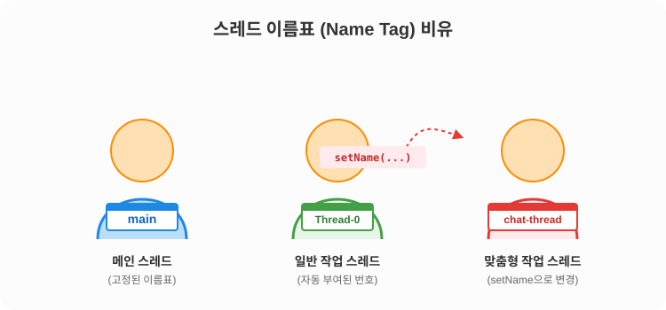

# 14.4 스레드 이름 (Thread Name)

회사에 출근한 일꾼(스레드)들은 누구나 자신의 가슴에 **'이름표(Name Tag)'**를 달고 일합니다. 누가 어떤 일을 하고 있는지 명확히 구분하기 위해서죠.

## 스레드의 기본 이름

스레드는 생성될 때 기본적으로 자바가 자동으로 이름을 붙여줍니다.

- **메인 스레드**: 기본적으로 `main`이라는 이름을 가집니다.
- **작업 스레드**: 별도로 이름을 정해주지 않으면, `Thread-0`, `Thread-1`, `Thread-2`... 처럼 번호가 차례대로 붙습니다.

---

## 이름표 시각화 도식



---

## 스레드 이름 설정하기 (`setName`)

"Thread-0", "Thread-1" 같은 기본 이름은 나중에 에러가 발생하거나 디버깅을 할 때, **어떤 스레드가 어떤 작업을 담당하는지** 알아보기 힘듭니다.
그래서 일꾼에게 역할을 뚜렷하게 알 수 있는 **맞춤형 이름**을 달아주는 것이 좋습니다.

이때 사용하는 메소드가 `setName()`입니다. `Thread` 객체의 인스턴스 메소드로, 원하는 문자열을 주면 됩니다.

```java
// 일꾼에게 "chat-thread"라는 이름표 달아주기
thread.setName("chat-thread");
```

## 스레드 이름 확인하기 (`getName` & `currentThread`)

반대로 스레드의 이름을 리턴받고 싶을 때는 `getName()` 메소드를 사용합니다. 
단, `getName()`은 `Thread`의 인스턴스 메소드이므로 스레드 객체의 참조가 필요합니다. 만약 스레드 객체의 참조를 가지고 있지 않다면, `Thread` 클래스의 정적 메소드인 `currentThread()`를 호출하여 **현재 코드를 실행 중인 스레드 객체의 참조**를 먼저 얻어야 합니다.

```java
// 1. 현재 이 코드를 실행하는 일꾼(스레드 객체)이 누구인지 찾기
Thread currentWorker = Thread.currentThread();

// 2. 그 일꾼의 이름표 읽기
System.out.println("현재 일꾼 이름: " + currentWorker.getName());
```

---

## 활용 예제: 일꾼 이름표 확인하고 변경하기

메인 스레드의 이름을 출력해 보고, 3명의 무명 일꾼(`Thread-0` ~ `Thread-2`)과 1명의 네임드 일꾼(`chat-thread`)을 고용해 각각 자신의 이름을 출력하게 해봅시다.

```java
package ch14.sec04;

public class ThreadNameExample {
	public static void main(String[] args) {
		// 메인 스레드(팀장님) 본인의 이름 확인
		Thread mainThread = Thread.currentThread();
		System.out.println(mainThread.getName() + " 실행");

		// 3명의 무명 일꾼 고용 (이름을 안 지어줌)
		for (int i=0; i<3; i++) {
			Thread threadA = new Thread() {
				@Override
				public void run() {
					// 자신의 이름 출력
					System.out.println(getName() + " 실행");
				}
			};
			threadA.start();
		}

		// 1명의 네임드 일꾼 고용
		Thread chatThread = new Thread() {
			@Override
			public void run() {
				// 자신의 이름 출력
				System.out.println(getName() + " 실행");
			}
		};
		// 이름표를 명시적으로 달아줌
		chatThread.setName("chat-thread");
		chatThread.start();
	}
}
```

**실행 결과**
```text
main 실행
Thread-0 실행
Thread-1 실행
Thread-2 실행
chat-thread 실행
```

> [!TIP]
> 실무에서 로그(Log)를 남길 때 스레드 이름은 필수적으로 같이 찍히게 됩니다. 백엔드(Spring 등) 환경에서 에러를 추적할 때 이 스레드 이름이 핵심 단서가 되므로, 스레드에 역할을 알 수 있는 이름을 부여하는 것은 아주 좋은 습관입니다!
