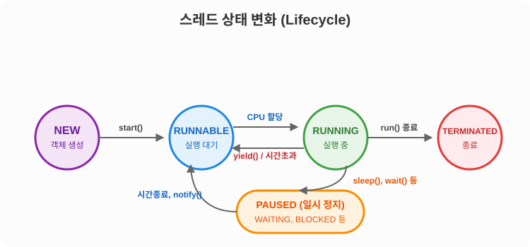
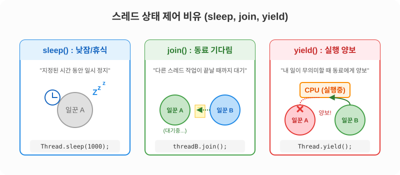
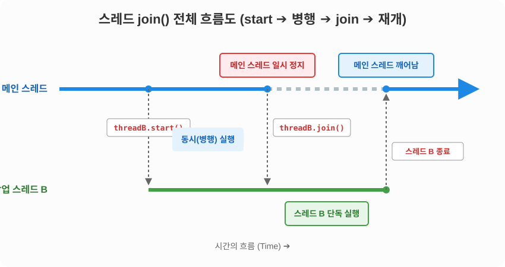
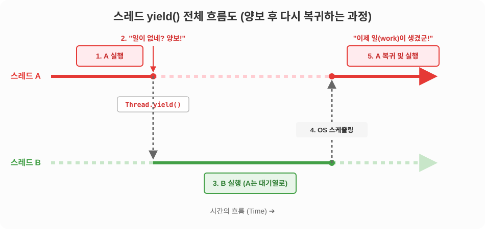

# 14.5 스레드의 상태 (생명 주기)

스레드 객체를 생성하고, 실행하고, 종료되기까지의 전체 과정을 스레드의 **생명 주기(Lifecycle)**라고 합니다. 이를 '회사원의 하루'에 비유하여 좀 더 상세히 살펴보겠습니다.

## 스레드의 5가지 핵심 상태

자바에서 스레드의 상태는 크게 5가지로 나눌 수 있습니다.

- **`NEW` (객체 생성)**: 스레드 객체만 생성되고 아직 `start()` 메소드가 호출되지 않은 상태입니다. **("채용은 완료되었으나, 아직 출근은 안 한 상태")**
- **`RUNNABLE` (실행 대기)**: `start()`가 호출되어 언제든지 실행될 준비가 된 상태입니다. **("출근 완료! 자리에 앉아 사장님(CPU)이 일거리를 주기를 기다리는 상태")**
- **`RUNNING` (실행)**: 대기열에서 CPU를 할당받아 `run()` 메소드 내부의 코드를 실제로 실행 중인 상태입니다. 자바에서는 `RUNNABLE` 상태의 스레드들이 번갈아가며 `RUNNING` 상태가 되어 일을 처리합니다. **("열심히 타자를 치며 실제로 일하는 중!")**
- **`일시 정지` (WAITING / TIMED_WAITING / BLOCKED)**: `sleep()`, `join()`, `wait()` 등의 메소드 호출로 인해 당장 일을 할 수 없고 잠시 멈춰있는 상태입니다. 일시 정지가 풀리면 다시 `RUNNABLE` 상태로 돌아갑니다. **("휴게실에서 낮잠을 자거나, 동료의 결재 서류가 오기를 기다리는 중")**
- **`TERMINATED` (종료)**: 맡은 업무인 `run()` 메소드의 실행을 모두 마치고 스레드가 완전히 종료된 상태입니다. 한 번 퇴근한 스레드는 다시 `start()`를 호출해 출근시킬 수 없습니다. **("오늘 업무 끝, 퇴근!")**

---

## 스레드 상태 변화 시각화



---

## 스레드의 상태 제어하기

스레드가 무작정 일만 하게 두지 않고, 프로그램의 흐름에 맞게 잠시 쉬게 하거나 다른 일꾼에게 순서를 양보하도록 상태를 직접 제어할 수 있습니다. 
이를 위해 자바의 `Thread` 클래스는 다양한 상태 제어 메소드를 제공합니다.



---

## 주어진 시간 동안 일시 정지 (`sleep`)

실행 중인 스레드를 일정 시간 동안 **'낮잠(휴식)'** 재우고 싶을 때 사용합니다. `Thread.sleep()` 메소드에 밀리세컨드(1/1000초) 단위로 시간을 줍니다.

> [!WARNING]
> `sleep()` 도중에 누군가 이 스레드를 깨우면(interrupt) `InterruptedException`이 발생하므로, 반드시 `try-catch` 블록으로 예외 처리를 해주어야 합니다.

```java
package ch14.sec05.exam01;

public class SleepExample {
	public static void main(String[] args) {
		for (int i=1; i<=10; i++) {
			System.out.println("Zzz... (낮잠 자는 중, " + i + "번째)");
			try {
				// 3초(3000ms) 동안 일시 정지 (꿀잠 자기)
				Thread.sleep(3000);
			} catch (InterruptedException e) {
				// 일시 정지 상태에서 interrupt()가 호출되면 이 부분이 실행됨
			}
		}
	}
}
```

---

## 다른 스레드의 종료를 기다림 (`join`)

가끔 내가 하던 일을 멈추고 **"다른 일꾼이 결재 서류를 다 만들 때까지"** 기다려야 할 때가 있습니다. (예: 계산 스레드가 값을 다 더할 때까지 기다렸다가 최종 합계를 출력해야 할 때)

이때 사용하는 것이 **`join()`** 메소드입니다. `threadB.join()`을 호출하면, 이 코드를 실행한 스레드는 `threadB`가 퇴근(종료)할 때까지 꼼짝 않고 대기(일시 정지)합니다.

> [!TIP] `pause`나 `wait` 대신 왜 `join`이라고 부를까요?
> 메인 스레드와 작업 스레드처럼 여러 갈래로 나뉘어 평행하게 실행되던 흐름이, 대상 스레드의 작업이 끝나면서 **"다시 원래의 흐름으로 합쳐진다(Join)"**는 의미를 담고 있기 때문입니다. 길이 두 갈래로 나뉘었다가 다시 하나로 합류하는 교차로를 상상해 보세요!

### ❓ `join()` 동작의 전체 흐름 시각화 (매우 중요!)

초보자분들이 가장 많이 헷갈려하시는 "도대체 누가 멈추고 누가 실행되는가?"에 대한 전체 흐름을 5단계로 자세히 쪼개어 살펴보겠습니다.



1. **스레드 시작 (`start`)**: 메인 스레드가 `threadB.start()`를 호출하여 새로운 작업 스레드를 생성합니다.
2. **병행(병렬) 실행 구간**: 메인 스레드와 `threadB`가 각자의 코드를 동시에 실행하며 사이좋게 CPU를 나눠 씁니다.
3. **`join()` 호출 (메인 스레드 일시 정지)**: 메인 스레드가 `threadB.join()`을 만나는 순간, 메인 스레드는 즉시 **일시 정지(WAITING)** 상태에 빠지며 CPU 자원을 완전히 포기합니다. `threadB`가 멈추는 것이 절대 아닙니다!
4. **스레드 B 단독 실행 구간**: 방해꾼이 사라진 `threadB`는 혼자서 CPU를 독차지하며 맹렬히 남은 코드를 처리합니다.
5. **스레드 B 종료 및 재개**: `threadB`의 `run()` 코드가 모두 끝나고 퇴근(TERMINATED)하는 순간, 자바(JVM)와 운영체제가 알아서 잠들어 있던 메인 스레드를 흔들어 깨웁니다. 깨어난 메인 스레드는 `threadB`가 남긴 결과물을 가지고 **남은 코드를 이어서 실행**합니다.

```java
threadB.start();
threadB.join(); // threadB가 완전히 끝날 때까지 나(현재 스레드)는 일시 정지!

// --- threadB가 끝나면 운영체제가 자동으로 나를 깨워주어 아래 코드가 실행됨 ---
System.out.println("threadB의 작업이 끝났으므로 내 작업을 이어서 합니다.");
```

다음은 `SumThread`가 1부터 100까지의 계산 작업을 모두 마칠 때까지 메인 스레드가 일시 정지 상태에 있다가, 계산이 종료되면 자동으로 깨어나 결과값을 받아 출력하는 예제입니다.

```java
package ch14.sec05.exam02;

public class SumThread extends Thread {
	private long sum;

	public long getSum() {
		return sum;
	}

	public void setSum(long sum) {
		this.sum = sum;
	}

	@Override
	public void run() {
		for (int i=1; i<=100; i++) {
			sum += i;
		}
	}
}
```

```java
package ch14.sec05.exam02;

public class JoinExample {
	public static void main(String[] args) {
		SumThread sumThread = new SumThread();
		sumThread.start();
		try {
			sumThread.join();
		} catch (InterruptedException e) {
		}
		System.out.println("1~100 합: " + sumThread.getSum());
	}
}
```

**실행 결과**
```text
1~100 합: 5050
```

---

## 다른 스레드에게 실행 양보 (`yield`)

스레드가 무한 루프(`while(true)`)를 도는 중에 일거리가 없어서 계속 헛바퀴만 돌 때가 있습니다. 이를 전문 용어로 **'바쁜 대기(Busy Waiting)'**라고 합니다. 아무 의미 없이 `while`문을 뱅글뱅글 돌며 귀중한 CPU 자원만 낭비하는 안타까운 상태죠.

이때 **"어차피 난 당장 할 일도 없으니, 내 차례(CPU)를 다른 일꾼에게 양보할게!"**라고 선언하는 것이 바로 **`Thread.yield()`** 입니다.



### 💡 `yield()` 전체 흐름 시각화 (양보 후 복귀까지)

`yield()`는 `join()`처럼 대상 스레드가 끝날 때까지 하염없이 기다리는 것이 아닙니다! 자신의 턴(Turn)을 한 번 넘길 뿐, 곧바로 대기열에 합류하여 다음 차례를 기다립니다.


1. **A 실행 (RUNNING)**: 스레드 A가 CPU를 할당받아 열심히 실행 중입니다.
2. **"일이 없네? 양보!"**: 스레드 A가 `work == false`임을 깨닫고 즉시 `Thread.yield()`를 호출합니다. 스레드 A는 `일시 정지(WAITING)` 상태로 가지 않고, 즉시 **실행 대기(RUNNABLE)** 대기열 맨 뒤로 돌아가 줄을 섭니다.
3. **B 실행 (RUNNING)**: A가 양보한 덕분에, 대기열에 있던 스레드 B가 즉시 CPU를 넘겨받아 유효한 작업을 치고 나갑니다.
4. **OS 스케줄링 (복귀)**: 스레드 B가 어느 정도 일을 하고 나면(자신의 타임 슬라이스 소진 시), 운영체제(OS)의 스케줄러가 대기열을 확인하여 차례가 된 스레드 A에게 다시 CPU를 돌려줍니다.
5. **A 복귀 및 재실행**: 스레드 A가 다시 `RUNNING` 상태로 복귀합니다. 만약 이때 조건이 `work == true`로 바뀌어 있다면 정상적으로 자신의 일을 처리하고, 여전히 `false`라면 또다시 `yield()`를 호출해 쿨하게 양보합니다.

```java
public void run() {
	while (true) {
		if (work) {
			System.out.println("ThreadA 열심히 일하는 중!");
		} else {
			// 당장 할 일(work=false)이 없으면, 무의미하게 루프를 돌며 CPU를 낭비하지 않고
			// 다른 스레드에게 CPU를 즉시 양보한다!
			Thread.yield();
		}
	}
}
```

```java
package ch14.sec05.exam03;

public class WorkThread extends Thread {
	public boolean work = true;

	public WorkThread(String name) {
		setName(name);
	}

	@Override
	public void run() {
		while (true) {
			if (work) {
				System.out.println(getName() + ": 작업처리");
			} else {
				Thread.yield();
			}
		}
	}
}
```

```java
package ch14.sec05.exam03;

public class YieldExample {
	public static void main(String[] args) {
		WorkThread workThreadA = new WorkThread("workThreadA");
		WorkThread workThreadB = new WorkThread("workThreadB");
		workThreadA.start();
		workThreadB.start();

		try { Thread.sleep(5000); } catch (InterruptedException e) {}
		workThreadA.work = false;

		try { Thread.sleep(10000); } catch (InterruptedException e) {}
		workThreadA.work = true;
	}
}
```

**실행 결과**
```
workThreadA: 작업처리
workThreadB: 작업처리
(5초 후)
workThreadB: 작업처리
(10초 후)
workThreadA: 작업처리
workThreadB: 작업처리
```

---

## 🎯 핵심 요약: `join` vs `yield`의 결정적 차이 및 사용처 (Use Case)

초보자분들이 방금 살펴본 두 개념을 혼동하기 쉽습니다. "둘 다 남에게 CPU를 넘겨주는 거면 똑같은 거 아니야?"라고 생각할 수 있지만, 내부적인 동작 방식과 목적이 완전히 다릅니다. 이 차이를 확실히 이해하기 위해 **대표적인 사용처 두 가지**를 비교해 보겠습니다.

### 1. `join()` 사용처: 완전한 결과 의존성 (Dependency)


- **상황**: 메인 스레드(영수증 출력기)가 다음 작업을 진행하려면, 반드시 작업 스레드(계산기)의 최종 산출물이 필요할 때.
- **특징**: "저 친구의 계산이 다 끝나기 전엔 난 아무것도 할 수 없어!" 라며 대상 스레드가 끝날 때까지 스스로를 완전히 얼려버립니다(WAITING). 대상 스레드가 종료되기 전까진 중간에 깨어나지 않습니다.

### 2. `yield()` 사용처: 유연한 상태 감시 (Polling)


- **상황**: 외부 요인(다운로드 완료, 다른 스레드의 플래그 변경 등)에 의해 내 작업 조건(`work == true`)이 언제 충족될지 모를 때.
- **특징**: "문이 열렸나? 안 열렸네, 그럼 내 차례 양보할게!" 라며 멈추지 않고 계속 대기열(RUNNABLE)을 오갑니다. 나 혼자 CPU를 헛돌리며 낭비(Busy Waiting)하지 않으면서도, 조건이 충족되는 즉시 작업을 치고 나갈 수 있습니다.

### 요약 비교표

| 구분 | `join()` | `yield()` |
| :--- | :--- | :--- |
| **목적** | 대상 스레드가 끝날 때까지 **완전히 기다림** | 당장 할 일이 없어서 다른 스레드에게 잠시 **순서를 양보함** |
| **주요 사용처** | 결과에 **완전히 의존적**일 때 | **상태나 조건을 유연하게 감시**할 때 |
| **상태 변화** | **일시 정지 (`WAITING`)** | **실행 대기 (`RUNNABLE`)** |
| **복귀 시점** | 대상 스레드가 **완전히 종료(퇴근)**되어야만 복귀함 | 대기열 맨 뒤로 밀려났다가 **OS가 다시 차례를 주면 수시로 복귀함** |

> [!IMPORTANT] 상태 감시가 필요할 때 `yield` 대신 `join`을 쓴다면 어떻게 될까요?
> 만약 `work == false`인 상황(지속적인 상태 감시가 필요한 상황)에서 양보를 한답시고 `threadB.join()`을 호출해버린다면, 메인 스레드는 `threadB`가 퇴근할 때까지 얼음(WAITING) 상태가 됩니다. 중간에 누군가 `work = true`로 상황을 바꿔주더라도 메인 스레드는 눈을 감고 있으므로 이를 알아채지 못하고 무한정 대기하게 됩니다.
