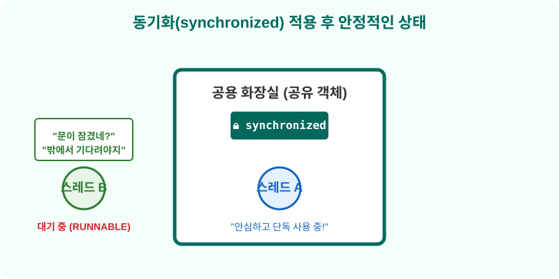
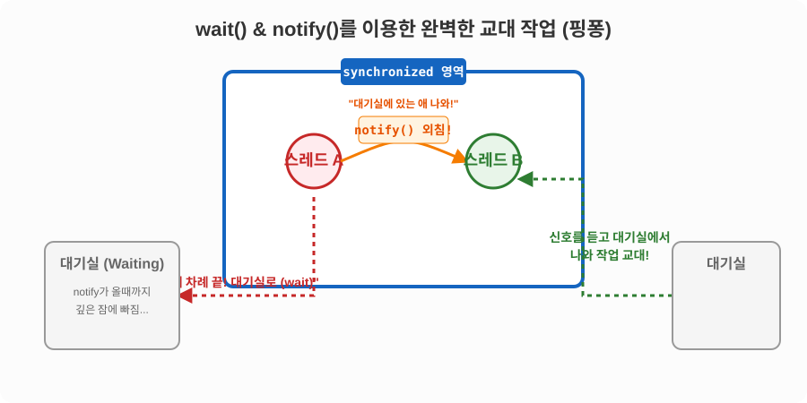

# 14.6 스레드 동기화 (Synchronization)

멀티 스레드 환경에서 여러 일꾼(스레드)이 하나의 자원(공유 객체)을 동시에 사용하려고 하면 치명적인 오류가 발생할 수 있습니다. 

이해하기 쉽도록 이를 **'공용 화장실'**에 비유해 보겠습니다.

## 1. 동기화가 없을 때의 대참사 (Data Race)

화장실(공유 객체)은 하나인데, 문에 **잠금 장치(동기화)**가 없다면 어떻게 될까요? 

일꾼 A가 화장실을 사용 중인데 일꾼 B가 벌컥 문을 열고 들어와 버리는 대참사가 벌어집니다. 


프로그래밍 세계에서는 이를 **데이터 레이스(Data Race)**라고 부릅니다. 

두 스레드가 동시에 접근하여 데이터를 수정하다 보니, 잔액이 마이너스가 되거나 데이터가 심각하게 꼬여버리는 현상이 발생합니다.


## 2. 해결책: 문 잠금 장치 (`synchronized`)

이런 대참사를 막기 위해 자바는 **문 잠금 장치(`synchronized`)**를 제공합니다. 

한 스레드가 화장실(객체)을 사용 중일 때, 다른 스레드가 들어오지 못하도록 문을 굳건히 걸어 잠그는 것을 **동기화(Synchronization)**라고 합니다.



동기화를 적용하면 안심하고 단독으로 데이터를 처리할 수 있으며, 늦게 도착한 다른 스레드들은 문 밖에서 줄을 서서 얌전히 기다리게(RUNNABLE) 됩니다.

## 동기화 메소드 및 블록 선언 (`synchronized`)

화장실에 잠금 장치를 다는 방법은 `synchronized` 키워드를 사용하는 것입니다.

### 1. 동기화 메소드 (화장실 전체 통째로 잠그기)
메소드 선언부에 `synchronized`를 붙이면, 해당 메소드가 실행되는 동안 객체 전체에 잠금이 걸립니다.
```java
public synchronized void method() {
	// 문 잠금! 한 명의 스레드만 들어와서 볼일을 봅니다.
	// 볼일이 끝나고 나갈 때 자동으로 문이 열립니다.
}
```

### 2. 동기화 블록 (필요한 칸만 잠그기)
메소드 전체가 아니라, 정말 중요한 특정 코드 부분만 잠그고 싶을 때는 동기화 블록을 사용합니다.
```java
public void method() {
	// 여기는 여러 명이 동시에 들어올 수 있는 세면대 영역
	
	synchronized(this) { // this = 현재 객체(화장실)
		// 문 잠금! 여기는 단 한 명만 들어갈 수 있는 양변기 칸
	}
	
	// 여기도 세면대 영역 (동시 접근 가능)
}
```

> [!NOTE]
> 어떤 스레드가 `synchronized` 영역에 들어가면 다른 스레드들은 문 밖에서 줄을 서서 기다려야 합니다. (실행 대기 상태)

다음 예제는 공유 객체로 사용할 Calculator이다. setMemory1()을 동기화 메소드로, setMemory2()를 동기화 블록을 포함하는 메소드로 선언했다.

```java
package ch14.sec06.exam01;

public class Calculator {
	private int memory;

	public int getMemory() {
		return memory;
	}

	public synchronized void setMemory1(int memory) {
		this.memory = memory;
		try {
			Thread.sleep(2000);
		} catch(InterruptedException e) {}
		System.out.println(Thread.currentThread().getName() + ": " + this.memory);
	}

	public void setMemory2(int memory) {
		synchronized(this) {
			this.memory = memory;
			try {
				Thread.sleep(2000);
			} catch(InterruptedException e) {}
			System.out.println(Thread.currentThread().getName() + ": " + this.memory);
		}
	}
}
```

```java
package ch14.sec06.exam01;

public class User1Thread extends Thread {
	private Calculator calculator;

	public User1Thread() {
		setName("User1Thread");
	}

	public void setCalculator(Calculator calculator) {
		this.calculator = calculator;
	}

	@Override
	public void run() {
		calculator.setMemory1(100);
	}
}
```

```java
package ch14.sec06.exam01;

public class User2Thread extends Thread {
	private Calculator calculator;

	public User2Thread() {
		setName("User2Thread");
	}

	public void setCalculator(Calculator calculator) {
		this.calculator = calculator;
	}

	@Override
	public void run() {
		calculator.setMemory2(50);
	}
}
```

```java
package ch14.sec06.exam01;

public class SynchronizedExample {
	public static void main(String[] args) {
		Calculator calculator = new Calculator();

		User1Thread user1Thread = new User1Thread();
		user1Thread.setCalculator(calculator);
		user1Thread.start();

		User2Thread user2Thread = new User2Thread();
		user2Thread.setCalculator(calculator);
		user2Thread.start();
	}
}
```

**실행 결과**
```
User1Thread: 100
User2Thread: 50
```

## 스레드 간의 완벽한 협력 (`wait` & `notify`)

두 명의 일꾼이 핑퐁 게임처럼 정확히 교대로 번갈아 가며 작업해야 할 때가 있습니다. 

(예: A가 물건을 만들면 → B가 포장하고 → 다시 A가 만들고...)
이때 아주 유용하게 쓰이는 것이 **`wait()`**과 **`notify()`** 메소드입니다.




- **`wait()`**: "내 차례 끝났어. 난 대기실(일시 정지, WAITING)로 가서 잘게."
- **`notify()`**: "야! 대기실에서 자고 있는 애 일어나서 나와 교대해!"

### 💡 깊이 알아보기: `notify()`의 대상과 `wait()`의 주체

처음 코드를 보면 "도대체 누가 잠들고, 누구를 깨우는 걸까?" 하고 헷갈리기 쉽습니다.

1. **`notify()`는 누구를 깨울까?**
   - `notify()`는 현재 이 객체의 대기실에서 자고 있는 스레드 중 **무작위로 딱 한 명**만 깨웁니다. 특정 스레드(예: "B야 일어나!")를 콕 집어서 깨울 수는 없습니다.
   - 만약 대기실에 자고 있는 일꾼이 여러 명인데 이들을 모두 다 깨우고 싶다면, 확성기 볼륨을 최대로 키우는 **`notifyAll()`** 메소드를 사용해야 합니다. (실무에서는 신호를 놓치는 일이 없도록 `notifyAll()`을 더 권장하는 편입니다.)

2. **`wait()`을 호출하면 누가 잠들까?**
   - `wait()` 코드를 마주치는 순간, **현재 그 코드를 실행 중인 스레드 자기 자신**이 스스로 잠듭니다. 
   - 즉, 남을 강제로 재우는 것이 아닙니다! 스스로 "내 할 일 끝났으니 쥐고 있던 자물쇠(Lock)를 풀고 대기실로 빠질게" 라며 자발적으로 수면 상태에 빠지는 동작입니다.

### 교대 작업 시각화

단순히 문 밖에서 기다리는 것과 달리, 아예 별도의 '대기실'을 마련하여 서로 신호를 주고받는 고도의 협력 과정입니다.


1. 스레드 A가 작업을 마친 뒤, 대기실에 있는 스레드 B에게 **"나 다 썼어! 나와!" (`notify()`)**라고 외쳐서 깨웁니다.
2. 그리고 자신은 당분간 쉴 테니 **스스로 대기실로 빠집니다. (`wait()`)**
3. 신호를 받고 깨어난 스레드 B가 바통을 이어받아 작업을 시작합니다.

> [!IMPORTANT] 왜 반드시 `synchronized` 안에서만 써야 할까요?
> `wait()`과 `notify()`는 반드시 문이 잠긴 상태(`synchronized` 내부)에서만 사용할 수 있습니다. 만약 문도 안 잠그고(동기화 없이) "대기실에 있는 애 나와!" 하고 외치면 자바는 `IllegalMonitorStateException` 에러를 뱉으며 프로그램을 뻗게 만듭니다. 문이 잠겨있어야만 서로 엇갈리거나 신호를 놓치는 불상사가 발생하지 않기 때문입니다.

```java
package ch14.sec06.exam02;

public class WorkObject {
	public synchronized void methodA() {
		Thread thread = Thread.currentThread();
		System.out.println(thread.getName() + ": methodA 작업 실행");
		notify();
		try {
			wait();
		} catch (InterruptedException e) {
		}
	}

	public synchronized void methodB() {
		Thread thread = Thread.currentThread();
		System.out.println(thread.getName() + ": methodB 작업 실행");
		notify();
		try {
			wait();
		} catch (InterruptedException e) {
		}
	}
}
```

```java
package ch14.sec06.exam02;

public class ThreadA extends Thread {
	private WorkObject workObject;

	public ThreadA(WorkObject workObject) {
		setName("ThreadA");
		this.workObject = workObject;
	}

	@Override
	public void run() {
		for (int i=0; i<10; i++) {
			workObject.methodA();
		}
	}
}
```

```java
package ch14.sec06.exam02;

public class ThreadB extends Thread {
	private WorkObject workObject;

	public ThreadB(WorkObject workObject) {
		setName("ThreadB");
		this.workObject = workObject;
	}

	@Override
	public void run() {
		for (int i=0; i<10; i++) {
			workObject.methodB();
		}
	}
}
```

```java
package ch14.sec06.exam02;

public class WaitNotifyExample {
	public static void main(String[] args) {
		WorkObject workObject = new WorkObject();

		ThreadA threadA = new ThreadA(workObject);
		ThreadB threadB = new ThreadB(workObject);

		threadA.start();
		threadB.start();
	}
}
```

**실행 결과**
```
ThreadA: methodA 작업 실행
ThreadB: methodB 작업 실행
ThreadA: methodA 작업 실행
ThreadB: methodB 작업 실행
...
```
