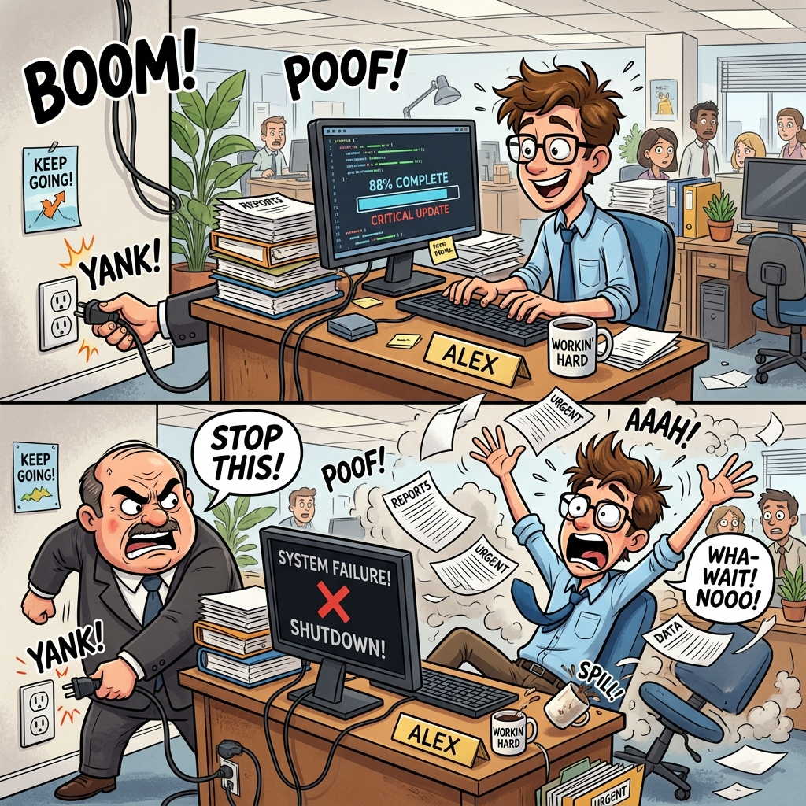
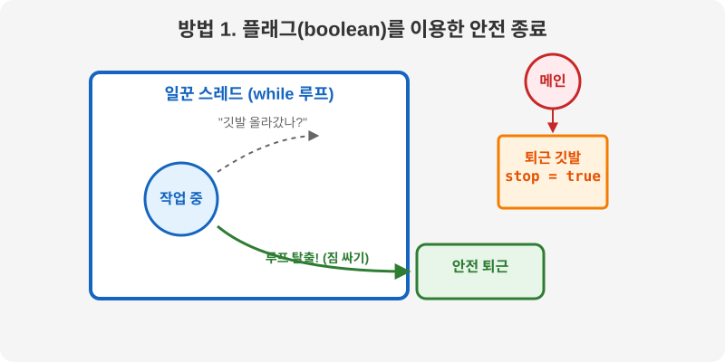
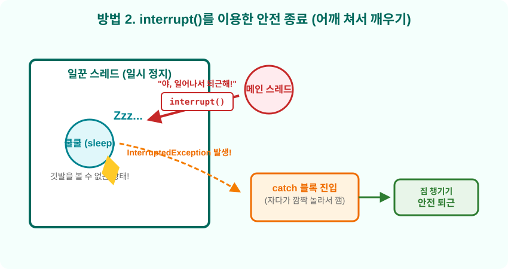
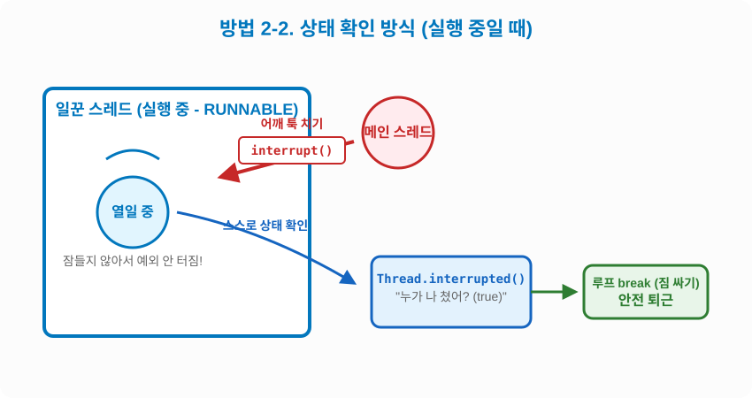

# 14.7 스레드 안전 종료 (Safe Stop)

직원(스레드)은 맡은 일(`run()` 메소드)을 모두 끝내면 알아서 퇴근(종료)합니다. 하지만 퇴근 시간이 안 되었는데 급하게 **"지금 하던 일 당장 멈추고 퇴근해!"**라고 지시해야 할 때가 있습니다.

## 절대 쓰면 안 되는 방법: 강제 종료 (`stop()`)

과거에는 `stop()`이라는 메소드를 사용해 강제로 퇴근시켰지만, 이는 **컴퓨터 전원을 확 뽑아버리는 것과 같아서(강제 종료)** 현재는 자바에서 사용을 강력히 금지(Deprecated)하고 있습니다. 



위 그림처럼 직원이 책상(리소스)을 치우지도 못하고 쫓겨나면 데이터가 심하게 오염되거나 중요한 파일(메모리)이 날아가는 대참사가 발생하기 때문입니다.

## 안전 종료: 스스로 짐 싸서 퇴근하게 만들기

따라서 우리는 직원이 **하던 일을 안전하게 마무리하고 책상을 치운 뒤 스스로 퇴근하도록 유도(안전 종료)**해야 합니다. 안전 종료를 구현하는 데에는 크게 두 가지 방법이 있습니다.

## 방법 1. 깃발(boolean 플래그) 이용하기

가장 직관적인 방법은 '퇴근'이라는 **깃발(boolean 변수)**을 세워두는 것입니다.



일꾼은 무한 반복(`while`)으로 일을 하다가, 한 사이클이 끝날 때마다 고개를 들어 깃발을 봅니다. 사장님이 깃발을 `true`로 바꾸면, 일꾼은 반복문을 빠져나와 `스스로 책상을 정리`하고 퇴근합니다.

> [!IMPORTANT] 핵심 포인트: "스스로 정리하도록 유도하기"
> 여기서 가장 중요한 점은 사장님(메인 스레드)이 강제로 일꾼의 숨통을 끊는 것이 아니라는 것입니다. 사장님은 그저 **"이제 그만 퇴근해~"라는 신호(플래그)**만 줍니다. 
> 신호를 본 일꾼은 `while` 루프를 빠져나와 그 밑에 작성된 코드(`리소스 정리` 부분)를 실행합니다. 이곳에 열어둔 파일, 데이터베이스, 네트워크 연결 등을 안전하게 닫는 **스스로 짐을 싸는 로직**을 추가하는 것, 이것이 바로 플래그 방식을 사용하는 핵심 이유입니다!

```java
package ch14.sec07.exam01;

public class PrintThread extends Thread {
	private boolean stop; // 퇴근 깃발

	// 외부(메인 스레드)에서 깃발 상태를 변경할 수 있도록 세터 제공
	public void setStop(boolean stop) {
		this.stop = stop;
	}

	@Override
	public void run() {
		// 깃발이 올라가지 않은 동안(false) 계속 무한 반복 작업 수행
		while (!stop) {
			System.out.println("실행 중");
		}
		
		// 깃발이 올라가서(true) while 루프를 빠져나오면 아래 코드가 실행됨
		System.out.println("리소스 정리"); // 파일 닫기, 네트워크 종료 등 스스로 짐 싸는 로직
		System.out.println("실행 종료"); // 안전하게 퇴근 완료
	}
}
```

```java
package ch14.sec07.exam01;

public class SafeStopExample {
	public static void main(String[] args) {
		PrintThread printThread = new PrintThread();
		printThread.start(); // 일꾼 작업 시작

		try {
			Thread.sleep(3000); // 메인 스레드(사장님)가 3초 동안 대기 (일할 시간을 줌)
		} catch (InterruptedException e) {
		}

		// 3초 뒤, 일꾼에게 그만 퇴근하라고 깃발을 올림
		printThread.setStop(true); 
	}
}
```

## 방법 2-1. 일시 정지 상태일 때의 `interrupt()` (예외 발생 방식)

만약 직원이 `sleep()`으로 깊은 잠에 빠져있다면(일시 정지 상태), 아무리 밖에서 깃발을 흔들어도(조건 플래그) 보지 못합니다. 이때는 직접 다가가서 직원의 **어깨를 툭 쳐서 깨워야(interrupt)** 합니다.



`interrupt()` 메소드를 호출하면, 자고 있던 스레드에서 즉시 `InterruptedException`이 터지며 화들짝 깨어납니다. 이것을 이용해 `catch` 블록으로 빠져나와 책상을 정리하고 퇴근하게 만들 수 있습니다.

```java
package ch14.sec07.exam02;

public class PrintThread extends Thread {
	public void run() {
		try {
			while (true) {
				System.out.println("실행 중");
				// 1밀리초 동안 짧은 잠에 빠짐. 이때 어깨를 치면(interrupt) 예외가 터짐!
				Thread.sleep(1); 
			}
		} catch (InterruptedException e) {
			// 자다가 어깨를 맞고 깜짝 놀라며(InterruptedException) 이곳으로 빠져나옴
		}
		
		// catch 블록을 빠져나온 후, 스스로 짐을 싸고 퇴근
		System.out.println("리소스 정리");
		System.out.println("실행 종료");
	}
}
```

```java
package ch14.sec07.exam02;

public class InterruptExample {
	public static void main(String[] args) {
		Thread thread = new PrintThread();
		thread.start(); // 일꾼 작업 시작

		try {
			Thread.sleep(1000); // 1초 동안 일하게 둠
		} catch (InterruptedException e) {
		}

		// 자고 있는 일꾼의 어깨를 툭 침! -> InterruptedException 발생시킴
		thread.interrupt(); 
	}
}
```

## 방법 2-2. 실행 상태일 때의 `interrupt()` (상태 확인 방식)

직원이 `sleep()` 같은 일시 정지 상태가 아닐 때(눈 뜨고 열심히 일할 때) 어깨를 치면 어떻게 될까요? **예외가 발생하지 않습니다!**



눈을 뜨고 일하고 있기 때문에 깜짝 놀라지 않는 것입니다. 대신 일꾼은 **"어? 방금 누가 내 어깨 쳤나?"** 하고 자신의 상태를 확인할 수 있습니다. 이때 사용하는 메소드가 `Thread.interrupted()`입니다. 이 값이 `true`라면 루프를 `break`하여 스스로 짐을 싸서 퇴근하게 만들 수 있습니다.

```java
package ch14.sec07.exam03;

public class PrintThread extends Thread {
	public void run() {
		while (true) {
			System.out.println("실행 중");
			
			// 눈 뜨고 열일 중이므로 예외가 터지지 않음. 대신 스스로 어깨를 맞았는지 확인!
			if (Thread.interrupted()) {
				// 누군가 어깨를 쳤다면(true) 스스로 무한 루프를 탈출
				break; 
			}
		}
		
		// 무한 루프를 빠져나와 짐을 싸고 퇴근
		System.out.println("리소스 정리");
		System.out.println("실행 종료");
	}
}
```

```java
package ch14.sec07.exam03;

public class InterruptExample {
	public static void main(String[] args) {
		Thread thread = new PrintThread();
		thread.start(); // 일꾼 작업 시작

		try {
			Thread.sleep(1000); // 1초 대기
		} catch (InterruptedException e) {
		}

		// 눈 뜨고 일하는 일꾼의 어깨를 침. 예외는 안 터지고 interrupted 상태만 변경됨
		thread.interrupt(); 
	}
}
```
