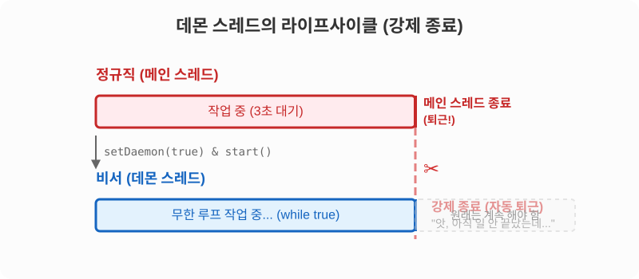

# 14.8 데몬 스레드 (Daemon Thread)

일반적인 작업 스레드가 **'정규직 직원'**이라면, **데몬(daemon) 스레드**는 정규직 직원을 돕는 **'비서(보조 직원)'**라고 할 수 있습니다.


회사의 운영 규칙(스레드 종료 규칙)은 다음과 같습니다.
- **정규직(일반 스레드)**: 자신의 일이 끝날 때까지 회사를 떠나지 않습니다.
- **비서(데몬 스레드)**: 정규직이 모두 퇴근해 버리면, 비서는 회사에 혼자 남아 있을 이유가 없으므로 **하던 일이 안 끝났더라도 무조건 자동으로 퇴근(강제 종료)당합니다.**

대표적인 데몬 스레드의 예시로는 문서 편집기의 **'자동 저장'** 기능이나, 눈에 보이지 않게 메모리 쓰레기를 치워주는 **'가비지 컬렉터(Garbage Collector)'**가 있습니다. 메인 문서 편집기가 닫히면 자동 저장 기능도 더 이상 필요 없기 때문에 즉시 종료되는 것이 맞겠죠?

## 📊 데몬 스레드의 라이프사이클 

정규직(메인 스레드)이 퇴근하는 순간 비서(데몬 스레드)의 운명은 어떻게 될까요? 아래 흐름도를 살펴보세요.



## 🎩 비서(데몬)로 고용하기 (`setDaemon`)

어떤 일꾼을 비서(데몬 스레드)로 만들려면, 일을 시작(`start()`) 시키기 전에 계약서에 도장을 찍어야 합니다. 바로 **`setDaemon(true)`** 메소드를 호출하는 것입니다.

> [!WARNING]
> 반드시 `start()` 메소드를 호출하기 **전에** `setDaemon(true)`를 설정해야 합니다. 스레드가 이미 실행을 시작한 뒤에 데몬으로 바꾸려고 하면 `IllegalThreadStateException` 에러가 발생합니다.

```java
package ch14.sec08;

public class AutoSaveThread extends Thread {
	// 비서(데몬 스레드)가 해야 할 보조 업무
	public void save() {
		System.out.println("작업 내용을 저장함.");
	}

	@Override
	public void run() {
		// 비서는 평생(while true) 1초마다 자동 저장을 수행하려고 합니다.
		while (true) {
			try {
				Thread.sleep(1000);
			} catch (InterruptedException e) {
				break;
			}
			save(); // 1초 대기 후 저장
		}
	}
}
```

```java
package ch14.sec08;

public class DaemonExample {
	public static void main(String[] args) {
		AutoSaveThread autoSaveThread = new AutoSaveThread();
		
		// 🚨 가장 중요한 부분: 일을 시작하기 전에 "너는 비서야!"라고 계약을 맺어야 합니다.
		autoSaveThread.setDaemon(true);
		
		// 비서 업무 시작!
		autoSaveThread.start();

		try {
			// 메인 스레드(사장님)는 3초 동안 자신의 일을 합니다. (비서는 1초마다 자동 저장 중)
			Thread.sleep(3000);
		} catch (InterruptedException e) {
		}

		// 3초 뒤, 사장님의 업무가 끝나고 퇴근합니다. 
		// 이때 비서의 while(true) 무한 루프도 싹둑 잘리며 강제 종료됩니다!
		System.out.println("메인 스레드 종료");
	}
}
```

**실행 결과**
```text
작업 내용을 저장함.
작업 내용을 저장함.
메인 스레드 종료
```

### 💡 깊이 알아보기: 특정 메소드만 데몬이 되는 걸까?

처음 코드를 보면 "어떻게 `setDaemon(true)` 한 줄만 적었는데 `save()` 메소드가 데몬 역할을 하는 걸까?" 하고 헷갈릴 수 있습니다. 여기서 아주 중요한 자바의 동작 원리가 숨어있습니다.

1. **'데몬 메소드'라는 것은 따로 없습니다.**
   자바에는 특정 메소드만 데몬으로 만드는 기능은 없습니다. `setDaemon(true)`는 **이 스레드(`AutoSaveThread` 객체) 자체를 통째로 비서(데몬) 신분으로 만드는 계약**입니다.

2. **스레드가 실행하는 모든 코드가 데몬의 운명을 따릅니다.**
   `AutoSaveThread`라는 일꾼이 비서로 계약(`setDaemon(true)`)을 맺고 출근(`start()`)하면, 이 일꾼이 `run()` 안에서 실행하는 **모든 동작**(`sleep()`, `save()` 등)이 전부 비서의 업무가 됩니다. 즉, `save()`가 특별해서 데몬이 된 것이 아니라 **비서가 `save()`를 실행했기 때문에** 데몬처럼 동작한 것입니다.

3. **스레드(일꾼)가 강제 퇴근당하면 그가 하던 일도 즉시 멈춥니다.**
   메인 스레드(사장님)가 퇴근하면, 비서 스레드는 그 순간 통째로 강제 퇴근(종료)당합니다. 따라서 비서 스레드가 `save()`를 실행하고 있든, `sleep()`으로 대기하고 있든 상관없이 **일꾼 자체가 사라지므로 모든 코드 실행이 즉시 멈추게 되는 원리**입니다.

> [!NOTE]
> 결과를 보면 알 수 있듯이, `AutoSaveThread`의 `run()` 메소드 내부에는 `while(true)`라는 영원히 끝나지 않는 무한 루프가 있습니다. 
> 일반 스레드였다면 프로그램이 절대 안 끝나고 평생 돌아갔겠지만, 데몬 스레드로 설정(`setDaemon(true)`)해 두었기 때문에 **메인 스레드가 종료되는 순간 무한 루프도 매정하게 싹둑 잘리며 즉시 프로그램이 강제 종료**됩니다.
