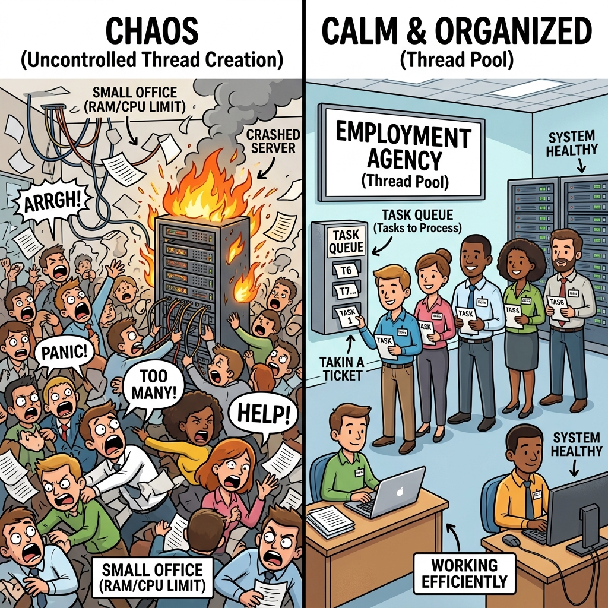
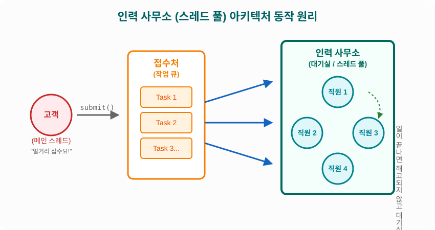
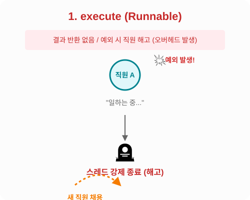
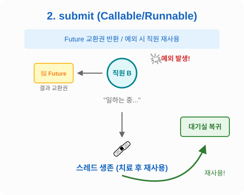

# 14.9 스레드 풀 (ThreadPool)

일거리가 생길 때마다 매번 새로운 직원(스레드)을 뽑아서 쓰고, 일이 끝나면 바로 해고(종료)한다면 어떨까요?
아마 채용 서류를 작성하고 해고 처리를 하는 데에 시간과 비용이 더 많이 들 것입니다. 컴퓨터(CPU와 메모리)도 마찬가지로, 스레드를 무한정 생성하고 폭증하게 내버려두면 서버가 터지는(성능 급감) 대참사가 발생합니다.



이를 해결하기 위한 똑똑한 방법이 바로 **'인력 사무소(ThreadPool)'**를 차리는 것입니다.
**스레드 풀**은 딱 정해진 인원(예: 5명)의 직원을 상시 고용하여 대기실에 둡니다. 고객(프로그램)이 일거리(Task)를 접수처(작업 큐)에 넣으면, 대기실에서 놀고 있던 직원이 나와서 일을 처리합니다. 일이 끝나면 직원을 해고하지 않고 **다시 대기실로 돌려보내어 다음 일을 기다리게 합니다 (스레드 재사용).**

## 📊 스레드 풀 아키텍처 동작 원리



## 🏢 인력 사무소 차리기 (스레드 풀 생성)

자바에서는 `java.util.concurrent` 패키지의 `ExecutorService`와 `Executors`를 사용하여 인력 사무소를 쉽게 차릴 수 있습니다.

```java
// 방법 1: 일이 많아지면 유동적으로 알바생을 무한정 뽑고, 일이 없으면 줄이는 사무소
ExecutorService executorService = Executors.newCachedThreadPool();

// 방법 2: 항상 딱 5명의 정규직만 고용하여 운영하는 안정적인 사무소 (가장 많이 씀!)
ExecutorService executorService = Executors.newFixedThreadPool(5);
```

## 🚪 인력 사무소 문 닫기 (스레드 풀 종료)

스레드 풀에 고용된 직원들은 기본적으로 퇴근하지 않고 메인 스레드가 종료되어도 계속 일을 기다립니다. 따라서 프로그램이 완전히 종료될 때, **"사무소 문 닫으니 다들 퇴근하세요!"**라고 명시적으로 지시해야 합니다.

- `shutdown()`: 지금 접수된 일까지만 다 끝내고 퇴근해! (안전 종료 권장)
- `shutdownNow()`: 하던 일 당장 멈추고 다들 즉시 퇴근해! (강제 종료)

```java
package ch14.sec09.exam01;

import java.util.concurrent.ExecutorService;
import java.util.concurrent.Executors;

public class ExecutorServiceExample {
	public static void main(String[] args) {
		// 스레드풀 생성: 딱 5명의 정규직 직원만 고용하는 인력 사무소를 차림
		ExecutorService executorService = Executors.newFixedThreadPool(5);
		
		// (이곳에서 작업 생성과 처리 요청을 함)
		
		// 스레드풀 종료: "오늘 영업 끝! 하던 일 멈추고 다들 퇴근하세요!"
		executorService.shutdownNow();
	}
}
```

## 📥 일거리 접수하기 (작업 생성과 처리 요청)

이제 인력 사무소에 일거리를 던져주어야 합니다. 일거리는 `Runnable`(결과 보고가 필요 없는 일) 또는 `Callable`(일이 끝나면 결과 보고서가 필요한 일) 객체로 만듭니다.

일거리를 접수처(작업 큐)에 넣는 메소드는 크게 `execute`와 `submit` 두 가지가 있습니다. 

> [!IMPORTANT] `execute` vs `submit` 의 치명적 차이점
> - **`execute`**: 예외 발생 시 직원(스레드)을 **해고(종료)**하고 새 직원을 뽑습니다. (오버헤드 발생)
> - **`submit`**: 예외 발생 시 직원(스레드)을 해고하지 않고 **치료해서 재사용**합니다. 또한 `Future`라는 결과 교환권을 받을 수 있습니다. 실무에서는 성능상 유리한 **`submit`을 압도적으로 많이 사용합니다!**

---

### 1. 결과가 없는 작업 접수 (`execute`)



`Runnable` 객체를 생성하여 `execute()` 메소드로 작업을 던져줍니다. "그냥 이거 처리해!"라고 지시하는 것과 같습니다. 메일 1000건 발송처럼 결과값을 돌려받을 필요가 없는 단순 반복 작업에 사용될 수 있지만, 예외 처리에 취약합니다.

```java
package ch14.sec09.exam02;

import java.util.concurrent.ExecutorService;
import java.util.concurrent.Executors;

public class RunnableExecuteExample {
	public static void main(String[] args) {
		// 1000개의 메일(일거리) 생성
		String[][] mails = new String[1000][3];
		for (int i=0; i<mails.length; i++) {
			mails[i][0] = "admin@my.com";
			mails[i][1] = "member"+i+"@my.com";
			mails[i][2] = "신상품 입고";
		}

		// 인력 사무소 오픈: 5명의 직원 고용
		ExecutorService executorService = Executors.newFixedThreadPool(5);

		// 1000개의 일거리를 접수처(큐)에 넣기
		for (int i=0; i<1000; i++) {
			final int idx = i;
			// execute()로 접수: "결과 보고 필요 없음. 그냥 메일만 보내!"
			executorService.execute(new Runnable() {
				@Override
				public void run() {
					// 5명의 직원 중 대기실에서 쉬고 있던 누군가가 이 일을 맡음
					Thread thread = Thread.currentThread(); 
					String from = mails[idx][0];
					String to = mails[idx][1];
					String content = mails[idx][2];
					// "저(thread) 지금 메일 보냅니다!"
					System.out.println("[" + thread.getName() + "] " +
							from + " ==> " + to + ": " + content);
				}
			});
		}

		// 사무소 문 닫기 준비 (현재 접수된 일까지만 다 하고 퇴근 지시)
		executorService.shutdown();
	}
}
```

---

### 2. 결과가 있는 작업 접수 (`submit`)



`Callable` 객체를 생성하여 `submit()` 메소드로 작업을 던져줍니다. "이거 계산해서 결과 보고서 가져와!"라고 지시하는 것과 같습니다. 

제출 즉시 **`Future`라는 교환권**을 받게 되며, 나중에 `future.get()`을 호출하면 직원이 계산을 끝마칠 때까지 기다렸다가(블로킹) 결과값을 받아올 수 있습니다. 직원이 일하다 실수해도 해고되지 않고 대기실로 돌아가므로 성능상 가장 권장되는 방식입니다.

```java
package ch14.sec09.exam03;

import java.util.concurrent.Callable;
import java.util.concurrent.ExecutorService;
import java.util.concurrent.Executors;
import java.util.concurrent.Future;

public class CallableSubmitExample {
	public static void main(String[] args) {
		// 인력 사무소 오픈: 5명의 직원 고용
		ExecutorService executorService = Executors.newFixedThreadPool(5);

		// 100번의 계산 작업(일거리) 생성 및 접수처에 넣기
		for (int i=1; i<=100; i++) {
			final int idx = i;
			
			// submit()으로 접수: "계산 다 끝나면 결과 보고서(Future) 꼭 제출해!"
			Future<Integer> future = executorService.submit(new Callable<Integer>() {
				@Override
				public Integer call() throws Exception {
					// 5명의 직원 중 누군가가 일을 맡아 덧셈을 수행함
					int sum = 0;
					for (int i=1; i<=idx; i++) {
						sum += i;
					}
					Thread thread = Thread.currentThread();
					System.out.println("[" + thread.getName() + "] 1~" + idx + " 합 계산");
					
					// 일 끝남! 결과물을 반환함
					return sum;
				}
			});

			try {
				// future.get() : "저기요, 아까 받은 교환권 줄 테니까 결과 보고서 주세요!"
				// 직원이 계산을 끝낼 때까지 메인 스레드는 잠시 기다림(블로킹)
				int result = future.get(); 
				System.out.println("\t리턴값: " + result);
			} catch (Exception e) {
				e.printStackTrace();
			}
		}

		// 사무소 문 닫기 (현재 접수된 일까지만 다 하고 퇴근)
		executorService.shutdown();
	}
}
```
