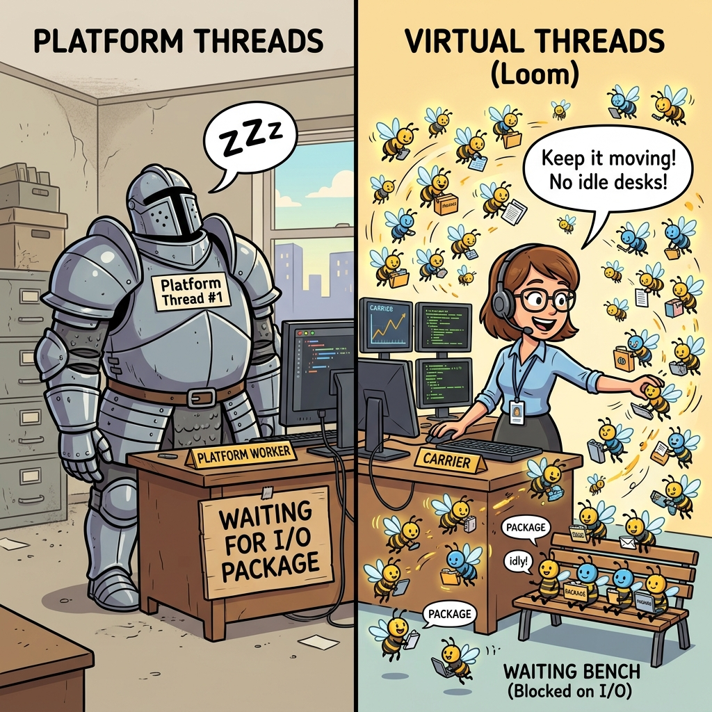
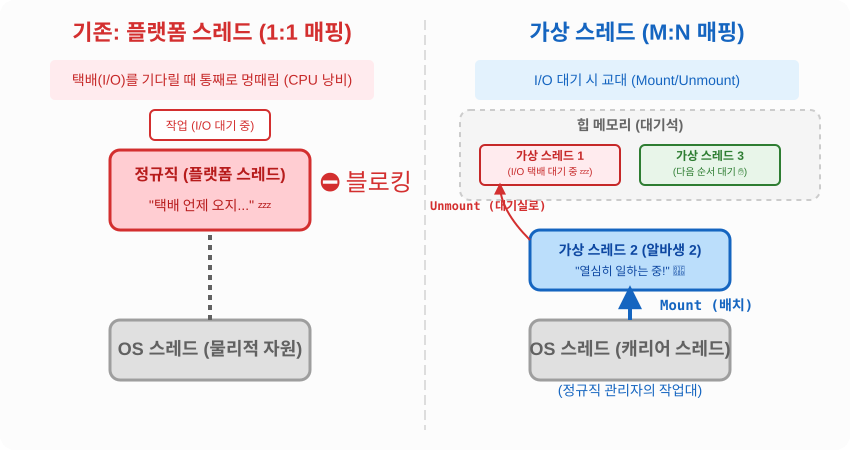

# 14.10 가상 스레드 (Virtual Thread)

자바 21부터 도입된 혁신적인 기능, 바로 **가상 스레드(Virtual Thread)**입니다. 

기존의 스레드를 혁명적으로 가볍게 만든 초경량(Lightweight) 스레드입니다.

## 👥 플랫폼 스레드 vs 가상 스레드 비유



- **기존 플랫폼 스레드 (무거운 갑옷을 입은 정규직)**: 운영체제(OS)가 관리하는 실제 스레드와 1:1로 연결된 무거운 스레드입니다. 월급(메모리 비용)이 매우 비싸서 한 회사에 최대 수천 명밖에 고용할 수 없습니다. 직원이 외부 택배(I/O 대기)를 기다릴 때, 작업대(CPU)를 차지하고 통째로 잠들어버리기(블로킹) 때문에 효율이 크게 떨어집니다.
- **가상 스레드 (꿀벌 같은 초단기 알바생)**: 자바가 자체적으로 관리하는 아주 가벼운 스레드입니다. 월급이 거의 들지 않아 수백만 명을 고용할 수 있습니다. 수많은 꿀벌 알바생(N)이 소수의 캐리어 스레드(OS스레드) 작업대(1)에 배정되어 일합니다 **(M:N 매핑)**. 

### 🔄 Mount와 Unmount (핵심 동작 원리)



가상 스레드가 혁명적인 이유는 I/O(택배)를 기다릴 때의 영리한 대처법에 있습니다.
1. 알바생 1번이 작업대(캐리어 스레드)에서 일하다가 택배(I/O)를 기다려야 하는 상황이 옵니다.
2. **Unmount**: 관리자(JVM)는 즉시 알바생 1번을 작업대에서 쫓아내어 대기석(힙 메모리)으로 보냅니다.
3. **Mount**: 관리자는 대기 중이던 알바생 2번을 즉시 빈 작업대로 불러와서 일을 시킵니다.
4. 택배가 도착하면, 알바생 1번은 다시 작업대에 올라가서(Mount) 하던 일을 마저 끝냅니다.

> [!NOTE]
> 블로킹 I/O 작업(파일 읽기/네트워크 대기)이 많은 웹 서버 애플리케이션(예: Spring Boot 3.2+)에서 가상 스레드를 켜면, 이 영리한 교대 시스템 덕분에 서버 한 대가 감당할 수 있는 동시 접속자 수가 비약적으로 상승합니다.

## 🏭 가상 스레드 풀 (수백만 개 생성 가능!)

기존에는 메모리 폭발을 막기 위해 '스레드 풀'을 만들어 개수를 제한(예: 200개)했습니다.
하지만 가상 스레드는 워낙 가볍기 때문에 **개수를 제한할 필요가 아예 없습니다.** 그래서 `Executors`의 가상 스레드 풀 생성 메소드에는 '최대 개수'를 적는 칸이 없습니다. 일이 들어오는 족족 새로운 꿀벌 알바생을 찍어내서 투입합니다.

```java
// 기존: 정규직 200명으로 꽉 막힌 인력 사무소 (플랫폼 스레드 풀)
ExecutorService platformExecutor = Executors.newFixedThreadPool(200);

// 자바 21: 일이 들어올 때마다 무한정 꿀벌 알바생을 찍어내어 투입하는 마법의 사무소
ExecutorService virtualExecutor = Executors.newVirtualThreadPerTaskExecutor();
```

> [!WARNING] 가상 스레드 사용 시 주의사항 (Pooling 금지!)
> 기존 스레드는 생성 비용이 비싸서 다 쓴 스레드를 풀(Pool)에 모아두고 '재사용'했습니다. 하지만 **가상 스레드는 한 번 쓰고 버리는 1회용입니다.** 생성 비용이 0에 가깝기 때문에 재사용(Pooling)하려고 노력할 필요도, 해서도 안 됩니다. 무조건 **작업 1건당 새로운 가상 스레드 1개를 생성**해서 처리하는 것이 핵심 원칙입니다!

## 가상 스레드 직접 생성하기

스레드 풀을 쓰지 않고 단일 가상 스레드를 만들고 싶을 때 자바 21부터 아래와 같은 직관적인 팩토리 메소드들이 추가되었습니다.

```java
// 방법 1: 즉시 꿀벌 알바생을 한 마리 생성하고 바로 일을 시작함
Thread.startVirtualThread(() -> {
    System.out.println("가상 스레드 알바생이 일하는 중!");
});

// 방법 2: 알바생 객체만 만들어 두고, 나중에 원할 때 start() 호출
Thread.ofVirtual().start(() -> {
    System.out.println("나중에 지시받아 일하는 중!");
});
```

## 🧑‍💼 (참고) 새로운 플랫폼 스레드 생성법

자바 21에서는 통일성을 맞추기 위해, 기존의 무거운 정규직(플랫폼 스레드)을 명시적으로 생성하는 `ofPlatform()` 팩토리 메소드도 함께 추가되었습니다.

```java
// 기존 방식의 정규직(플랫폼 스레드) 생성
Thread.ofPlatform().start(() -> {
    System.out.println("나는 정규직 플랫폼 스레드!");
});
```
