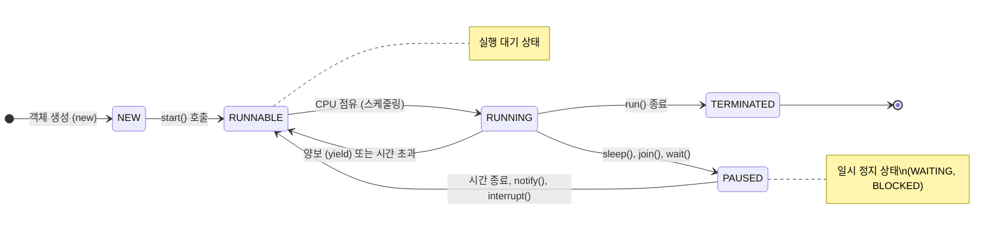

# 14.5 스레드 상태

스레드 객체를 생성(NEW)하고, start() 메소드를 호출하면 곧바로 스레드가 실행되는 것이 아니라 실행 대기 상태(RUNNABLE)가 된다. 실행 대기 상태란 실행을 기다리고 있는 상태를 말한다.

실행 대기하는 스레드는 CPU 스케줄링에 따라 CPU를 점유하고 run() 메소드를 실행한다. 이때를 실행(RUNNING) 상태라고 한다. 실행 스레드는 run() 메소드를 모두 실행하기 전에 스케줄링에 의해 다시 실행 대기 상태로 돌아갈 수 있다. 그리고 다른 스레드가 실행 상태가 된다.

이렇게 스레드는 실행 대기 상태와 실행 상태를 번갈아 가면서 자신의 run() 메소드를 조금씩 실행한다. 실행 상태에서 run() 메소드가 종료되면 더 이상 실행할 코드가 없기 때문에 스레드의 실행은 멈추게 된다. 이 상태를 종료 상태(TERMINATED)라고 한다.

실행 상태에서 일시 정지 상태로 가기도 하는데, 일시 정지 상태는 스레드가 실행할 수 없는 상태를 말한다. 스레드가 다시 실행 상태로 가기 위해서는 일시 정지 상태에서 실행 대기 상태로 가야만 한다.

### 스레드 상태 변화 (생명 주기) 시각화



## 주어진 시간 동안 일시 정지

실행 중인 스레드를 일정 시간 멈추게 하고 싶다면 Thread 클래스의 정적 메소드인 sleep()을 이용하면 된다. 매개값에는 얼마 동안 일시 정지 상태로 있을 것인지 밀리세컨드(1/1000) 단위로 시간을 주면 된다.

```java
try {
	Thread.sleep(1000);
} catch (InterruptedException e) {
	// interrupt() 메소드가 호출되면 실행
}
```

일시 정지 상태에서는 InterruptedException이 발생할 수 있기 때문에 sleep()은 예외 처리가 필요한 메소드이다.

```java
package ch14.sec05.exam01;

import java.awt.Toolkit;

public class SleepExample {
	public static void main(String[] args) {
		Toolkit toolkit = Toolkit.getDefaultToolkit();
		for (int i=0; i<10; i++) {
			toolkit.beep();
			try {
				Thread.sleep(3000);
			} catch (InterruptedException e) {
			}
		}
	}
}
```

## 다른 스레드의 종료를 기다림

스레드는 다른 스레드와 독립적으로 실행하지만 다른 스레드가 종료될 때까지 기다렸다가 실행을 해야 하는 경우도 있다. 예를 들어 계산 스레드의 작업이 종료된 후 그 결과값을 받아 처리하는 경우이다.

이를 위해 스레드는 **join()** 메소드를 제공한다. ThreadA가 ThreadB의 join() 메소드를 호출하면 ThreadA는 ThreadB가 종료할 때까지 일시 정지 상태가 된다. ThreadB의 run() 메소드가 종료되고 나서야 비로소 ThreadA는 일시 정지에서 풀려 다음 코드를 실행한다.

```java
threadB.start();
threadB.join(); // ThreadA 일시 정지
```

다음은 SumThread가 계산 작업을 모두 마칠 때까지 메인 스레드가 일시 정지 상태에 있다가 SumThread가 최종 계산된 결과값을 산출하고 종료하면 메인 스레드가 결과값을 받아 출력하는 예제이다.

```java
package ch14.sec05.exam02;

public class SumThread extends Thread {
	private long sum;

	public long getSum() {
		return sum;
	}

	public void setSum(long sum) {
		this.sum = sum;
	}

	@Override
	public void run() {
		for (int i=1; i<=100; i++) {
			sum += i;
		}
	}
}
```

```java
package ch14.sec05.exam02;

public class JoinExample {
	public static void main(String[] args) {
		SumThread sumThread = new SumThread();
		sumThread.start();
		try {
			sumThread.join();
		} catch (InterruptedException e) {
		}
		System.out.println("1~100 합: " + sumThread.getSum());
	}
}
```

**실행 결과**
```
1~100 합: 5050
```

## 다른 스레드에게 실행 양보

스레드가 처리하는 작업은 반복적인 실행을 위해 for 문이나 while 문을 포함하는 경우가 많은데, 가끔 반복문이 무의미한 반복을 하는 경우가 있다.

이때는 다른 스레드에게 실행을 양보하고 자신은 실행 대기 상태로 가는 것이 프로그램 성능에 도움이 된다. 이런 기능을 위해 Thread는 **yield()** 메소드를 제공한다. yield()를 호출한 스레드는 실행 대기 상태로 돌아가고, 다른 스레드가 실행 상태가 된다.

```java
public void run() {
	while (true) {
		if (work) {
			System.out.println("ThreadA 작업 내용");
		} else {
			Thread.yield();
		}
	}
}
```

```java
package ch14.sec05.exam03;

public class WorkThread extends Thread {
	public boolean work = true;

	public WorkThread(String name) {
		setName(name);
	}

	@Override
	public void run() {
		while (true) {
			if (work) {
				System.out.println(getName() + ": 작업처리");
			} else {
				Thread.yield();
			}
		}
	}
}
```

```java
package ch14.sec05.exam03;

public class YieldExample {
	public static void main(String[] args) {
		WorkThread workThreadA = new WorkThread("workThreadA");
		WorkThread workThreadB = new WorkThread("workThreadB");
		workThreadA.start();
		workThreadB.start();

		try { Thread.sleep(5000); } catch (InterruptedException e) {}
		workThreadA.work = false;

		try { Thread.sleep(10000); } catch (InterruptedException e) {}
		workThreadA.work = true;
	}
}
```

**실행 결과**
```
workThreadA: 작업처리
workThreadB: 작업처리
(5초 후)
workThreadB: 작업처리
(10초 후)
workThreadA: 작업처리
workThreadB: 작업처리
```
