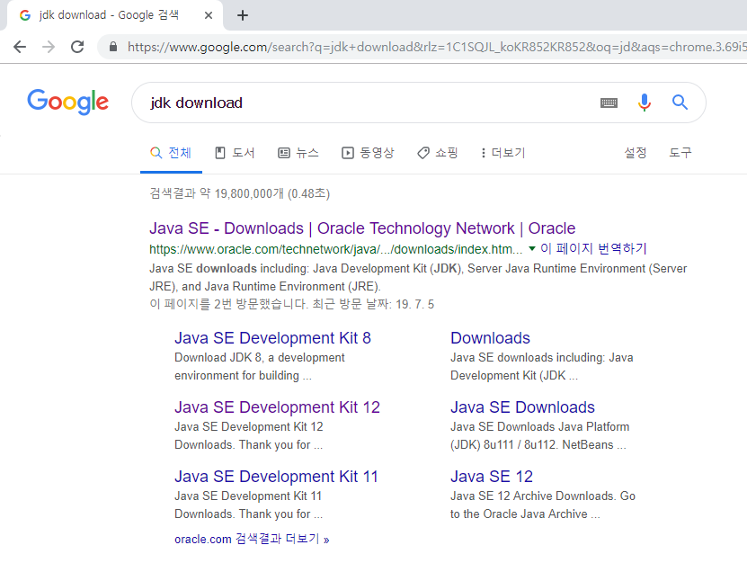
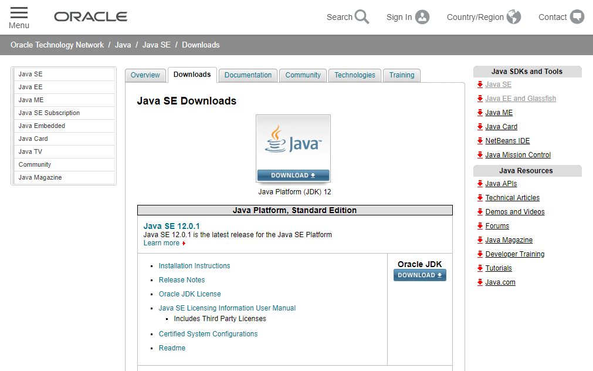
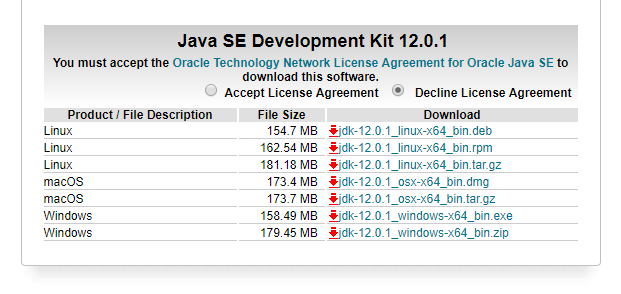
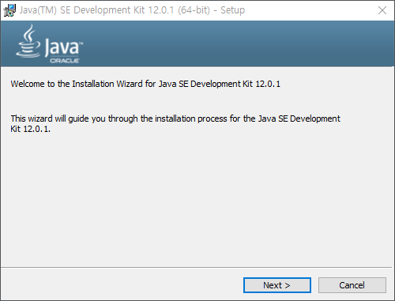
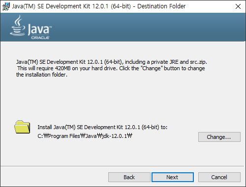
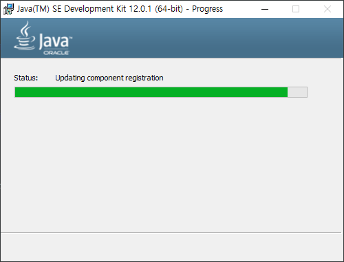
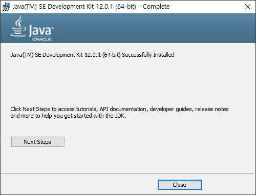

# 자바설치
---
먼저 컴퓨터에 자바를 설치하여야 합니다. 자바는 오라클 사이트에서 다운로드 받을 수 있습니다.

먼저 검색엔진에서 `jdk download`를 입력해 봅니다.

검색된 링크를 클릭하여 다운로드 사이트로 이동을 합니다.

다운로드 페이지에서 `download`를 선택합니다. 하단으로 페이지를 스크롤하면 다음과 같이 설치 파일을 내려 받을 수 있습니다.

설치파일을 다운로드 받기 위해서는 라이센스 사용동의가 필요합니다. 페이지에서 `Accept License Agreement`를 선택하세요.  자신의 운영체제에 맞는 파일을 다운로드 받을 수 있습니다.

다음은 윈도우10 운영제체에서 JDK를 설치하는 방법입니다. 64비트 기준으로 `x64` 버전을 다운로드 받습니다. 다운로드 받은 설치파일을 실행합니다. 설치 환영 인사말이 출력됩니다. `다음`을 선택합니다.

설치할 경로를 입력합니다. 기본 설정값으로 설치를 하는 것을 합니다. `다음`을 클릭합니다.

설치가 진행이 됩니다.

잠시 기다리면 설치가 마무리 됩니다.

